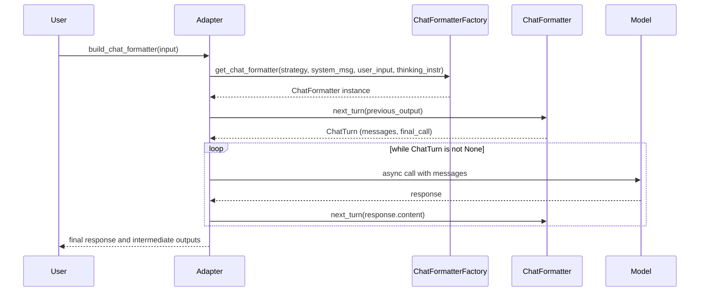

# Discussões da PR #358 | Projeto: Kiln

**🔗 Link da PR:** [https://github.com/Kiln-AI/Kiln/pull/358](https://github.com/Kiln-AI/Kiln/pull/358)

## 📊 Resumo de Interações

| Origem da Tabela | Quantidade de Registros |
| :--- | :--- |
| `pull_request` (Body) | 1 |
| `pr_comments` | 3 |
| `pr_reviews` | 9 |
| `pr_review_comments` | 16 |

---

## 📝 Pull Request Body (Autor: scosman)

> ## Summary
> - add base ChatFormatter abstraction and individual formatters per strategy
> - expose `get_chat_formatter` helper via adapters package
> - update unit tests for new formatter classes
> 
> ## Testing
> - `uvx ruff check --select I`
> - `uvx ruff format --check .`
> - `uv run pyright . --stats`
> - `uv run python3 -m pytest --benchmark-quiet -q libs/core/kiln_ai/adapters/chat/test_chat_formatter.py`
> 
> 
> ------
> https://chatgpt.com/codex/tasks/task_e_68485c4e38288332890092f9c28521d7
> 
> <!-- This is an auto-generated comment: release notes by coderabbit.ai -->
> ## Summary by CodeRabbit
> 
> - **New Features**
>   - Introduced a chat adapter supporting multiple conversation strategies: single-turn final answer, two-message chain-of-thought (legacy and new), and single-turn with embedded reasoning.
>   - Enabled flexible chat formatting managing multi-turn conversations with system, user, assistant messages, and intermediate reasoning steps.
> - **Refactor**
>   - Replaced fine-tuning data strategy enum with a new chat-focused strategy enum across core modules, APIs, and UI.
>   - Updated model adapters to use chat formatter objects for iterative multi-turn interactions instead of static prompt strategies.
>   - Refactored fine-tune dataset formatting to use chat message abstractions, simplifying data generation and format conversion.
>   - Simplified prompt builders by removing deprecated user message formatting methods.
> - **Tests**
>   - Added extensive tests covering all chat formatting strategies, user message formatting, and backward compatibility of data strategy handling.
>   - Updated existing tests to adopt the new chat strategy enum and validate related logic.
> - **Documentation**
>   - Updated API schema and UI types to reflect the new chat strategy enum and expanded structured output modes.
> <!-- end of auto-generated comment: release notes by coderabbit.ai -->

---

## 💬 PR Comments (3)

**👤 coderabbitai[bot]** comentou em 2025-06-10T17:51:18Z:

<!-- This is an auto-generated comment: summarize by coderabbit.ai -->
<!-- walkthrough_start -->

## Walkthrough

A new chat formatting framework was introduced, including a set of formatters for different chat strategies, an enumeration for strategy selection, and a factory function. The chat formatter API is now publicly exposed via package initialization files, and comprehensive tests for all formatter strategies were added. Related adapter code was refactored to use the new chat formatter abstraction, legacy methods and tests were removed, and references to the old `FinetuneDataStrategy` enum were replaced with the new `ChatStrategy` enum throughout the codebase and tests. Additional changes include removal of a prompt builder method and updates to data structure upgrade logic.

## Changes

| File(s)                                                                                      | Change Summary                                                                                          |
|---------------------------------------------------------------------------------------------|--------------------------------------------------------------------------------------------------------|
| libs/core/kiln_ai/adapters/__init__.py                                                      | Added `chat` to imports and `__all__`, exposing the chat adapter in the public API.                    |
| libs/core/kiln_ai/adapters/chat/__init__.py                                                 | New module re-exporting `ChatFormatter`, `ChatMessage`, `ChatStrategy`, and `get_chat_formatter`.      |
| libs/core/kiln_ai/adapters/chat/chat_formatter.py                                           | New module with chat formatting framework: strategy enum, dataclasses, abstract base, concrete formatters, factory function, and utility. |
| libs/core/kiln_ai/adapters/chat/test_chat_formatter.py                                      | New tests for all chat formatter strategies and user message formatting, validating message flows and intermediate outputs. |
| libs/core/kiln_ai/adapters/model_adapters/base_adapter.py                                   | Removed `run_strategy`; added `build_chat_formatter` returning a `ChatFormatter` instance based on strategy and model capabilities. |
| libs/core/kiln_ai/adapters/model_adapters/litellm_adapter.py                                | Refactored `_run` to use iterative chat formatter interaction loop instead of static two-step CoT prompt calls. |
| libs/core/kiln_ai/adapters/model_adapters/test_base_adapter.py                              | Removed parameterized test for deprecated `run_strategy` method; added test for `build_chat_formatter`. |
| libs/core/kiln_ai/adapters/model_adapters/test_structured_output.py                         | Updated adapter initialization calls to use `RunConfigProperties` argument instead of separate model/provider/prompt parameters. |
| libs/core/kiln_ai/adapters/data_gen/test_data_gen_task.py                                  | Updated adapter calls to use `RunConfigProperties` instead of separate model/provider/prompt parameters. |
| libs/core/kiln_ai/adapters/fine_tune/dataset_formatter.py                                  | Refactored dataset formatting to use `ChatMessage` list and `ChatStrategy` enum; removed legacy `ModelTrainingData`; updated format generators; replaced `FinetuneDataStrategy` with `ChatStrategy`. |
| libs/core/kiln_ai/adapters/fine_tune/test_dataset_formatter.py                             | Updated imports and tests to use `ChatMessage` and `ChatStrategy` instead of legacy structures and enums. |
| libs/core/kiln_ai/adapters/fine_tune/base_finetune.py                                     | Replaced `FinetuneDataStrategy` with `ChatStrategy` in method parameter type annotations.              |
| libs/core/kiln_ai/adapters/fine_tune/test_base_finetune.py                                | Replaced `FinetuneDataStrategy` with `ChatStrategy` in imports, parameters, and assertions.            |
| libs/core/kiln_ai/adapters/fine_tune/test_fireworks_tinetune.py                           | Replaced `FinetuneDataStrategy` with `ChatStrategy` in imports and test parameters.                     |
| libs/core/kiln_ai/adapters/fine_tune/test_openai_finetune.py                              | Replaced `FinetuneDataStrategy` with `ChatStrategy` in imports and test parameters.                     |
| libs/core/kiln_ai/adapters/fine_tune/test_vertex_finetune.py                              | Replaced `FinetuneDataStrategy` with `ChatStrategy` in imports and test parameters.                     |
| libs/core/kiln_ai/adapters/provider_tools.py                                              | Replaced `FinetuneDataStrategy` with `ChatStrategy` in imports, function signatures, and logic checks. |
| libs/core/kiln_ai/adapters/test_provider_tools.py                                         | Replaced `FinetuneDataStrategy` with `ChatStrategy` in test fixtures and mocks.                         |
| libs/core/kiln_ai/adapters/prompt_builders.py                                            | Removed `build_user_message` method and related imports from `BasePromptBuilder`.                      |
| libs/core/kiln_ai/adapters/test_prompt_builders.py                                       | Removed tests asserting user message content inclusion; deleted one test for non-ASCII structured input. |
| libs/core/kiln_ai/datamodel/__init__.py                                                  | Removed export of `FinetuneDataStrategy` from package public API.                                      |
| libs/core/kiln_ai/datamodel/datamodel_enums.py                                           | Renamed and redefined `FinetuneDataStrategy` enum as `ChatStrategy` with new chat-oriented values; updated related constants. |
| libs/core/kiln_ai/datamodel/finetune.py                                                  | Changed `data_strategy` field type from `FinetuneDataStrategy` to `ChatStrategy`; updated thinking instructions validation logic with new strategy list. |
| libs/core/kiln_ai/datamodel/test_models.py                                               | Updated tests to use `ChatStrategy` instead of `FinetuneDataStrategy`; added tests for new strategy values and enum string equality. |
| libs/core/kiln_ai/datamodel/task.py                                                      | Modified `TaskRunConfig.upgrade_old_entries` to look for `structured_output_mode` inside nested config.|
| libs/core/kiln_ai/datamodel/test_task.py                                                | Added test verifying backward compatibility and upgrade logic for `TaskRunConfig` old entries.        |
| app/desktop/studio_server/finetune_api.py                                               | Replaced all `FinetuneDataStrategy` references with `ChatStrategy` in imports, type annotations, validation, and logic. |
| app/desktop/studio_server/test_finetune_api.py                                          | Replaced all `FinetuneDataStrategy` references with `ChatStrategy` in imports, parameters, and assertions; added error expectation for legacy strategies. |
| app/desktop/studio_server/test_provider_api.py                                          | Modified test to remove capturing exception object in `pytest.raises`.                                |
| app/web_ui/src/lib/api_schema.d.ts                                                      | Replaced `FinetuneDataStrategy` enum with new `ChatStrategy` enum in schema definitions; extended `StructuredOutputMode` enum. |
| app/web_ui/src/lib/types.ts                                                             | Updated exported type alias from `FinetuneDataStrategy` to `ChatStrategy`.                            |
| app/web_ui/src/routes/(app)/fine_tune/[project_id]/[task_id]/create_finetune/+page.svelte | Replaced all `FinetuneDataStrategy` references with `ChatStrategy` in imports, variables, and logic for data strategy selection. |
| libs/core/kiln_ai/adapters/fine_tune/base_finetune.py                                   | Changed `data_strategy` parameter type from `FinetuneDataStrategy` to `ChatStrategy`.                  |
| libs/core/kiln_ai/adapters/ml_model_list.py                                             | Added optional `tuned_chat_strategy` attribute of type `ChatStrategy` to `KilnModelProvider`.          |
| libs/core/kiln_ai/adapters/test_adapter_registry.py                                     | Added `data_strategy` attribute to mocked finetune objects in test fixtures.                           |

## Sequence Diagram(s)



## Possibly related PRs

- Kiln-AI/Kiln#343: Modified adapter construction calls to replace separate model/provider/prompt parameters with a single `run_config_properties` argument, closely related to adapter initialization changes here.

## Suggested labels

`codex`

## Poem

> In the warren, chat flows anew,  
> With strategies four, and formatters too!  
> Messages hop in a tidy array,  
> From system to user, the rabbits now say:  
> "Tested and tidy, our chatters delight—  
> Formatting messages morning and night!"  
> 🐇✨

<!-- walkthrough_end -->
<!-- internal state start -->


<!-- DwQgtGAEAqAWCWBnSTIEMB26CuAXA9mAOYCmGJATmriQCaQDG+Ats2bgFyQAOFk+AIwBWJBrngA3EsgEBPRvlqU0AgfFwA6NPEgQAfACgjoCEYDEZyAAUASpETZWaCrKNxU3bABsvkCiQBHbGlcABpIcVwvOkgAIgAxeAAPSFh8AHdIdJJIADN8CmZqRlhqRC5sDHhc+VxYHKYlcIESXBo+AGEAeWhGNB97XFloyAAKDHxIWnxsARHEWUQaZgBKZtb2hSU/EmxEElDYlAxcCkVsBml0SAE0fcgAAw7S3HiCorbKB/QBJaoxeD4LD9IFELLqWDHWiSeC0bD9PLvaibeDMbjRNgnaiAjDIfJ8aG5XKUdglYr4j7iDBgv7UEhEeDSDSQACSuEgJCS3Hw+2QaFSJC83EoeUqAKBj1IuAA+gwXtKKcivpAJPB+XUcmhaGhuO1kNw0AwANZoUgRSa5Q3wLzqOnoBiXRDIAgRer3RWfCiIZlwHK2dBeRCTbDcbU0ZCVdQRELOyZMKR8DWQciZD2bBheO68jRuELwak8SgUmL5jPYJTIG0nfNg9IQx7YCQpCjYIklURG3RgfbRMSsh7hNM1lWUarwBjYiV1uoNpt+Vu5RGFYoQOUdyAaAcRWTC9vG4d7YcPRvzrDcWQUeBEWDs5kQJZlLeYegtjBVAuR9nh3DIaeQloYHKRQUEaw7QogKjRPQqr8seEinjwsh1ECADMujMIh35dgBQHOEaYBBIy7IEZANq/AA9Ew/jkaBXgYNK2jkVqOp6pRLzkd+srymmlAaOeDw5gYvrWHYqCwuwY4xHcyaOC0fAoQArAAHOgGD0Ok0kOAIzDqDQ9ByK6OR7CKsSIEwiBFBgGhHMJuTeL4Si4NogaqfQjQNKU1JXBOWAtIilT0MUSa8PgqpKPQADi6gABKzJAACqNgADJcDeuDcOU5HkQydSzBoTDMORADS1oYGAACCLLFaV5GeD45GKUpgkWJAHQsJiP72I4wGuEJ9SQEU+ZTEgDB7IgOLHIZCisOwyCXCclDIBKSYtKUqoFPwi5ysUbBOqaORDgWcKXgWpzaO+YLPhyEj9PC4gStwpS8uE0jCgwao+PI+I7HcQLDswiiCnyalkvmYD4LkYDIdg17sqMbXQCsgxUDQDJMkY8X7HwsROekGCyJZ4hUSQRz+NyFCdUGbAoE6wRLb8lBSPQx3Dmd+bDldJA3V4d0TRD1w2CQv0XQNgNeD69TyCFYU5AAUgAyl0AByHJJGgaLRMg1o87SVJgkmu0QaQyD7Cc5pTbkVBsOkBRGhwRhQAAItgJ361Q7PUuEBvSEbOT7EEZCXMcZYVtc43UvMizLDwZxouy+Q+BkMQGcZfBXVmSBOWbhv7d6BhOy7w5c7dk5YH+U2JOQUOVDEVix7qXv9TnZr+8EgGatwwrOLGwc89suA2/YUckBhIVx4g4TpAgcr2CQI89/4uS9uy0REIa8irWg60UIJ7jIOBDBk5gDDyA4RDG51dTFKv68KBguRXi7pfIEUp/iAME7GVMMxzH7w+j/XTqLMCzFx5qXSe09IRJn9NoZgPdBSonzHSXe/VU53wfoUZ0LwpqcjenpG4JA1qAgoIAFAIt74FhGBH+kclgjxjiwXUiASGoEEFjJmWR6hYEPKdfqTwXjyzOqjWQGgB74GlM3Egsp8C4G+AaK2rReIwElqrXgPtGCFx5OoeQKgZjsinrUBA+pnDqwUXwfMS826OnoXHSAex9rhGkhqeQuDRD4INmLc2/QNKLFsfcJMbMRZj11Bwsgs9l7DkriQMA0Aa70DrgwzQRh4guw1HwAqHU5qZkvDUV0xQbpVB8PyAGSgXKbykOgZALixB0HtvnSAbw+ApgiHcI0yBRiHyFvgy20hYDhAmOyDMQI6BrBuNIyEAAhO445XKtXwL0XW9JGS/nrBFKw0AAAskwdJVCyLbBQFB/BiC8MIpRDQCiHPZAjAhRCNp/l0REQeCxaEAISUtB0LtfycNIvSW+xScioH6b4ugOYoDCRsAARkgChAATOM0WJSAxBl2SBOa5zXHHPBDOAQYzICTPGgwGZVyFlozzlABp3y14n2aYgVpjc/YmOuVvYhNN+AMwoEzLgeLplXSueXVZGytnsxmRCqFsL4VA2RZ2KiFzjmT3rEmaVrjZm9DKcy8YkxpizBodHIJP4kZT1CTfKlfyWXgUgsCowXQEz9C8HS6aGTUhXlgDaWGuSvz9X9KiaW3lsGHTBCnKoNRhzuRmQg7Z2IjrUL/s86xjDJpXInD4CeNw8AUtvkwe+j8UY4hfmgN+2t6FwiDkmfAXglB8FVQUCWOQD5jQmv0JFBALhun4FgJM+Z2iGnur5Vo2RQnbXZMSqWxi2B6hmbq3x+0piFxAdzXmQJwj5mhBOPW9gWA5AwPCduWssBpEyBOnsriJpiXvjzQOyd5ADuRnSIgp8Ng1jzvnMAhgDAmCgGQeg/M0B4EIKQcgKMYjpPYFwXgrKRAAikDIS9gMqCqHUFoHQ+hX3gFBYYllmAcAEGIGQZQ+CgMnC4FQTIDgnAuBuNB8tKg1CaG0F2F9yHTAGDIogSiBQSA0VKgxeATFtS6kWuRaU0p2YymlHxWQ9tYiSYMC1Sq2H/10noCRnqm0yReUQG4XhA7vhaWKd4HIGk+S0HCubdtaICgr0zjMpMDxBM2sE98XB5nSKWaGtZ5jrHqK0XooxZifGvQCaE1UETYnvgP2iBLVA20vIqJ5FcazWn0C8c2NJOR7J+bBS1dM8qVgWQqes75vUsjDQmlIOEIooECxRi3s5c1S5VbtAwAiL+IJqTjW2JyTOw4dPnE1l1Ge0kHhhjQNKP9W4HigKfCDB4D9yDSlwDXASkAlaTDGSKLw+AGQEo2hm04pa8jrcyAZ+FklaCCXMJYcqXhO3dp7kmJQGZjE3ZU45imMQNqeDmNMiS4hpAO0gOVIzMQHgJZdKZ8m+Dutwl60NB47niYcbolxnjLF+OCeE4JkLdSAfGeBy8b4oPeG2Z8PZ5zSxJqw/gBReHXmkcFdR4F9QGP+IGEk7EB2jG4dsYR957jdP/MDoC+j0T54JNSZkyyOTuGYhKecPIfmUXjZGHKsmEgmRdMjAp1TrnNOfNJf4wLtHQWmeyG+Ce3bRaYhX3ZF68zeIZh8G+0skhfDqANMpF8cILvcAAFkfb7TG88agAiAO3sm/QB4UouLUAVEiT0DwSGWxYFNXH0eeIUG07MdX+mISuf6hBamBpjT7WrfcG3FM+T+EMlgXBNp3pRHkP4MAL38EwWT0TrwJObRLDK2gCr+t6ij0yxmbRDofaU5GAatt/VC8lf+VrMzr3TtKMi55FurQIzcGuBmIWfAPu1/+zlrqFBLRB2+gq7BfPyPoHPv4Neq6jQkGg2Z8gJxkD+EzG4uMvrY+rqukOs70mF2V2uGOaJm/U92WSz8z2XI5mb2u+Q+HI1YP26mdSSsqu8KemjwnOnmnGuuKO/O7EhujOwuJuMWFMR4gerwP+HujwlBvue0pAAe/Cgi9IJuDiU2keA6Mey4ceKoaojw7e9mOYrO7OYARg2B7GOuvOeuBB1AbEqe1BO8IuLOYuF2Euf6Uuim3UsuKmCuv2BgyuTSWeUwJAM2Vw/IlsJiNsIEdWfqZIAyQICYEET25czA3g4g6IfsLBJK4QDgnc5mXWpwFw82/g9AbhV28A1cFAWAHayg4ouImKkI+AuoOICIsRhQdAaoNAP0QYIstCGUzIbIxw5uFwVwXu9Bvs3wV0XuMS0R3wQ2D2TocWkwZM/gps1uakMIcICIEiwM9ARAZwIYgG2CIRuI1aPwtIfYtw9wjRyAXubuSo6eA0mAucd8ThpcgwdIvhBAbRA0fuxsXs/wrSxRlAbA0IdouingP47BL4gQ2A8AuxWksxzRKAGsI8pI1m5ASQMoox3wo6aQ9ALoWo+Sxa/UGa6x3agkbwLsd8HS2RaejAmYTR8+nhHUw0SwpYDhGAEJE0S8GQ5Qf2Dw8sNY0QtRGACxvBwmWRVw5cTy0cV0aCvRdK1eXIrifI9gJJB0SCvgGcD4ZsbR3IuIJAIKjw0ANsFR+0bUuASUPyJ8FJ7Q3w/ghEuxDwdQ+YfegWfwwROaW4D45eiRQ8zy4QqcNxro6pw4+YWp8RyaGoLJeCwMJxGR5x2RvJWcaWeAVxYw20Q06WaQMMN4IyCcB2F61waCE6Z+/UM2CImAiA2QFAppUZn0U0rpmAuAgAmAR4jck7CICCn7AikPBin4ASmkBSnynKgNotF3EPFlFqkYAamWlBHWnfACCpoFRqDkARhYzHCelXS1l97HBWlPYdqTD8jhxEAjCMn7H/JBYfSypV6IiJzpBYL0rUzpFnHUkzKJnZm5k5AGiejAjLlppUpp75nEkRwkBkkQruB1k1hllLFlJXA2gP6PBnnjkXkuzkmKHNmpqoDgR6z3GID1D6Rvwh7yCNZsCCQACihokICJg0WIlpjpjWvgD44YYwDwepMinuaAGk6gNYc2CAN51IY2OF2gesCo3JY20w5ADwSMV07svIHIByBQWsi4Sp9xoRMcXMgIew/AHpeAFeOQOkToNY4xxh0s4k7JJ+OxX0Yo3akorQUeMoae+O2CDZqZ1Jh5OoIUvAG5CJ0xb2U+fsgoriQOlBweN6bBPAGcBY5AjoEEZGciJieogk2OeFQINqsgDiti78WioogE8l02se0oqc4iU53w4JlAnUaC+Ynpowfww4G0y63asuSMw51wCsysyMiVu+mYQ0CVBY30Eid8NAJwABMmwB2aQIt24BogkBT2/MzecBPACBju+hUA2OMQDRSJcxdB4VBpD8gotAcxZw0QXASU6gygXgAA2qZP/LEOELECmScAtXEKnLEAALpVFTY7bAaQBdApEeUzV/BbUimdXMzUCGg9W0EvBknfDlyDVlpzG9HjWZzTV9UMEkBbUzLTbcmyg2pcDYqloCRY6A6BS/BnRTF3ANDXXzFfmJH2yQC6CzK4iNk7H2iXApEFgYX/xhWfVcB/BjahWxV4AE2nCQAAA+kAjs44WFMyyRKVvgqphF9ZqNLY1pZNfAVNy2NFOYSNUA8SwoFM8gDwvRiprQH5R4E1Sw71LwxZX1IN/NkAvuyE4eEi0oyViAowKw4toxUtb1yV01fw2xXNS2QyG1p1BgStKtAJjwa5mRdI0olxAl2tutkt2NNNYgRtpwJtltSt5UEN/w7I/xigjwXxPxH5owqi60ewTt/FnAyMlNZt5AkAAAvMnSQEjM+vtYdchbLdQGSZbR1WDbCf4NkU8T1VcPzHDTwQqYjcjUSZyWSXeabm8R1EeOHXNh+YrQ3YWfLVKTKZSrIC3a8aiRJNjZ3b8TMuxQ8UeH2fhQ2ezTdj3VAAWeKVOaWfDV6hiOPWCA8JPd3dPVWa7I8PPdSJqWjTqXzQ3a+aSR+VeSzbeVvW3bvWHZyBHXUWdSXdJQULJQFRNBHopVwSpQaeNEQI1iESQPXQ8DA+eMhBgFbSYYuJwdxIoaMIg0jUjUOlwOZd4V5Rg5g3SSPHjb7JzaEAQ0jcTRgFcZzUnZ7WEBQ2aURUQBfUvTmrQ9zUMmnRneQ0jVnXoK1C8HeYgzAw8KDcZngNaH5XZP/RKEFTwSFVjCQ/tKMCTQnfQ0nX8Pw8jCDSIU+mIUxpTixtTrgdIfgcY+xJxMA4oWJqLmzuLpLgBloaRnLltKvvoXvCrpkFhMYRGR5OSIocUWcBbibMkNGGTjI9aW6iqP0LCHaISMSP4GbFenYcSkslZqgl2cVXYZIzaEMOMd+KigmBbKWgdl1vNM4ICASXUqqSEEpdwe7hQBRchU7RgMcg8FwNADGMnmOdEF3XUdekIoWhcBzHkFmcteyAKdVZqLkCiDOQiEQxhAyVk1OcmgmNULIMOBMI6euRcfHaSqfXU9Y7XZQM0/0AxGpIFu0LszQB0zAN09ZqIso6QFIjKEaqQUOgafbc6TkDjI/dSEcIvdqdVfTfswQviDkEmFuRM9udM+EGuPuJVgtE6Ruc7Z1M4JC0cRaqvVY6gyc0008+rUwDIp0w87woS1Oa89pngyEpXkmJOZ9b3OWFcIOS7CWNQ6mr2f82CEC9aYOKU0nMBRUuNHye6uaQWGi5ueM7iHGeENzHE6ut86i/s/mbiwofi9KBQOCtKEsMMCQHc100sIeRhZyf0/RFqwReK0QNS6BbS5C/1DC1M0KUy6HCPC0CXWfWCGi/C0CBgtsmCFuYmr4JWmnCDNs0q3s+lAJaq3Ux6Io6cxIncwAGqxNhhxa8JxuhWJv+XxF1bojnTZVIs9kgyZUqxqMvS4gzpgiluzyXixMABeGxqibCVwD+cuFA5aMbSwOr29kiuq0oLZ1o5aOraNbLtAgWVx0oEw3mZk8A8AdzzwHYWCxQ8jHw8bTT2biqRy8gnktAvWrLnFajJV50WzQIFU8sHQLIuW20Qdi04QzbjMrMA+k0Ja8dUFMF4Tg6qI3gdIqK2Ji0GxoxUGfQPgHd79ZrrtraJT+LDiTR+pCqaKYgHZS0i43sjLrc56fRYzyFIHvgS8poyaV06zg1h5qFOQ/MEb2RaL3o/2szIoULWZoxfSFoKS9QfAvR6AleIUFutAppCHbx2RxVhiMlyxuAa4lSrJYgz8zUQB12oBBONadVj2oBjVMBi+/A8Bn2BKbVKBUAaB3jIQObT2WoxmMOEh3OtOMhFjcharylNj/E9dOLRzeLjTZzHeQIxyrtiDTn3bxzrniZFz47lHJAXnSttTvnLnixc2NszzkixLoXDdtnDTUXFrur0QCXPndnCjWbU5GXhz3b40bx0o/bg7ZapzB7dAE7eAU7QIDEs78AXnejEABj2l5EFYRoBA3A5ESw5YgIOrjMlAHEdTElw7Oo8AtjKh9jahjjCmXULjuh7jKBwkWE4XMoGadlMo7rZwxoIVdZEweM0olAZwSxR2xSJ25s/gAM5SSYGc4DaJvpOQnImN8lu13xMTdbv8jw+rL7vCcDIQGgDF0gowkFSQz3OIOtJV79yxjWpAO8pyn7yYGQHJGs2icHl82CQbR463riA7dA23Ro919YDIUgWAHSSg1YDafg2gjFGGDwIPYPQIhP0MAyLEVbOCoPJAudYGSq30dkFMbHA5eCOI4xpFk1bkNq5swOQIG3uPtA+PpuyA2z62XkacIl4DluI573aon3lp4k7PDPpPQINA3xMn/2lVUBCnJhD2VVCRqn4OzVe+X2SBSyRgPNwpk3oh4hRjHmkhpjyOfmLGQ2I2ZAQ33bQff6c2LSE3IhDjGhTjc3ym8ui3GmkLhnkTQ52J+A/ZDwfO3BkfNK3wa0OQLQoSIYabgJlZ+boJu5/gMdJsnPj2u5I6piz1YsU7JiY2I3NB1R/bsITPkIo5nJjwr4UimaLDOlUVSyVRFARAjg7AEWFes/aJqAGG6l7cKmDwNglQbUY/gtk/0gpu8zNo9bMQ5cotbf4F+rnufyHeXfTTl/3wUdtfPFiAGKDwd/tFnuvftA2mrQkvpkvbYroAgHb3EyuFAWIGHmuBNJHq4eCruOzRbiJAYv/L8JMAeCxBKgRofbhgAgEL9VMZoNAESDZKuh/AqfCJnJXYb5cZQ4fMgAxGJw39EAQA0KOJC9BjZOI1A+iPnk8K0CO89AxgTLBYGmlVuGtS6sHw4HqwuBdmXgXfwYF/gR2S9MdnHSjYyJxiZeNLIuE37b9fWV4PfuQQP55BY4jwKQhoCGw38RELSBXolmMwug/C4OM0jR2EhtE1BU0LCOtk2yLpAIfcC0hy3ZCqInK3adwRIHwArocQppLMJP2qrhBLu50CMIBHcanYjA52M3nJxBaW8ICynEFnb1gKfpNO++HTn9jd7jE9CS0NptokIF9gsIIaK6NMER7B1FAGzVSM4jU74J3srVJAvIDSE2884TXDnN7xMaI48CAfciGYS7rkA2ul1fYFl0abR9VC/2dQjhnj4y4yMSfTAIrj6hnJtgi8LtCxSmDjC/+dhXnvmCiTzYRYieJZkeRFre4xY0Ad2BdEdiXV6il1WYmAAMqBRO4ZwD9kCS8b2E9ijLLvLUIRTcI96H1Soj9VwagVFswkVQRv26DQBpQ8QFkErHKhJRpQ5UJWPLAADqkFGwNKFsBdBvcaybauHkiTHCSAdwpyBZSEQWDLuoUKSCDDJiZhLg6kesKoJQ43VqA8tMbCg3VaNNIBXuCkawQhG8JLhJSa4Se2pBki0ADwpyLMRmTqA+QToIIdSXoCuDxw7gkOEeBsG24qWMycIh4RGCeswA7+WbjAMI6V5qRTMFBGckrzp8AGpXcdgEnwpDYqRZAExIFDpEkBe2HUKSHMTtFzYbh+FLTBAnHCQgy6H5dkn8OhFy1+qDZIWJ+kXCwRhRgoUUR7CIASjD+fJS4IUXZDGR2SKeSYYsW+CCAnIhw6CPwUAZrdIuvBF0HaKmhXogONwaGp+iMpsjcA/I0PIgUcDhBd2VYMEAkxJBmw0mNJesLBA+ByhqWdIDqOMWjov9ponhFIBmmhCM1SIG2aZBGStY7CnIoaZinwG7EWk38nPBkSGSDY9xyxlrZhsIKciEioB6BTkKUD2DiBykZARwExWO4CghQiiMFJCjS72t1xWMD6PAEbbyVUAgcHUA4A/zstHgf4htpIlS5DA+mibVygMA9CQA4+1ADaDaJBYYtbEoYWbkCVHzBIKcMtYEftG+oxitQG/RMV4GTG3D7hYlKcihPmEbEMJCRUYIA3kw0B6m6tP4ZyMYkcSuC6tJ1vsB4nsTJEQgXIjqzXBFBYuwkqXJxMpYEBS0QbGSQBmlCwAYYDIakCfji7yhlg+bW5p7lQkcS1J58GsFpPqa6TwJc2fAIpJtS8jDJkiBMMb2D7bJ52dFM0arkvCfA20kwSagBn4DFNyi/VQQOBmuIxMbQabPwKWmkCmkaxxVZKqkUvDmEHQBQaEBHBOTCQVRBKb6LuJ4TrjeWN2cICKm/FMM+8ppb0mVAhhQw/SrqVAOaJiCnDDI9wQySxVg61jsExVCMXZCTKBxAYh5SKl6FLiuU3xQtLAncBlDq04Bo/UqjInqxB0sO8rNNsgBra7UzYDUpMEiQGTtT6J30GtmZAHz8hey1k3wEGyXAfB7B/UJNlFU5CQAIoI8IVMhOalmIN85fc2EUE3yjUrgDUq9Bx0t5VJ8Et0lyZFM1iWjHgEoiYXeWMGOBuAVkiitED+KtBbaYDCBmyxZRl9cJI5fCeyD5F4N0xNAcidXWJE1wJRbYk3FmNw6HkmkDwX0Q6PPoJYroBoZElNDaLuFg0W034ZZkt4PTeJVaeHmFn0yeThwmUnYPBRiF6F6AT3TnvHA2j0scJ+CIbPtgyCCQrUU1W1G1JWFXB6RhoTUKLAmB5Np4G40cqO0rzlwLC0QJIOPn8bB16JKgSYv4NsSBoQKllVIM+B7F8FYIYIyypAMK7oh6hXM9iRNAMi+SI0XrYpt9NWZU9UkuSQ3p0UZoYowhzAT7IVUZBPVyqsnEAikMmB3YlOnQ6Avb2yEtUtOiBSIC7zqTJJZGWAJGdQBRloy9IXAQbKYRTRDs/RYolhkNlGBOQaUmrSoJ0xaRb8MAvhXGhIjIYGy5BllLgITPIDEy8GjcK1qw2Ba4gOGGdbhm720aUTqJNYNMZAEABJhI8CUCLhqZ/o2mS8HbktIu5GAHuTSj7kDznksXYeUH2waCMg808kqQvTZrzzygidThinXTorzdAAjP4fnR9xTlSJWATXMY21x+8+cLGYYSSLGEdzFKJ5ZnKXPIESgTONSXeQ3MjyesLxaAE+Z3NfAXyjQfc7RoTXJzmcpC/vViDAprhwLoa+Yz0JjmQXlzLB6C+uYuA2mxc5BwRBQStNwDtzD5LDAdFwAAXETSAG1bRvQ0P5YFehEC/oWY0GHULRhQ2CYclwYVIKyUKCiuVeGRmV4a5rCveQxJElyTPqmrV6NM34UtycFXANeQIolESLaa3teMv9nxjfUd5bCwxbJP4mUtBJIXGmYIpeDCK3qoir6vYq9rG1nFsgEBdIq1w4E5FlC/jIovYzKKEF9nE3H9jLm5tK5kDbCeXzrkGL7J0oMSbVz2kjxhsEiCxSmKsXK0rhtiy6qEtwCOLwg5UFxd8DcX5LeJok8SSUqknlK/FSlQJURKjGfVxFf86mg4vCXNLIlUisBT7ws4DCqFhwkYUkt2H0L2gjCjRcwqyXVzZZ+izBR0uMW+wrJNknwBUouhVKbFLcuxaMvoaNKIlrijBcg32VeKTFCkrwEG1OUBiAlpOBpcEpGXZ0blEylpWQpkWxKec8S/zIktoUqLEFaSphZku0VVzdFOy2gHkr2VGLjJGkogGZK4IWS6QHy8+kNmsU1LLldS65eMp9p3LWlDyjxSpIxWmStZ5kkeHpN8UCL+l3ywBfLT+UCMAVFKyZVEpmV9CwVUCoYYstgXJLVlvEdRfUk0UclwGiKoyMitRWPL0V6k+lZcEZUaxHary95X0sJXVKRRtSpyPUtuV8qqV7igpXSs0kMqcVTKyydqptT4r/F1AAZT8qGW+wuVYysJbyqBVmcQVvvOJcKshXirVFayqVRkvkpbKkVuS6lQUscmchnJ7MR1ecuJUpirl/y8lU4tNXbyY1+yuNUkATVVAk1Qi9lb8uNWAqplwKmJf6qFVWcRVs2MVSspDWSrYVUAG2qHUjUKro17iuEGiBhl8z4qgoXIL4R9kyhL+w8uNkMGFBcAwZrQCkuEHvl4Nx5hwkkVPNAr3tqAsALgFYA3VJ03ey8oZNo23V1AzVBintdDIICwyQuPYIdfYBHXt82A464KpOqgbU0Vlc6keQ/I9lCJ11dQLdTuq/k5Af5B60ZUetgBSKZRDwGdVQXxbTLyFkC2tUGsbUwqxG3QgxnBoDUIbRVNCtgUhtSV2NACswmbhDm0JLC3G6spbv1CwgOBJqthQ4dXBTrirTpyIYcEdk2FiA2MFfHYFX01ADAcxeWIUSmpomXiDZyMbhZXi5Y5AqZoA+0ayqdFGcJo5cazMEu+ARiKuGTSTQfMsUJZmJkQ0wuEgLCjkEAszfQUnn5CjQlgSePxSJuClKpPhYcz6s8MbFca2i7AQacrRZmeFMIafZIJA1/Akggm5wRkebC76ixjQ3w4qhh23TObpAr9PsUky/ACL7AFTS8DyDVGeCCwgFJzAOhtI2xuwNATfPm1iJvdstfHXLfkUgDLSXgj6S7L4EKZ1ZDJrMnaPRJ8U2kjp5M00oxoRJnr+AQtKAnGU7XoygUjUy2T8N9hjNvibLHdLQnxnqCLlqa+4QOSziOhmQ5UNHqAX63HZBqnG4jgYi8LyDxNIMXhQtya3syjWEcgXlfGBBtBLwLZNCtXTm1CbJR4xJ8RhAeATzSRl1EmfdWkiaygtBkbGeCMmgS8KhNqLDmEPIIgsjRn+ETf/iMCQVtxzstSK7Lq3fR8wC0irYrDLbeS9sJ0hrVOH8105ONSYJpPZrG0eh4W9QRFv3hyAbTRtU6I7TtMx1hTKE+Te5mdu+h2jWYiW+WftxHDZJdts8AOOvyuhHbq6ym7nmIDfwbr6OnkMZkNWKHXB5Zsxe9i5vZRPsadK4rKRtBylghyp4MSGNDFdTwwegdFd0cLECKc8ZAqaXBG0X2CAlYAgxa8OFtWauUjM7lZCnOX5BNIVunEPNQWvgCasop4iHUFImtSMEsg0kNBdttHA5IrcyeJNliOgCQUAAGtKAiiQVvcCIlkNKBsBdAkokFaUN7myz1FaaCUp/Kok4TjQpAGKeMItADC+BuQIlT7oFM+oA8op3wOdNFMQIOAT62zD6ajIwBvThQ+c9+lQGWKdwH0qsTOIJBZAL5OoG2rUEIHvEa8dgS8WzW6H8ZqY0tvXSrHPooJur/cnuGEXCIRFIiURaIzEdiNxH4joAvIhPTYCT2p709mepWNntz357C9xekzRhHPwBN8WGBaIKaV+1Hh3tq6z2QaQB3gG1p4BS6jfw7FwIlZ1qHwHaiKH2AjN7qUgb/jeH4AP2DUszfeMs3c7LqExSGvJTs1szfYjmu3SQaDohCclwc+vTsHAmAkYwg4HzZNtCFrbMJyUjtiSWEQJCCNl2ZIQkVSHZyoCmQ9Ti0MLl5C4VEahFdkr0UorHgmmypXJrcUqGzlCWX1VWrmXyKFl9a7DXU2DXIaxgxkegK5hjArBUC6BP7hE3YO7Eo9dcgGDtz6VcFMtFMV2tfyCFGhm5lSnFTF3yLFc8qC0b4p4ceDOGfDrhnSQEfy2FLcikHbQ+AtBWWdzGdayRLApw3wKJVShNJXp3QJYRmJLCpQ0IL92kAXJge+CSHtr1UBSACR0BehprWpHIVmRuhU2pyMoapM+jL3joYoXCqb+DEWtQZQGP4FphU3QjfZOcaJ8yNamFPnsVVrD9Kgo8ykRHv3FXdaRtxbjUKyk1Ny/OBYoMTPF52hjoiuYygiPRs19gyJcY64PNk80VhD4lOdXYM1YLjpAE4xIwgjNDqORTihwvqdgk+YvCoOwUFzevy/SgwKpBu6qTeDGAwikYuqO1DfwADk+483QWAnAGg1AeTLyjMkwC1BYk3wz5lmEVGzdFNTcMWIUUXDbMYRsadkB1iNaLpJmEtY49cARImzIJprKev/lZDxiIgeJq9J81QATDZRivaRGyfPJmstwUYI4wkQsKBNAR0TEkYphpYkmcgVJidI4m5aLa2G1VZkF0FSR1h9gi6VDqSYRS1ShYuRYNDqHNT0mdg9YmU//uVOim3yZrTVtq09Y2snZpYdLdTtag9BqT5JmoTkT+ionLTn3W7dcFVOAIp9dJlAAydtNMbPQBpR5jFyJbSJ3TQiXAb9vTY19uKMwPkNgY/b8wpTgsoOShRpYFUiAWHXVMshnCGz9t9UwJucZpOARQJP7VdEmAJMgxiqGaQcsLyVxu7Y5WJlkUwcG0pMf8w4Viaca/IGSgGlYhUqbvt2Sav1Ao+A1kAJ1g1QhXCTdNQe7NulaCPQE/YiORGoiMRWInEbnpv3fbVjNI+IQkIqrCGaqina3uIcXBNV85jvbTs73arK0PjimeQ9sq7UGKR+Q6AdV4FyDaMYknhaahNU7QzVYgxLOrrF1WpwXpE0XMREGyQvTFxwm1E2ruvNonqG5vo3Y56BAs3q1G062mpo1ODaNJzMGyaBBrxQkAAc+BWDX6t0PgqWM/R4VUMb5yY5UN3RpI9WpSODDOLtavJoKC8DMBhjfmUY4IbmEiTJjOhZYTMbWECFXw8M+Y6xtMJbDOKLoTM2HCchEwysLMvLbaz12VTDdUJ+GHMlhORmdzWp4ECDDR1BCNirJ2gLIHArTIg5D4y2VQfZadpc2cp2CERYVLMg64OZvYHOW9jzHLI8IJMqV3ZD8g1TIMBlr7AcSdwP0MQK5FWYbHUHUFCET5qMGQsyg7giFjTnEHgtPN0LIyK6EUG2BcNpZjyBvn5OPFgEhKYsLgBggibbZSgYMcy5CYZMomiAzJOrAxxw4xk4yuApy14HYQ15xwUYDqZZksj7Q0S6cdK50Qy3/wZkKV1Yt9ARggymkno1zUBKP4ATzCjwYK+WRBjsA69/IdbMkWiZkxOkdAGvaDvOuzneIB9aIpBwdO6UNokrSoO/ER6ih+e9HMMcLILYbQikaAc2W4Qwj8xwUAABh5NMnTTMFYFPUg2hCwZ4THGMwoB8BECJeHHaAwdEULzrTE2yGkvUEjnWDQI70sxc6zsIAmpwVNgXlGFQCjWEQQbTg+5blBnAJgEVy9K9fcQIplT9wXouMR8UsoFpxo6WTuE1CHaje7APjmCUVtmwBTOxb0VNF+t8BJWfjFXG9y8u9mDCdHB3B+x8WGnaxqt63JUjjgbxOW5oHHRL0v70AcYp8nxUcFpOdRc8QlKcnamcBL9Zo/GoKG1pOlYSzDFSLWylp1tvsuTQNyViwgEDFjyAvHVSC+I2i1Tqe6N8qCbamh3XuA7g65g7So5gssJZdRKewmJvfCTyvMrMhIiROBmRYR24Cd8VvbmHFwD7E4MrZyCS2Gdr124GFst7+25+r+FTPyFdv4L6b+wI4K8tw4oAjTNaasn2Cbs23dQ/BlS9ONzMYpw7Twfc/CMPPn6TzV+88wSLviisj6zB6HrFbp34C1rqU2sP5rqlL54dr4nXSscSxL7aEnGhFp2CKpIAxyZVtHam1hZCk+QOd9tHJ3KQhR7K52mXRhgIGbAsbkIJdF0SvtBtCh7Ua67QHBjW6EdyIG7XgA8jrhlo/USW5pbWNL5IRc+6EbvdP1HmL9p56/SfbIfXmI7bN4U8uJV5AobzysqgMgctsnBRqCszIGLO/3MnkgluXLSdKJRKn6wMVnovRIjFLWyjHxTXmvvNm/wjLERKIqT2/z4swAcvSQKEnSJdoJoed6Jt2KuDBc+KSgrDluUluj6THQIU3kIfTkiHM5tVJ8w1RfNNCHerQ4uV+eWx4CXi7Zv87sQkPNCchTvfx35sry1XhS8PGzGpbmOIzQn3d0pYhTFBxDhCnR5rvxdmW9Ha1Il1I5xG4syEZLsfDpQpdI1BOKNC9tsHVMPISQuOzfdoKdZYNkDmFQgoCzjOibEdGQC5hYxwJ6ch0rjN3GQvsZDGMnk71xkMPMBpZM3DeCcpBF47BP66qpMwI3TCepNcVTYlwE2mJrezx0+g6JqRkMCANmmgzuukM6c/SloYsI4diIz3EK6tn7WMWu+IuNALpw0elufqH9Olw0sbj4WVkGeEPH8akA3lJpE5VHSjgT+7T+ODKqEGEX3rSxFfuuY4TBjP2xrJF9yILHJPFA9dw9Lm2WFSz/9zxGQE5uIfZndn5HbkxGYSTeUFT+JmlpXbgN38u7Ddi0yc8xP8a2rJSN4/kcM6PPI7CSRuWAJ1EeI7+5sHbII41Cl5vB80mPekzj1JgpT9Z//WvyDijiW0SYP525GuqX8hTxwPCtBKZEzgEOByJVIs2vvy36AMVbwWTIrLvP3dnlPcMcUebcs55TZdANdspwEORrvCPuhvWkQj1Zi/LgzmTmqP6hDkdAc9POF6wGo6WeJwcUtATCXhtge879Fdgk7Pc6svTI4R+SeMkoQkWAKk57cI5m7zTwZrl35XMRnootCJOUBQkzHw9H7CPfIOZsMqFvcTnhZNFPGtCvOvhBRoIXxolANvrqa/cQBsXpktORQW7XAMh2cfm8nsohzxyp28d5yyr75ouXhS/OGt4XzCx+3XLuA82kGn7M+UsdYKjA+cPrGUHCedkMDJp3rDl7TJDOAGVEplWgBD0SP5P4NqRop4MJKfQ0pLoa3I2zv3e5tHD1Kkp9JvqZp4r34zhQLe8ARexYkF729LpsGv/V0Tb73V20dlA9Uv39R1iwU7/dt9hVgH/YMB+bUdG2cXRwxj0d/fCWyPtaziI+7fbKEY+03CYwn0UvTHVhlD2wWRzRLfQNBGAHfg/CIA6DkCl5oowGFBBtZJNfc8T1eFCwGCHgRgkwWSY7kE9CiWAXUfAE80FHNFnyfzTnxkJ59tPFgoNnQDtQb3eKULlvuEYv4d8v+ZwfgbyO/73UH7B4rWUK0H7nlBno/CT4wKFrSfOOAd5JtVTRqn96won5T5J7OChep+uAppI2ZdZlF+jD/LwyUj4HMD7133UYMWAoBv8P+Iyd/sAL76hCvhMAyCUbMq4IC/kyA//hgKwE4Dl8c0dxugDKHo8DoxnwL2x6UFzYQgY2bp3WaC7eD8+PhiYNKGlvdpIBCqCXuNGyIw5WPdX+AfHVeaMC44IAodl8HQcCO9seJTIJzAR2v2ohQ0TJ+rJTthmxn+BI15O+P4bFedfG2swc7chaDZ+NvCXR0Wm1XH9gfgpvvIhcqJCXHOcld/VTXdkEInBc3IZ+d05m0anrV2VToqrrrushm7vxzu5idCUtQ8T4SGdwfjBDMJledIjhxdCFGWrV0Icx534N8X6PAlti8KpK7SbFo5Trj5U54/VOihsxhJsLJpFYuYPOXT6updtqV2HgDF+JHHHGQs+liob9r3i/oB2fX+I+Z7rSO7Kpp0sct0GbTULF8AMKpwK8aq8Cjxn8E21luKcFEqx3203gt+/yHikeUXA1pqCcfxLAoDrgqiNoLIDAC6UFo9AXaRb+pAABufgHqaQAHBcbRvqaEe0j2FswQqiB+EkBDKxBIRNvpABwAAA62AiWyPFCjRlAwPkjwcy0PIlJWgfMee48CKUYBW6tgiTdr7EDV+nMDU1UjuBrBbg+3M8DbTT64dX41SL8H88yECerY+AzEzm4tzKsE/xwFvOMEb0EdHeyrR3bXS7MSrvId4Ahu8644fNW8IfGQtH5Icicfnonf2NtbcXIdKrRX47IX77BIvuCaGnq9kFTS0ajLSFQ0ei9DUl+6hpfu3lF0R4Y8YbUjzPr/29BmcOnwaMhLViE4gAAsASADxMD3gqd5LTn1cYanWY1QM6pKPyocCZZdSJlPtHpyp9UaWMVHonMSA2WMm/DT1gMyTTTxy8XtRAEWwWQZsSEFvZPpkgDy0K8XoDABJgPK41vRQSuJ8cNPmM8/bLgxENsEPpx+dpyT0nLM37T02ZZzDZsTN8cgbj3+1iSN4nf9cAT/zAENAX0Uv9/cZ2XKQS+LABL89IcIGiAmUCVhKFkyAQOXYMDdX2tsAzSQNM5mxCdDlFB1Z7WrA6WXgM6dWPNgOAE7RDgLG8quUdVq47gd6HnYJnT9h+digadnPZL2XLCPYjsOdwxRbAiCXpYVmT6i7FpIXQL58LRepG5I5yb20oEtvXUB28wBBUFjghMH/nk0F0ZPAXVAdIe2E9pZXhHe1cZY+DnwgnegCb9QDbANAoNAALmfArmU4iLtvuF0CIDWCERGTNKWYlkWxB/SOUykXoU7yX9PYMq2ldDvA7ER8sJOJ1TkkhDfyR8OhZ8yh9fHaQzh8/sR2BMo3ENwPiIz/DwKK52Appkmk1GGrhnYgg9uV7U9yWAEI9olBnxI8APYbi8CZfaAJo9Peenx/c4lCgMFAOIKPg48ZhWTG49FhRAO58VLEMAGJcfJ2jLRDuAR3SYRnH7hyBoAXuU0Ex+REizA37CfxX09CVICR5rMAb0nZGvOXTLR0MUfCaJmYNnnllZvBTS+R1sLUGHAGpPmVCtn+Te0HN2QaEBlRL0SnQfxWgjaH19fAhryQFvXZwXutogavR5crA4aHiJZcAfwyBrTO62OIRPckOq5KQjsnwRdefuF4QR+DNGC8J+XQWoDFQlKjIw/wXIKPYhsf0zFC3vLgO1DJQgFBFN8gAKEMgDtcPCNCPvEL335zQstyd918Wr3FCNvSkMGDg8N7y6B46RMQ0AWvDICr8ByPXgeAfQsfj9CzQwURXx1ZAMG0VDyeEKoBtgIWQdNRoC1zNh5ZNTQTdJNLUPGkXQiTjwQV9PyH1DJNVMJNDEvf0JBpbzNOTB93HR8239beXf2h8t3GQz04v8cjSR8O1VkVfMMffYOidVzWJ1x8xKOoUJ8XLaSFJ8EQS3mPBuABEKUAkQ8dnYBEpc0JlF0Q6uixDL5HEIk9dGHJx6Ff/MFWBCvAUPh+IwQmAM49xjDn2hDjtZS0MIBXDp1zYunRY2NCrwEKi3CCwyRFLQ9w1EL0EjsKPXNgdtaJgLJsQsTw+8IqRDnrxrKL0EfJZSdoWIMKuP9iTstmEIDexhAAmxBgwsFyCGgM3dwjCk6YCO3IAY3Ch0o1DOF73sBxBEYHt9GsMjFaIYtasAM0sAMCLy09WWtn/FYXUUgQj4vfvipDhqPrAH45iCQDGwsvc638AFMBiDppgcRSL0gB2KyhTD/w30NNCwvVRkL877EMMdCJQpQE/4fqXVBoD2QWb3TZigORH/te/ETW45SiXMVPCiFc8JU9FtJoINJdXb1wt9btHIE71k0WwMeNdQoHGrDEBUyIKZDOR1wAjMEaJjsiWNYcUh43ufDj3pWQu+2KCWAS9VTprhYIGbJCELeEsdyeImE8pq0fuQj8c/SDB6ZOAkyO+422URy0j6IACPH42wjMOxM0eCwLQj/7O5FTQEOEI0mZM7XMRTZwpUuGfsCgNvwQARgBKILBiwxWze4HAUfDoAsOCYTmJwo8MNQF0BPbgTC2vTxjq1+7I0A0gO2WcWxAMTPyhF0gQD5yOokGTN1XQQ2adBPoKwUcAbZBpNfy7Cp/KaG2CVnKcKkNYfQ/1kN60MGnOC6mFsMAj8wxELAiUQi3yB5XggVVkVbwsgJKQHwyb14srwlrk7g2uaQA65kibrnmxoQMRBbYKANIxJEGIbgHG5wQsY0hC3wkjRhDk+FSxDRMzPkAGBF4fsSsRfpTdFe12g8kR6dWTJpBe0WxL7WIENnP0ksDfqcgGJixuELAAM8fNDASCUSW3C9gtfTAH6Rn4Mm0tBKIwKLlZU2DYmmCZkBcWddjpIUJo55YN6DHAg2GALqQBPJzAwCxYrAK5jAdU03Icj6TYwgMlzUPBFJhIQbBEFk3HVhDA85ULGTlpAx4He14kfgUolvgZ70YpCJV1SflQKb6nLgKIq7CoifUK7waiAuGnxYDugy5mC58cVATzdxTH6gpYTFcYPdjeEKoKgMA48nA6A1IkgHe1BYAOCWALBRQ3Ngv4IYPbFLjDfk5i0AL7VNI5RZnTDANodENRcP7fBENAqIO+2OQRSWgI+iVlb+Dxh0oxAloBuQDtE1iRo+SnOj/2L0DL9d5L2J6dyzYU0yAW412NIJ2462IlpJ5DoM9kS43r3cCPXfKRzRMoyS3YphvRHmO9MZXqmYJqgw7UNi6sE1jFNRiF0zPE+8XGXwDq6TOPG9C7H5gASCoPcgtkQaVDDORUaVMlBlIKeIHKh4oJKFhFHYcqGgByoaUHlhoAGwGwTIKCKBZBIKeWEbjkVZuPuBW44RDzip6aoiPiRgsRBTMZpE+PL8lfIOMwDz4u2PANAokUnDV5ONSnvgRQcsO8J0mBqVZc3PZgSWhh/LhJyAWQR2H3ibTAtz+FWRGhMVJpdRMFl03tORLANKRM6g/gLo/WNdcsOCMWgT/ASvUETbI7kIFtV9FmKBxO4gWMCjOOAbWh1D4j+N4TbodGAMBAnVAxdBFgvDmWDMbWYKR1BZTXRcSAtHjgIRZAC6MSwWIVmB7CvhPmOfVChMfywluzTOFJA/8f+GxACUTMwdR+YLhmSStfE2X6QBeQ0DOAnQKaCzx1g0H3eis5Vdx39dgt80x9kCQkmDipE8tDDi8Qp0A6sK4z2Kcg0PJZB9j/CRfHxwtfERyb8AFRxLwZvqQYJEUPEoRCLpaCauNri7iZ+NmI+koam3jBkodHGTdwSZLU8ZkwHUGCj4h4GD90Qh4GsicFNDw+ZUnFoNEcizbGliAq4p6zWT643AAgFzYPvSmdVIZWMhJ/ouRjLjUYYZNOEIowUFy9y0J/iYFy0LgBKg6ISiRDjmBbRmmTdEi+KWSIqOIQu5fkqOMAUSZZZIESgUneJDxQUkoLMJiY2EGhT+BZpjPjJEWEE5oUUt6mOTLKb6hEddLHFIWSY4llLgTpVTp3MRTmYFMWRpAPPhv4r3G6GtBzUcFMDAXVaanhSMASiQ2oVdGFNOZyUmuFKDh5O/ny8GU0ZVRSbY7hK7jZkzFJTj2U0YmkVBlLlIxTsnWj1ycDAVrna5OuHGN658YgbkJjOIVVNmwJY8mNksiNaXGpiPw/jwYiycajWW9QFN1LkSSYsmNIIjsJuPZTuNRg2ZikmVmMSSdEvVI+0eE5Yz5iHTdRJXNVBeqTU9SApyFME7wlEMcBqAyawMjk4tTBfZDOBzz1BYOLGAKlNyGVRasodFfVESSUpkEgBjY0QFNjPKWpHgTroyiM1F1OdtJvRxE9CTkT6EfgXFQXIDbUOSk8FNNpS9E4YLTiShDOL+oeg7OMl5GEuhMPpqiQuMOVi4upG3UgfGF0txumb6A6QGDd1KuAI4xc0WTlzDWOxNgQfs1SIG9Gdz18/pQ7m3EZPaCJdALHd92qRoILWPkpLQa0Em06sd5kLclkd2IvS6gvKTfkomDbRjTgwahLOSk4oKIMjhwWtJhcNiGkT4AoMkXRdh4tJlw7SDmKDVni2mHAzhclE9xItTH0rxKm08ZUZ36gwI+AxFJKJY4ESZY3OrSqFsImln5TE0jXU2xMXOcNcSV9P6S2s0Mh9PbEn04KILAIUMAGgSTokYBug62V/BFIxoncTmDawSPRLpcgm9MYA1IiaCwggSNHmuB1kaFGhRgHe4EnxU7QB3ClzhLt1Rk7dK+IICKYDuLRT005c2YcmYXTWdj/tM5IMTSzE+jEteHLDj5iE0zDmHNodUdJBTLHNtEM4n4s7S+cG09bX80m40eJSk+DQSF8Sx/DbTickfYmGXERM7bBn8lgpHge5RMloBiSQYArHV0f9RJN5j2Y7cF3B04N3RAQEdP6Q2JX7b6Cgzk3WpKXd5ORJM+jIfb6P39t3NpNQJRwqtIKzcfLYLEMvonxxaSZwrHx+52bbzSBcatTbUn8XCfzTXDatTOUM5DrLEGM4QYHDL4A+Ej3jo9WubIAEAQqbjEQAKABgHIgyIJiFJiJJfaWMEREAkhfDKY+APfClLANLqdFwDtGCZnI68UyBik3cGzSHqe3Fj9nMGCwwy65WIFXTjkCAU9xUcjdKzjkWG5hJgxsHGFGCi46RAxyfqLHJaZN03HP6CoEhhBUz8clLxvEWshmMjtwrZX279F0ldXRTlzPmKGh9PTzW6VErVqOQIYslfTMJ6NMCH4zOgrtJNjlwz6DtQBk4bD2T6EUL3kAYcV5LpB3kumBmlqiBoKS19pQjj80BgdU0k1BUklBGS/Y5XKipVc0BQ6TlUigDDjmOTICiz1+bNLYTOE1NOXS3Y+HgKArwLMg5zbYg1MB0+YveSpIJQB2OvNXdS6I90sTazEjCxAMdmjClBRMQcwWs5u1KpjMAyBM5WYQeCaRxAsLIbQUc+MLxgvk9OB2ygcWIATjPk+omkB7jLnmQdghSrGsDCMkGEy1vAegEBQ/IcO2+gSdaGnOlJNTaMwFtojvS8TTUGvJu1NbLvO2xe8u1img4Bax09ITUV0PZBB8vGAVjSYs2LqwwIkUHoFTSVvOpCLfc+BFB+QV8HEBqYdUJDB/XYvkM4GaI219AZiMfz0VnBLXxDyZyDOSG1iddAmzS+Y76DiznjQlzXirrLkFr858yVhNQb8kFlZMoMyvOfT7ZFfIrkDLd3kEMhst/IaS+wycOWzpw36Kx8/sc6ngM65dDPLhnEtATRzZAI4Cppyc85kpyIE6kjIK4gA9P2hXmWgooKO8Kgr6DIEi1mUzxAX+C+SYcaBKGRX8WagFzEATah5TBYR2Je065ZlOIC1PPgpfwfwQQskk7gEQpFJ4oShN0jagOWzyViU8AzVzVkuRLritc1TwXSpC5c1OSZM0mTqRVCl6XULWsl9QVzbk6ZV1y2grzMDzwDMwvoy3YywrUKhcjQqnUdkxXLEThU4dL0hHCuRKRSuksWCMKOYlwpJlpqOZNQEj4uIp5SrC2bgkKXyNb0TyriZPPJxZC2aAUL9ckQqvws855KLzsBK8QJ9NmZ5Mryvku40vAueF0Hry7QKDLsRSAK1P+DbskgHuz7ibrmezXsynA4g5bb0B/B8NOAM0IEA/1I8ZKNRWJtBpIZvAxDHgDoq6LHs3orezn1IYvNC+ZN+3nToij3K5z2xdwtbEcZZkHGQcUNYoiTc01oIMF4sBhH4L5C0yEULhC76kv4cyLWWaBeovPBlzpkAXLsShM9SGkgm4pvwSAYivBi+TBgl5PMK2vSYIF4/ExJJ71Bida111AYMqyzylxIsP801g16I2Duwj6MWyxsjAp+ionbAotjpitUGekFMOuTmLn1LIN2LvM29G4ZcigQvuKCijalmoTC29EKK3FSkq18j4+kpuK5CxAHyLSlR4tmoj4wophxFih7J6KXs1YsGKfsv4Juz0Yu7MlKnsl7MGJwwciCvdO4FYDSMllciGmoQoEKVKCNqPUu08jSyiGriaU2BQABqA0FaLEAavRoARi9nwBy/UoHMmL1hNJ241GY3wGdyk0p/Jhy2SqNNi90MgzLo0SRIzM6QJoW0uliT0EOCzN3MwdAQKOoO1CpKqs+wqVy1M7Xjfda/VMvL90yvBn65l4J2lzpzQ5wCoBbnHHwn0JWRcF/y6SzMBaAyIskrcTpMjwtII22Qjg6zLoL4XrLBQH+MJzmEsYJJzyipcMqLvTHsrw5RQ5gsC5eglFjpAdoyMgRc9FG5O9jgiugHDikePjWzSziy9NpyuC1iMlyx08whBgNQB4lIgVAIGHGIhZH/PJsUxY6L3Ka0A8viytYF+CXD+nc2ASDHgfss4ViWHgrwCZtT8rASZyvHN/LKM+eNe50WEGDszLgCmALZpBdElqwkwIqTwYVBI/iTiN+U3OPj6+N3wY4vQBwjRA6c5zMrsm4v4WZAd+KPIRB4oXLCSZy0DmHOyP0m03LsEQVtKJ0YDTcQJMo1EcyFC+y+gpeYfy4BP/LiC7HPAS2CmgomCVsKYPCSysg70CSkeVAywkwcwLQtQkC+8wWzGk/sOaTMCwkqmzQULXyhExZOuShEqSgAG9qSpdL2L5AAAF8zVQyq18TKnkqsrycCUu6KVS8iDVLpADUu0ptSyFX1KzgQ0thBjS6alNL/K80qetLSmhRtLi8e0sFBbmOpBTYPufUQmS4hOuWiA+Q7QqEQl1GktcLljNxRSqP1RdUflDi+2NAUnK5YtVLdEdys1LuALyqw1RhHyvwA/K2gACqgqxqpCrHaG9PIgIqu0odL9WWKsqYEKxKqu9kqv/gwrCynHnAKF5SAGmpAyk2hrAWS+5VhxhqtKtYJRqsQGLKbsLgDxTn5cszmrplEqqlLXK8qpYxKq6qoMNaqg0px5gqwKtPlgqq9I4l2qzquFIoq4AjEYNleFTlUFDHZTGBt6Oaysj+CKkpaLM6OuSXLTc4ZNXLaAUYH6M7+TmmHAqaTdD4chjfo3pSEc2GvshF0BgWmA546jMBojpIWHKjqsCVN/gpUj+Vtz+BOIqTo4arwAh4709+NbL+Kq439z9UgWIOyMUH/MfLnjZiq15zULDiH1J9cUsVLOi5Ut6K3Ko6s8qdS2BTqqGqpquuqWq26skR7q6Mo0AnqmKpADiPRj30N0jGhSGMb0tn1fCXS+bjdLanBMs8zMqgWJIDTGYwQRjBQGT1bd6KHzz+1tEGInQD1BdDLNq5FC2sLTyAy2o7wqAxbDagLXHMiMS0pFMsVi3waRCYk6gk3KWr2xC7PmLVI0Kp6DMKCKmupjw9QQYt3tJiz8wZPbYvdyzK2ktIIDir7RVCQ/AXiFkpK3bBkrhHfLPRKFwzErqTl3EbNxKmk8bJh8tKkuQFp6KqkqViw6l7iSr/ChwvJw06uRIzq1lWWunLE6hXweTnCk2p6cC6o4uuybU0APmUElGqvYwKPOWrkSda/7LGLAcvj3dKEeENBW86mLWo3r+IN+xQyuNUFwl5fS4J3qDgSoPJays09DO/z8082rvD3a9WDb4fa8tLjK5Y8vHXVT0y7MYzrKOkKR98y6oJn5h7DonJlJeS4WNB3tfKAtKE6pyAphIBcHSewdtR4zAby47ZNyDmZCIiOgva5kG7T3oWXLnJnEp8kk1AyroL+p04n6iobAKrdI21MzU10hAaExWvZM90qbEYSeKuLlTNdNHMiPRq9E5ChK1sTXRmCX7HTPCAy62f2WDYgrJ1rrkCtxxxK1K9Ao3cCSg/yJKCheeuvD3gtWuXrTq1etjZqyawlaQ5sE+ufCIQuS23rXS3esNqCjftzyCMEVXFtgGBKkFpTJY6NMoTY00FySCp0NMsDKU858UfrzCwJowgm/YtK/r4eKEVPjOcvOutrKomz1BEQmiQLn12WX71Iq0UAOoRLIrafA/S2nBHiEEClHoNmdqMuIw84fY2kPNDTuV8pX06MwqssomE78tTMkm1svYa/4w+mcShoONKqyOEhmrTSsqldKEqgK/oJYD6GmhrXSReBUXehZuZmlnk746qmHyz0VYwLZLvLyCXwRGtJDH8XQHWICShHKRodwQkvdhY1q6pQEGyVK8H3SF1K5uqHCDg6bMR8XQa5taT2hRuoSI5s7YFzxfyaoFyA2iuj0Xq9DfRo1rRhTiGSIXRAPW1qvU0YoWEbGpAJUsKhJEsPru2EFsawwW8xpk9z6vSyvrTCexM38+mz3NIJM0+VF4Qn6lrPCavaktLgRBRf5Cdqc62JoGb2xXzPWML63zyvxVBffVpqVtAYA1dKbUzzGaWmWhtFDeWygpxzqCukC89dFagxSwP0mRMAyW8IBosMztOdKxSXQOppJk2mp0ynpRQ7hqJzD05poFJBGwUFudYyvuErTjYWOqRbtAMKpopxtSBnhYhbVATPU+1ftykVS2JKBpVAOVg3HQ8m4SJB1GKET04gimy5hKatQMpraZpQWQQwqxK4utEa3BNO20zQk+YOkaKsw7GkhCQm8xB9FGzf1Gym6/EomzhwhH1QM3myFgbqVGsqwnDc5dH3UbJs9Jg+bMycLG0a0NVWr/8FFFeqRi/dcFosaKYqxqhb9a2xtmM4W95tDS6mNttRaCQmps40MWpmKxahMnFoCaVzYJtpqVzV2p5x36otLJbImy2I8yYmgPIFiGWt0Q2NDxPz0drbBMXRCbdPZPGHbU0/2Im1/AeXIjaJIrYqxSp63OrpbhEEgpzj+Y5Ct3TP6YFy1svW89LJxCm/ZWKb0QUpsr8vALcH8RDOCcEYpkMrxtQz701pp4btRBhPMK1Wvpino3c3FvMrqGinOFaRK0Vroa76hprfai6ofxKzVREqhkbVQ+f0ObXZAtpObEC9NvObi2tAvLa9/Fuo0btK/Nq2bYS1J2las2q5pzaOOqtppIGO9bP3gvmn5oXrG2xo0GFNU15WgCnS3Wusae2mFo3bEyicVJBPGl6XZS1jGlu3acAxyz/LzDKh2zTSWj2soD2YstN5kEXOyJVSSgu9pEde4mOqpKn22loFjZ6z+P3bmWvqPIqDY9cDc6DOzoIYaqc9gu1ZOC2BO3TUOr9vNZXTblhoC6Am9MhSE2SIvKDyo6zEUjK3QRVfdvub+zftCuCVOK95Ac+pVbP2jhuiIAEt00W0QE9QUFaWCvDtnKOJDgt3LYElbVfSjqT3Wq9+khU3qYlcqCI9Zk0uVMRTOk5UC5bfCP/k5kwymuHrssG/RNOR78scL0tr6mdqI6M0h+sJaEO+prW7nxBkk+qOaoWSyzeDNKTObNgi5pzlwnPYKwKuOwlK0V3q/83JLqVOzqaYwUjCtGAMKjKufaSZVeTFgT0rGAUTcLK1raUG5J7ofjlyvBje6o68TAKqvu0ZURTu4SgH+6ANFixvCwA/jHk6jpX4Pra8nQVVR7/MCAJG6CWDHs3qu22bh3q1OwNIcIB2vIPR7S0X4LPq4OplqDhMW7jKi0Nw2doJazXIluSbn6hdILSP6vlwiarOxbGIbe0uXMmg+ckYAT9fNKzCg7p8uPQiMFg6uP06rWxsxtJS4yHqqIfXfyIfaU4hqXIb4AZ8iw686nDvOZ04z3BC6RW/SR+oLe/Dqa7wulrt/h32xVCybDI7NOcSFo6SMdN0O7uk9wkO8YMEEYuyrvi7cBYkIIFiQSXWqTvDeqUnTay4ruoN5WzqAOEq4Rl0kS7crDhPK+AEAqOc/kGjg2byOrbDSRysiutt9KqOgGD9f9aLFQAbQHSDcTZZR4z5jJ8rRMjrdknAK16/XBPutaIM3slOCbsE7uxLUCy5tUaK23NtuaCheHlQMu/MPts1vNa9qPK4XLYGnIGsSnh6j/hDZlorGhNRomzCjbbGuoJwqTp0bAQ+GIs6QQogmCwIW50pU6pjcnqpaa/QAuPa8y9npJaX6t2rfrBe0tPibyHDJv9rBSceKxMjel9t/T8/DILzTLNQnG4FO8TOBCCAkw8i3dssXLGbxWRazD56b+IrCLxWihHzI6YShMulaEBsTOWJTmhRuY7lG1jou6Vsq7rbrIAMQpYd/+02quLfnDAp05ycQQmlBke3RqBCvawXCNwSCeUuk6UexiDvDaFfoyoDien1KqcaY8jVmM+YiDVnbNLZ2yPoX8zW1hykokR32BCYVcWHc8QAwTFzjhCXM3FJA8aAlBk3KVz+M6vaDM7ThISmWJbnxBSpCZ/IAkE6wAqKu1jwP5X+PVbD6VRhmgfmVSFjJKAMrz96ULd5kf4oM0RG0dVnPqyFjcAPwe1aGC8YLGBvdXLVNSzLCEwiHqrKbED6LWKrvioh+U1PLg3WOgGMxMuy53JxgAPsj0B8cAjhWAv+p1l/75c6AGigERIqAREIoaUCwScEvBIISiEkhLISVNSzG07Bta+o/bAdJ9P8AUpEkE40Py9aUwiHkQgGyZY8MZlwr+WRchDJEK8FH4j5gbIY/Iu7ZsXiGZh7aVjwpxGxLmJH+nbsct0WKZqVFvlPAcftF3IgYH7zugcMu7W6r80goWsmUSSZXRGZA7UWgyQtW7L3cJReHHACHjcUj4+KgpUAR1YFYHD+pHAEG3+hA2ZwoAHfjPsqSkRyI4gGxQzrk6hhoaaGWh7BNwT8EwhKT0uh+WBlTAy+asxGlYRoaVhmh1obxGOhwkdITiRktXML+VP5sEGxYNkcs7S0lGOtSD+nHv4GOB9tqU6t67tqv7YQj2N1zETOYjvaavKkrkbdeugce4WsmgZnqEikJrlROexTjVjE4zvXoMukNTzfbJeGLsWwvw4Ryi8kEiMUg1cR9oYJGWQIkZz1IKAAEVKKmwEgpHYaUHJHKR5oYRF8R+KA6BoAFkGVhyEiQIO8eOH1gQoRYURFvUe0wn0GHwDPmMCi65fwbeZMIlgKTGOw4SCZCJQIWRhxrk7BXmbcQNFoZ68ug1EjlZm88XzHSyyvEFMNoGek4oFnPYgTlFoBAE3wa27ssswUYC7Vl07iWJiGBPEDkgC94xkfNFihW4Ssa79WKofptDIhf3Y5w5RVuNTKyNfXKEHWJYcVMyMiO1utLME9oXbOm4ztHt+xt8mV7+mpxK8TEDFWRQMx/DFv3GRgPmM+ZixpKLYBGxr0GbHXXa/GiEErS4a3GtuhjKWa6sAJNdk7Mz1k1N35CJJtRBWMq1rGlKpjtO6WOwfrY7Bw1pIoHEgbZM7qQYaAp1H9KvuoflAy7hiQmy0N7q0t3CVOjq7WmOcg0AyJoEcwn8qnkvTpcJ8GsrzU6HdPK7yosiY0BXg6QbkTIRvke4wBB9tpeqUaM+0g9LRtofxHsE20YZH7Rp0ZZAXRt0Y9HsR70YITfR/0cDGZUo+JZGZO6EYFHUWupGP9kfeVXtkRHMM0zGsAIWXRHqVXMdvjEMm7BIttGeWEHVwNWGl1zv3LiY5GQQ3ibGAjJl+KBQ+/R8cAoDPcnBpHrR0SbtGXRySekn3R+oYpG5JtEQUm/RgMbRE6a57CCAex2oE1483Fc070rDFWr4HuJjgc4h6BEQahDoWsUYp6uoGjT6HodCdp9Kp26LMt5W3ZUfvqgmjbq+Ev81PNSbLihdNhHrO4SAuz8mn3SMbU0wBNfkezaqhm8QMnEHXKD4yOPQznE1iSNHfe6Id4qAhlMc9x0huLqtZ5vfqBTA45EulVIFp3hpkQ0qXcaqy2M+qc8SlmicZd6i4STnwRpx612x97AF1BvAMUVCRd8hWIImbM2zD4ujGneZ8QNcWXeiS0hxA7+0fRCyQd1l6YOtcysFUBMNIGm8xyyfvijJp3vwypoSwdQ60xpOK9g8wAsGxQZwDuyZ66shmBBMjTBDOGnXmwlvVtOgvsz87Ou73R76AGJLiHRyW39IG7hWKKnlM88APzBBnEqrNRmF2vmIfG5ICTi7QMULV1nzOZjDPlCTp44YwgBZu9m702efaMOj3vfCq4KbnSaHEDOI9oheifEmbNNbC2orLYx8+sqw8mWwTWGD8u/HVyZzqpqLW76I3fDKnRYOnToXHl4FGcZznxAGr776kjxxIGHhsgaeH4fG7qKMgYiLmjxGZl7TqM3gqEf5Hj++8LymxYTHrp89qlyrezcmaBUUJ1ioUZJ7iNVTuKnr438JGqH+N+3foMrTjQAyUSt9KjGSGr4vFnoOz6QjrKJwHQuyuQ1nJyDg6bSnLybescdBKNowWEGtIS6jslMpnOYliBe5rLrGBgh3LVmGeCFYC+SIyYoFrnsTIzGdAc89AlrmXBr8pYSvkqU2HnR5ooYHUAfF+QLAJEGeZYCpy1grHGaclWYtkt5oec/Ld5kWFGARUZCU9YT58YmgK7o87wSJVm0gBTsnk70yPZxA6oCBsF5rV28SoJ/vu9nYJ0gc0rOOigbyyxwy3jLboFytp05zZ0wOt8l+3wFLry/KcMKNZu5asv4IelvtApoa6kBWBSF61lHbCQfp336G27KfYtyIZgB4E2+EivP7lOkUd49r+o2qE9SQET2G67cpWA74fqOPMgZaATIrwBsio7FwRnwFfUdcoRdRPGIHgIbp+6CepOvxDypkMmKKuy1L1zpoyNvuyJVSVDzcMenTXxhyeSpHtwE8HX12W994Ydy9FAoGQA9EPwagzsyikDxFQBtBvE1ZMBGquYJQ+TAFz+M/SakL8htKG0CkgWeAYFPz4nPPtLrC+6SqEdEfQts9n664gagXfZmBZE74fXAp0WlxKxe17DF5O166qJ8woB7ANDOnfbrMZRZKRwi5UBlEnJuGNx6OLZhZy9WFiwqym2B2TvAC6mXPlvxM4FwAKmqYnOdpjluGfuyVz+HbiS6wUvvioXzuBoorTU7cuaui8lv13wX6WpqZ1HBKvlpKEvkyl1C1hQ5ROiJvvEPs69i5tSEPIIjaPuT6a4b73NhnncCW0DRmVZdIJ1CkIKOxAUJXwxQJhZJeGzUl+4Y0qUF25pHD7mmCb+XHm1bOQJ9+l9DfQF40ex/RRB+1D2oiMcYoMh3IWDGowEMOjAYwoAdJEZxYQBgWf5VcSrkwpMVrFa69aAJSHWQAANkpWAAdgUgFIGldyAlIS0AEBaABSAEAlINAEUgFITospXbgWgEpX1kFCAABONABpW54BgHWRMV6Fa5XcgaFHBQlISlfBQaV4VeVWUIBgGFWlIaFC1XaABGzQBOi6FFMJxVicAYABAXIDpXjVlSCQxoVhSCZXcgWgHWQaV2gGhQ5VmlaUgGASldEA6VkgBhRoUQVYUhhVhG3NWjVhG2FWFIMVeFXKV6VZQxIAJSHBRcgBgHFWEbcFDZXaAQNYRtBV6FGFX1kS4ENWXV9ZAEBKV6FA5XHVtADQBKVozAYArV59FJXtQJSDNW3VmlehQy1gQBQhaABgBQgg1ylY7WnV8FAYBi18NdMIUIGlZQh1kdlclWFIaNYgBIAcFAUgEbdtfnWGAWgFyBW1jVZXWSAGlYrXoUDNaFXh19ZDjXhV9NeJABAGlYnAp1qABQgy14VZaBcgcFGFXtQKzJaAaV9ZHBQK109fpWSAJSCbX2Vr9YUh1kIzGvWg4a1ZjXm1pSGHXzVhGz/W0AetcZXoNkgHBRW1pQH/XNV9ZARtL1yldvWsWhgGTXz1jkBfX+1ttdoA1V0QCJA5VyNfA2SAVDf3Wc1lCFEB9VwNYEB41glCQxSVnFZlA8V0xVVBCV8CPoB9AIAA= -->

<!-- internal state end -->
<!-- tips_start -->

---

Thanks for using CodeRabbit! It's free for OSS, and your support helps us grow. If you like it, consider giving us a shout-out.

<details>
<summary>❤️ Share</summary>

- [X](https://twitter.com/intent/tweet?text=I%20just%20used%20%40coderabbitai%20for%20my%20code%20review%2C%20and%20it%27s%20fantastic%21%20It%27s%20free%20for%20OSS%20and%20offers%20a%20free%20trial%20for%20the%20proprietary%20code.%20Check%20it%20out%3A&url=https%3A//coderabbit.ai)
- [Mastodon](https://mastodon.social/share?text=I%20just%20used%20%40coderabbitai%20for%20my%20code%20review%2C%20and%20it%27s%20fantastic%21%20It%27s%20free%20for%20OSS%20and%20offers%20a%20free%20trial%20for%20the%20proprietary%20code.%20Check%20it%20out%3A%20https%3A%2F%2Fcoderabbit.ai)
- [Reddit](https://www.reddit.com/submit?title=Great%20tool%20for%20code%20review%20-%20CodeRabbit&text=I%20just%20used%20CodeRabbit%20for%20my%20code%20review%2C%20and%20it%27s%20fantastic%21%20It%27s%20free%20for%20OSS%20and%20offers%20a%20free%20trial%20for%20proprietary%20code.%20Check%20it%20out%3A%20https%3A//coderabbit.ai)
- [LinkedIn](https://www.linkedin.com/sharing/share-offsite/?url=https%3A%2F%2Fcoderabbit.ai&mini=true&title=Great%20tool%20for%20code%20review%20-%20CodeRabbit&summary=I%20just%20used%20CodeRabbit%20for%20my%20code%20review%2C%20and%20it%27s%20fantastic%21%20It%27s%20free%20for%20OSS%20and%20offers%20a%20free%20trial%20for%20proprietary%20code)

</details>

<details>
<summary>🪧 Tips</summary>

### Chat

There are 3 ways to chat with [CodeRabbit](https://coderabbit.ai?utm_source=oss&utm_medium=github&utm_campaign=Kiln-AI/Kiln&utm_content=358):

- Review comments: Directly reply to a review comment made by CodeRabbit. Example:
  - `I pushed a fix in commit <commit_id>, please review it.`
  - `Explain this complex logic.`
  - `Open a follow-up GitHub issue for this discussion.`
- Files and specific lines of code (under the "Files changed" tab): Tag `@coderabbitai` in a new review comment at the desired location with your query. Examples:
  - `@coderabbitai explain this code block.`
  -	`@coderabbitai modularize this function.`
- PR comments: Tag `@coderabbitai` in a new PR comment to ask questions about the PR branch. For the best results, please provide a very specific query, as very limited context is provided in this mode. Examples:
  - `@coderabbitai gather interesting stats about this repository and render them as a table. Additionally, render a pie chart showing the language distribution in the codebase.`
  - `@coderabbitai read src/utils.ts and explain its main purpose.`
  - `@coderabbitai read the files in the src/scheduler package and generate a class diagram using mermaid and a README in the markdown format.`
  - `@coderabbitai help me debug CodeRabbit configuration file.`

### Support

Need help? Create a ticket on our [support page](https://www.coderabbit.ai/contact-us/support) for assistance with any issues or questions.

Note: Be mindful of the bot's finite context window. It's strongly recommended to break down tasks such as reading entire modules into smaller chunks. For a focused discussion, use review comments to chat about specific files and their changes, instead of using the PR comments.

### CodeRabbit Commands (Invoked using PR comments)

- `@coderabbitai pause` to pause the reviews on a PR.
- `@coderabbitai resume` to resume the paused reviews.
- `@coderabbitai review` to trigger an incremental review. This is useful when automatic reviews are disabled for the repository.
- `@coderabbitai full review` to do a full review from scratch and review all the files again.
- `@coderabbitai summary` to regenerate the summary of the PR.
- `@coderabbitai generate sequence diagram` to generate a sequence diagram of the changes in this PR.
- `@coderabbitai resolve` resolve all the CodeRabbit review comments.
- `@coderabbitai configuration` to show the current CodeRabbit configuration for the repository.
- `@coderabbitai help` to get help.

### Other keywords and placeholders

- Add `@coderabbitai ignore` anywhere in the PR description to prevent this PR from being reviewed.
- Add `@coderabbitai summary` to generate the high-level summary at a specific location in the PR description.
- Add `@coderabbitai` anywhere in the PR title to generate the title automatically.

### CodeRabbit Configuration File (`.coderabbit.yaml`)

- You can programmatically configure CodeRabbit by adding a `.coderabbit.yaml` file to the root of your repository.
- Please see the [configuration documentation](https://docs.coderabbit.ai/guides/configure-coderabbit) for more information.
- If your editor has YAML language server enabled, you can add the path at the top of this file to enable auto-completion and validation: `# yaml-language-server: $schema=https://coderabbit.ai/integrations/schema.v2.json`

### Documentation and Community

- Visit our [Documentation](https://docs.coderabbit.ai) for detailed information on how to use CodeRabbit.
- Join our [Discord Community](http://discord.gg/coderabbit) to get help, request features, and share feedback.
- Follow us on [X/Twitter](https://twitter.com/coderabbitai) for updates and announcements.

</details>

<!-- tips_end -->

**👤 tawnymanticore** comentou em 2025-06-13T22:20:12Z:

some issues on train/test time maybe. here is a sample from training a Reasoning model (what was sent to FW):

```{
  "messages": [
    {
      "role": "system",
      "content": "..."
    },
    {
      "role": "user",
      "content": "The input is:\n<user_input>\n ... \n</user_input>\n\n..."
    },
    {
      "role": "assistant",
      "content": "..."
    },
    {
      "role": "user",
      "content": "Considering the above, return a final result."
    },
    {
      "role": "assistant",
      "content": "{\"difficulty_factor\": 1.4}"
    }
  ]
}
```
and here is the log when sending an eval request in the Run Methods of this same reasoning model when using the Fine-tuned Prompt as the prompt. this looks like the legacy config to me:
```
{
  "model": "...",
  "messages": [
    {
      "role": "system",
      "content": "...."
    },
    {
      "role": "user",
      "content": "...."
    },
    {
      "role": "system",
      "content": "..."
    },
    {
      "role": "assistant",
      "content": "..."
    },
    {
      "role": "user",
      "content": "Considering the above, return a final result."
    }
  ],
}
```


edit: can confirm that the expected behavior is observed with `ChatStrategy.two_message_cot`. nit: although curious why this param matters? I thought the model should use the training prompt no matter what if I select Fine-Tuned Prompt?

**👤 tawnymanticore** comentou em 2025-06-13T22:20:34Z:

vanilla models all look OK though

**Vanilla models**
In a brand new Task (not clone, but New Task, then copy paste prompt/requirements etc just in case)
- Basic and CoT with GPT4o mini
    - Works
    - Note: correct CoT without 2 system prompts is without using legacy mode
- R1 32B
    - Basic works
    - CoT works

In a Legacy Task
- Basic and CoT with GPT4o mini
    - Works
    - Note: correct CoT without 2 system prompts is without using legacy mode
- R1 32B
    - Basic works
    - CoT works

---

## 🔍 PR Reviews (9) e Comentários de Linha (16)

### 🛠️ Revisão por coderabbitai[bot] [Status: COMMENTED]

**Comentário Geral da Revisão:**
> **Actionable comments posted: 1**
> 
> <details>
> <summary>🧹 Nitpick comments (3)</summary><blockquote>
> 
> <details>
> <summary>libs/core/kiln_ai/adapters/chat/chat_formatter.py (1)</summary><blockquote>
> 
> `53-74`: **Duplicated logic between `FinalOnlyFormatter` and `R1Formatter`**  
> 
> `R1Formatter` is byte-for-byte identical to `FinalOnlyFormatter`, differing only in class name. This invites maintenance drift. Consider parameterising the behaviour or aliasing the class:
> 
> ```diff
> -class R1Formatter(ChatFormatter):
> -    ...
> +# Alias – behaviour identical to FinalOnlyFormatter
> +class R1Formatter(FinalOnlyFormatter):
> +    """Formatter kept for backwards compatibility with R1 strategy."""
> ```
> 
> </blockquote></details>
> <details>
> <summary>libs/core/kiln_ai/adapters/chat/test_chat_formatter.py (2)</summary><blockquote>
> 
> `1-2`: **Remove unused `pytest` import**  
> 
> `pytest` is never referenced; this trips Ruff’s F401 rule.
> 
> ```diff
> -import pytest
> ```
> 
> <details>
> <summary>🧰 Tools</summary>
> 
> <details>
> <summary>🪛 Ruff (0.11.9)</summary>
> 
> 1-1: `pytest` imported but unused
> 
> Remove unused import: `pytest`
> 
> (F401)
> 
> </details>
> 
> </details>
> 
> ---
> 
> `50-57`: **Add assertion that `next_turn` raises when `previous_output` missing**  
> 
> The contract of the formatter classes specifies that omitting `previous_output` in certain states raises a `ValueError`. A negative test will guard against silent regressions.
> 
> ```diff
> @@
>      first = formatter.next_turn()
>      assert [m.__dict__ for m in first] == expected[:3]
>  
> +    # Missing previous_output should raise
> +    with pytest.raises(ValueError):
> +        formatter.next_turn()
> +
>      second = formatter.next_turn("thinking output")
> ```
> 
> </blockquote></details>
> 
> </blockquote></details>
> 
> <details>
> <summary>📜 Review details</summary>
> 
> **Configuration used: CodeRabbit UI**
> **Review profile: CHILL**
> **Plan: Pro**
> 
> 
> <details>
> <summary>📥 Commits</summary>
> 
> Reviewing files that changed from the base of the PR and between bd8f0269dd0690991dfabd24b3c57a180e537b5d and afd84667557f8fabd5b8a355eb6bad6439a7eec4.
> 
> </details>
> 
> <details>
> <summary>📒 Files selected for processing (4)</summary>
> 
> * `libs/core/kiln_ai/adapters/__init__.py` (2 hunks)
> * `libs/core/kiln_ai/adapters/chat/__init__.py` (1 hunks)
> * `libs/core/kiln_ai/adapters/chat/chat_formatter.py` (1 hunks)
> * `libs/core/kiln_ai/adapters/chat/test_chat_formatter.py` (1 hunks)
> 
> </details>
> 
> <details>
> <summary>🧰 Additional context used</summary>
> 
> <details>
> <summary>🧬 Code Graph Analysis (2)</summary>
> 
> <details>
> <summary>libs/core/kiln_ai/adapters/chat/__init__.py (1)</summary><blockquote>
> 
> <details>
> <summary>libs/core/kiln_ai/adapters/chat/chat_formatter.py (4)</summary>
> 
> * `ChatFormatter` (25-50)
> * `ChatMessage` (20-22)
> * `ChatStrategy` (11-16)
> * `get_chat_formatter` (143-159)
> 
> </details>
> 
> </blockquote></details>
> <details>
> <summary>libs/core/kiln_ai/adapters/chat/test_chat_formatter.py (2)</summary><blockquote>
> 
> <details>
> <summary>libs/core/kiln_ai/adapters/chat/chat_formatter.py (7)</summary>
> 
> * `ChatStrategy` (11-16)
> * `get_chat_formatter` (143-159)
> * `next_turn` (46-50)
> * `next_turn` (54-73)
> * `next_turn` (86-117)
> * `next_turn` (121-140)
> * `message_dicts` (42-43)
> 
> </details>
> <details>
> <summary>libs/core/kiln_ai/adapters/fine_tune/dataset_formatter.py (2)</summary>
> 
> * `ModelTrainingData` (39-57)
> * `generate_chat_message_response` (144-182)
> 
> </details>
> 
> </blockquote></details>
> 
> </details><details>
> <summary>🪛 Ruff (0.11.9)</summary>
> 
> <details>
> <summary>libs/core/kiln_ai/adapters/chat/test_chat_formatter.py</summary>
> 
> 1-1: `pytest` imported but unused
> 
> Remove unused import: `pytest`
> 
> (F401)
> 
> </details>
> 
> </details>
> 
> </details>
> 
> <details>
> <summary>⏰ Context from checks skipped due to timeout of 90000ms (6)</summary>
> 
> * GitHub Check: Build Desktop Apps (ubuntu-22.04)
> * GitHub Check: Build Desktop Apps (ubuntu-22.04-arm)
> * GitHub Check: Build Desktop Apps (windows-latest)
> * GitHub Check: Build, Typecheck, and Test Python (3.13)
> * GitHub Check: Build, Typecheck, and Test Python (3.10)
> * GitHub Check: Build Desktop Apps (macos-13)
> 
> </details>
> 
> <details>
> <summary>🔇 Additional comments (3)</summary><blockquote>
> 
> <details>
> <summary>libs/core/kiln_ai/adapters/__init__.py (1)</summary>
> 
> `19-33`: **Public API surface correctly updated**  
> 
> Including the `chat` sub-package both in the eager import list and in `__all__` makes the new formatter utilities discoverable to external consumers—nice catch keeping the order alphabetical.
> 
> </details>
> <details>
> <summary>libs/core/kiln_ai/adapters/chat/__init__.py (1)</summary>
> 
> `1-9`: **Straight-through re-export keeps import paths clean**  
> 
> The thin wrapper cleanly exposes only the intended symbols, avoiding a heavy import cost. Nothing to change.
> 
> </details>
> <details>
> <summary>libs/core/kiln_ai/adapters/chat/chat_formatter.py (1)</summary>
> 
> `42-44`: _🛠️ Refactor suggestion_
> 
> **`message_dicts` leaks internal mutable data**  
> 
> `message_dicts` returns a list built from the internal list but the dictionaries themselves still alias the mutable `ChatMessage` instances’ attributes (they are not copies of primitive values). If later code mutates a `ChatMessage` instance, previously returned dicts will reflect that change, which can be surprising.
> 
> ```diff
> -    def message_dicts(self) -> List[dict[str, str | None]]:
> -        return [{"role": m.role, "content": m.content} for m in self._messages]
> +    def message_dicts(self) -> List[dict[str, str | None]]:
> +        # Return fully detached copies
> +        return [{"role": m.role, "content": m.content if m.content is None else str(m.content)} for m in self._messages]
> ```
> 
> 
> 
> 
> > Likely an incorrect or invalid review comment.
> 
> </details>
> 
> </blockquote></details>
> 
> </details>
> 
> <!-- This is an auto-generated comment by CodeRabbit for review status -->

**Comentários de Linha atrelados a esta revisão (1):**

- **📍 coderabbitai[bot]** em `libs/core/kiln_ai/adapters/chat/chat_formatter.py` (Linha/Pos 1):
  > _🛠️ Refactor suggestion_
  > 
  > **Validate `thinking_instructions` eagerly but allow empty string**  
  > 
  > The current guard only checks for `None`; an empty string silently passes and will be sent to the model, which is probably unintended.
  > 
  > ```diff
  > -        if self.thinking_instructions is None:
  > +        if not self.thinking_instructions:
  >              raise ValueError(
  >                  "thinking_instructions are required when strategy is final_and_intermediate"
  >              )
  > ```
  > 
  > 
  > 
  > <!-- suggestion_start -->
  > 
  > <details>
  > <summary>📝 Committable suggestion</summary>
  > 
  > > ‼️ **IMPORTANT**
  > > Carefully review the code before committing. Ensure that it accurately replaces the highlighted code, contains no missing lines, and has no issues with indentation. Thoroughly test & benchmark the code to ensure it meets the requirements.
  > 
  > ```suggestion
  > class FinalAndIntermediateFormatter(ChatFormatter):
  >     def __init__(
  >         self, system_message: str, user_input: str, thinking_instructions: str | None
  >     ) -> None:
  >         super().__init__(system_message, user_input, thinking_instructions)
  >         if not self.thinking_instructions:
  >             raise ValueError(
  >                 "thinking_instructions are required when strategy is final_and_intermediate"
  >             )
  > ```
  > 
  > </details>
  > 
  > <!-- suggestion_end -->
  > 
  > <details>
  > <summary>🤖 Prompt for AI Agents</summary>
  > 
  > ```
  > In libs/core/kiln_ai/adapters/chat/chat_formatter.py around lines 76 to 85, the
  > constructor only checks if thinking_instructions is None but allows empty
  > strings, which may cause unintended behavior. Update the validation to raise a
  > ValueError if thinking_instructions is either None or an empty string, ensuring
  > that only meaningful non-empty instructions are accepted.
  > ```
  > 
  > </details>
  > 
  > <!-- This is an auto-generated comment by CodeRabbit -->

---

### 🛠️ Revisão por coderabbitai[bot] [Status: COMMENTED]

**Comentário Geral da Revisão:**
> **Actionable comments posted: 4**
> 
> <details>
> <summary>🔭 Outside diff range comments (1)</summary><blockquote>
> 
> <details>
> <summary>libs/core/kiln_ai/datamodel/task.py (1)</summary><blockquote>
> 
> `146-153`: _🛠️ Refactor suggestion_
> 
> **Guard against `run_config_properties` being `None`**
> 
> `data["run_config_properties"]` is indexed without first ensuring it’s a dict.  
> If an old JSON dump contained `"run_config_properties": null`, the assignment would raise `TypeError`.
> 
> ```diff
> -        if structured_output_mode is None and "run_config_properties" in data:
> +        if (
> +            structured_output_mode is None
> +            and isinstance(data.get("run_config_properties"), dict)
> +        ):
> ```
> 
> A tiny check prevents hard-to-trace validation crashes on legacy artefacts.
> 
> </blockquote></details>
> 
> </blockquote></details>
> 
> <details>
> <summary>♻️ Duplicate comments (1)</summary><blockquote>
> 
> <details>
> <summary>libs/core/kiln_ai/adapters/chat/chat_formatter.py (1)</summary><blockquote>
> 
> `103-106`: **Validation should reject empty `thinking_instructions` (repeat)**
> 
> Previous review noted that checking only `None` allows empty strings; the issue is still present.
> 
> ```diff
> -        if self.thinking_instructions is None:
> +        if not self.thinking_instructions:
> ```
> 
> Empty instructions yield confusing prompts and should be disallowed.
> 
> </blockquote></details>
> 
> </blockquote></details>
> 
> <details>
> <summary>🧹 Nitpick comments (4)</summary><blockquote>
> 
> <details>
> <summary>app/desktop/studio_server/test_provider_api.py (1)</summary><blockquote>
> 
> `309-312`: **Tighten the assertion by matching the expected message**
> 
> The test now accepts any `Exception`, which could mask unrelated failures.  
> Specify the expected text to ensure you’re exercising the “unknown error” branch:
> 
> ```diff
> -    with pytest.raises(Exception):
> +    with pytest.raises(Exception, match="Some unexpected error"):
> ```
> 
> </blockquote></details>
> <details>
> <summary>libs/core/kiln_ai/adapters/fine_tune/test_dataset_formatter.py (1)</summary><blockquote>
> 
> `10-11`: **Remove stale TODO tag**
> 
> The comment `# TODO remove` is now obsolete – the new import location is permanent. Drop the tag to keep the test file clean.
> 
> </blockquote></details>
> <details>
> <summary>libs/core/kiln_ai/adapters/model_adapters/base_adapter.py (1)</summary><blockquote>
> 
> `204-237`: **Simplify the strategy-selection block to silence pylint R1705**
> 
> The current `if / elif / else` ladder is perfectly valid, but pylint flags the `elif` as redundant after the early `return`.  
> Since each branch already ends with a `return`, you can flatten the structure for slightly cleaner flow:
> 
> ```diff
> -        if cot_prompt and reasoning_capable:
> -            ...
> -            return get_chat_formatter(...)
> -        elif cot_prompt:
> -            ...
> -            return get_chat_formatter(...)
> -        else:
> -            return get_chat_formatter(...)
> +        if cot_prompt and reasoning_capable:
> +            return get_chat_formatter(...)
> +
> +        if cot_prompt:
> +            return get_chat_formatter(...)
> +
> +        return get_chat_formatter(...)
> ```
> 
> Not critical, but it removes the linter warning and improves readability.
> 
> <details>
> <summary>🧰 Tools</summary>
> 
> <details>
> <summary>🪛 Pylint (3.3.7)</summary>
> 
> [refactor] 213-237: Unnecessary "elif" after "return", remove the leading "el" from "elif"
> 
> (R1705)
> 
> </details>
> 
> </details>
> 
> </blockquote></details>
> <details>
> <summary>libs/core/kiln_ai/adapters/model_adapters/litellm_adapter.py (1)</summary><blockquote>
> 
> `10-16`: **Drop unused chat-formatter imports**
> 
> `COT_FINAL_ANSWER_PROMPT`, `ChatStrategy`, `format_user_message`, and `get_chat_formatter` are not referenced in this file after the recent refactor. They trigger Ruff F401 warnings and slightly slow import time.
> 
> ```diff
> -from kiln_ai.adapters.chat.chat_formatter import (
> -    COT_FINAL_ANSWER_PROMPT,
> -    ChatStrategy,
> -    format_user_message,
> -    get_chat_formatter,
> -)
> +# (no imports needed from chat_formatter in this file)
> ```
> 
> <details>
> <summary>🧰 Tools</summary>
> 
> <details>
> <summary>🪛 Ruff (0.11.9)</summary>
> 
> 12-12: `kiln_ai.adapters.chat.chat_formatter.COT_FINAL_ANSWER_PROMPT` imported but unused
> 
> Remove unused import
> 
> (F401)
> 
> ---
> 
> 13-13: `kiln_ai.adapters.chat.chat_formatter.ChatStrategy` imported but unused
> 
> Remove unused import
> 
> (F401)
> 
> ---
> 
> 14-14: `kiln_ai.adapters.chat.chat_formatter.format_user_message` imported but unused
> 
> Remove unused import
> 
> (F401)
> 
> ---
> 
> 15-15: `kiln_ai.adapters.chat.chat_formatter.get_chat_formatter` imported but unused
> 
> Remove unused import
> 
> (F401)
> 
> </details>
> 
> </details>
> 
> </blockquote></details>
> 
> </blockquote></details>
> 
> <details>
> <summary>📜 Review details</summary>
> 
> **Configuration used: CodeRabbit UI**
> **Review profile: CHILL**
> **Plan: Pro**
> 
> 
> <details>
> <summary>📥 Commits</summary>
> 
> Reviewing files that changed from the base of the PR and between afd84667557f8fabd5b8a355eb6bad6439a7eec4 and a3f2186179173c98282d0aeb2ef7ecacbf757ec8.
> 
> </details>
> 
> <details>
> <summary>📒 Files selected for processing (14)</summary>
> 
> * `app/desktop/studio_server/test_provider_api.py` (1 hunks)
> * `libs/core/kiln_ai/adapters/chat/chat_formatter.py` (1 hunks)
> * `libs/core/kiln_ai/adapters/chat/test_chat_formatter.py` (1 hunks)
> * `libs/core/kiln_ai/adapters/data_gen/test_data_gen_task.py` (4 hunks)
> * `libs/core/kiln_ai/adapters/fine_tune/dataset_formatter.py` (1 hunks)
> * `libs/core/kiln_ai/adapters/fine_tune/test_dataset_formatter.py` (1 hunks)
> * `libs/core/kiln_ai/adapters/model_adapters/base_adapter.py` (2 hunks)
> * `libs/core/kiln_ai/adapters/model_adapters/litellm_adapter.py` (3 hunks)
> * `libs/core/kiln_ai/adapters/model_adapters/test_base_adapter.py` (0 hunks)
> * `libs/core/kiln_ai/adapters/model_adapters/test_structured_output.py` (4 hunks)
> * `libs/core/kiln_ai/adapters/prompt_builders.py` (0 hunks)
> * `libs/core/kiln_ai/adapters/test_prompt_builders.py` (0 hunks)
> * `libs/core/kiln_ai/datamodel/task.py` (1 hunks)
> * `libs/core/kiln_ai/datamodel/test_task.py` (1 hunks)
> 
> </details>
> 
> <details>
> <summary>💤 Files with no reviewable changes (3)</summary>
> 
> * libs/core/kiln_ai/adapters/prompt_builders.py
> * libs/core/kiln_ai/adapters/model_adapters/test_base_adapter.py
> * libs/core/kiln_ai/adapters/test_prompt_builders.py
> 
> </details>
> 
> <details>
> <summary>✅ Files skipped from review due to trivial changes (1)</summary>
> 
> * libs/core/kiln_ai/adapters/fine_tune/dataset_formatter.py
> 
> </details>
> 
> <details>
> <summary>🚧 Files skipped from review as they are similar to previous changes (1)</summary>
> 
> * libs/core/kiln_ai/adapters/chat/test_chat_formatter.py
> 
> </details>
> 
> <details>
> <summary>🧰 Additional context used</summary>
> 
> <details>
> <summary>🧬 Code Graph Analysis (4)</summary>
> 
> <details>
> <summary>app/desktop/studio_server/test_provider_api.py (1)</summary><blockquote>
> 
> <details>
> <summary>app/desktop/studio_server/provider_api.py (1)</summary>
> 
> * `connect_bedrock` (788-833)
> 
> </details>
> 
> </blockquote></details>
> <details>
> <summary>libs/core/kiln_ai/adapters/model_adapters/test_structured_output.py (3)</summary><blockquote>
> 
> <details>
> <summary>libs/core/kiln_ai/datamodel/task.py (2)</summary>
> 
> * `RunConfig` (85-94)
> * `RunConfigProperties` (48-82)
> 
> </details>
> <details>
> <summary>libs/core/kiln_ai/adapters/model_adapters/test_base_adapter.py (1)</summary>
> 
> * `adapter` (35-44)
> 
> </details>
> <details>
> <summary>libs/core/kiln_ai/adapters/model_adapters/test_saving_adapter_results.py (1)</summary>
> 
> * `adapter` (42-51)
> 
> </details>
> 
> </blockquote></details>
> <details>
> <summary>libs/core/kiln_ai/datamodel/test_task.py (1)</summary><blockquote>
> 
> <details>
> <summary>libs/core/kiln_ai/datamodel/task.py (1)</summary>
> 
> * `TaskRunConfig` (97-155)
> 
> </details>
> 
> </blockquote></details>
> <details>
> <summary>libs/core/kiln_ai/adapters/chat/chat_formatter.py (1)</summary><blockquote>
> 
> <details>
> <summary>libs/core/kiln_ai/utils/exhaustive_error.py (1)</summary>
> 
> * `raise_exhaustive_enum_error` (5-6)
> 
> </details>
> 
> </blockquote></details>
> 
> </details><details>
> <summary>🪛 Pylint (3.3.7)</summary>
> 
> <details>
> <summary>libs/core/kiln_ai/adapters/model_adapters/base_adapter.py</summary>
> 
> [refactor] 213-237: Unnecessary "elif" after "return", remove the leading "el" from "elif"
> 
> (R1705)
> 
> </details>
> 
> </details>
> <details>
> <summary>🪛 Ruff (0.11.9)</summary>
> 
> <details>
> <summary>libs/core/kiln_ai/adapters/model_adapters/litellm_adapter.py</summary>
> 
> 12-12: `kiln_ai.adapters.chat.chat_formatter.COT_FINAL_ANSWER_PROMPT` imported but unused
> 
> Remove unused import
> 
> (F401)
> 
> ---
> 
> 13-13: `kiln_ai.adapters.chat.chat_formatter.ChatStrategy` imported but unused
> 
> Remove unused import
> 
> (F401)
> 
> ---
> 
> 14-14: `kiln_ai.adapters.chat.chat_formatter.format_user_message` imported but unused
> 
> Remove unused import
> 
> (F401)
> 
> ---
> 
> 15-15: `kiln_ai.adapters.chat.chat_formatter.get_chat_formatter` imported but unused
> 
> Remove unused import
> 
> (F401)
> 
> </details>
> 
> </details>
> 
> </details>
> 
> <details>
> <summary>⏰ Context from checks skipped due to timeout of 90000ms (5)</summary>
> 
> * GitHub Check: Build Desktop Apps (ubuntu-22.04)
> * GitHub Check: Build Desktop Apps (ubuntu-22.04-arm)
> * GitHub Check: Build Desktop Apps (macos-latest)
> * GitHub Check: Build Desktop Apps (macos-13)
> * GitHub Check: Build Desktop Apps (windows-latest)
> 
> </details>
> 
> <details>
> <summary>🔇 Additional comments (1)</summary><blockquote>
> 
> <details>
> <summary>libs/core/kiln_ai/datamodel/test_task.py (1)</summary>
> 
> `271-325`: **Great backward-compatibility test**
> 
> The new test thoroughly exercises the upgrade path, including the branch where the field is missing – nice coverage!
> 
> </details>
> 
> </blockquote></details>
> 
> </details>
> 
> <!-- This is an auto-generated comment by CodeRabbit for review status -->

**Comentários de Linha atrelados a esta revisão (4):**

- **📍 coderabbitai[bot]** em `libs/core/kiln_ai/adapters/data_gen/test_data_gen_task.py` (Linha/Pos 21):
  > _🛠️ Refactor suggestion_
  > 
  > **Use the enum, not a raw string, for `structured_output_mode`**
  > 
  > `RunConfigProperties.structured_output_mode` is an `Enum`. Passing a raw string relies on Pydantic coercion and weakens static checks.
  > 
  > ```diff
  > -from kiln_ai.datamodel.task import RunConfigProperties
  > +from kiln_ai.datamodel.task import RunConfigProperties
  > +from kiln_ai.datamodel.datamodel_enums import StructuredOutputMode
  > ...
  > -            structured_output_mode="unknown",
  > +            structured_output_mode=StructuredOutputMode.unknown,
  > ```
  > 
  > Apply the same change to every instantiation in this test module (lines 113-120, 262-268, 317-321).  
  > 
  > 
  > 
  > Also applies to: 262-268, 317-321
  > 
  > <details>
  > <summary>🤖 Prompt for AI Agents</summary>
  > 
  > ```
  > In libs/core/kiln_ai/adapters/data_gen/test_data_gen_task.py at lines 113-120,
  > 262-268, and 317-321, replace the raw string values assigned to
  > RunConfigProperties.structured_output_mode with the corresponding Enum members.
  > Import the Enum if not already imported, and update all instantiations in these
  > line ranges to use the Enum constants instead of plain strings to improve type
  > safety and static checks.
  > ```
  > 
  > </details>
  > 
  > <!-- This is an auto-generated comment by CodeRabbit -->

- **📍 coderabbitai[bot]** em `libs/core/kiln_ai/adapters/model_adapters/test_structured_output.py` (Linha/Pos 21):
  > _🛠️ Refactor suggestion_
  > 
  > **Prefer `StructuredOutputMode.unknown` over literal string**
  > 
  > Same rationale as in data-gen tests – leverage the enum for clarity and type-safety.
  > 
  > Add import once:
  > 
  > ```diff
  > -from kiln_ai.datamodel.task import RunConfig, RunConfigProperties
  > +from kiln_ai.datamodel.task import RunConfig, RunConfigProperties
  > +from kiln_ai.datamodel.datamodel_enums import StructuredOutputMode
  > ```
  > 
  > Then:
  > 
  > ```diff
  > -            structured_output_mode="unknown",
  > +            structured_output_mode=StructuredOutputMode.unknown,
  > ```
  > 
  > (Apply to all newly added `RunConfigProperties` constructions.)  
  > 
  > 
  > 
  > Also applies to: 231-236
  > 
  > <details>
  > <summary>🤖 Prompt for AI Agents</summary>
  > 
  > ```
  > In libs/core/kiln_ai/adapters/model_adapters/test_structured_output.py around
  > lines 152 to 157 and also lines 231 to 236, replace the literal string "unknown"
  > used for structured_output_mode with the enum value StructuredOutputMode.unknown
  > for better clarity and type-safety. First, add the necessary import for
  > StructuredOutputMode at the top of the file if not already present. Then update
  > all RunConfigProperties constructions to use StructuredOutputMode.unknown
  > instead of the string "unknown".
  > ```
  > 
  > </details>
  > 
  > <!-- This is an auto-generated comment by CodeRabbit -->

- **📍 coderabbitai[bot]** em `libs/core/kiln_ai/adapters/chat/chat_formatter.py` (Linha/Pos 1):
  > _⚠️ Potential issue_
  > 
  > **Runtime `TypeError`: avoid `isinstance(input, Dict)`**
  > 
  > `typing.Dict` (PEP 585 generic) cannot be used with `isinstance` before Python 3.12 and raises `TypeError: Subscripted generics cannot be used with class and instance checks`.
  > 
  > ```diff
  > -    if isinstance(input, Dict):
  > +    if isinstance(input, dict):
  > ```
  > 
  > This bug will surface as soon as a caller passes structured input.  
  > 
  > 
  > 
  > <!-- suggestion_start -->
  > 
  > <details>
  > <summary>📝 Committable suggestion</summary>
  > 
  > > ‼️ **IMPORTANT**
  > > Carefully review the code before committing. Ensure that it accurately replaces the highlighted code, contains no missing lines, and has no issues with indentation. Thoroughly test & benchmark the code to ensure it meets the requirements.
  > 
  > ```suggestion
  >     if isinstance(input, dict):
  >         return json.dumps(input, ensure_ascii=False)
  > ```
  > 
  > </details>
  > 
  > <!-- suggestion_end -->
  > 
  > <details>
  > <summary>🤖 Prompt for AI Agents</summary>
  > 
  > ```
  > In libs/core/kiln_ai/adapters/chat/chat_formatter.py around lines 243 to 245,
  > the use of isinstance(input, Dict) causes a TypeError because typing.Dict cannot
  > be used with isinstance checks before Python 3.12. Replace this check with a
  > runtime-compatible alternative such as isinstance(input, dict) to correctly
  > identify dictionary inputs without causing errors.
  > ```
  > 
  > </details>
  > 
  > <!-- This is an auto-generated comment by CodeRabbit -->

- **📍 coderabbitai[bot]** em `libs/core/kiln_ai/adapters/chat/chat_formatter.py` (Linha/Pos 1):
  > _⚠️ Potential issue_
  > 
  > **`SingleTurnThinkingFormatter` ignores the COT instructions ⇒ strategy broken**
  > 
  > `build_chat_formatter()` selects `single_turn_thinking` when a COT prompt is present and the model is reasoning-capable.  
  > However, this formatter never injects `thinking_instructions` into the message list, so the model never sees the COT prompt.
  > 
  > ```diff
  >  class SingleTurnThinkingFormatter(ChatFormatter):
  >      def next_turn(self, previous_output: str | None = None) -> Optional[ChatTurn]:
  >          if self._state == "start":
  >              msgs = [
  >                  ChatMessage("system", self.system_message),
  > -                ChatMessage("user", format_user_message(self.user_input)),
  > +                ChatMessage("user", format_user_message(self.user_input)),
  > +                ChatMessage("system", self.thinking_instructions or ""),
  >              ]
  > +            if not self.thinking_instructions:
  > +                raise ValueError("thinking_instructions required for single_turn_thinking")
  >              self._state = "awaiting_final"
  >              self._messages.extend(msgs)
  >              return ChatTurn(messages=msgs, final_call=True)
  > ```
  > 
  > Without this fix, reasoning-capable models will skip the structured thinking step, degrading output quality.  
  > 
  > 
  > 
  > <!-- suggestion_start -->
  > 
  > <details>
  > <summary>📝 Committable suggestion</summary>
  > 
  > > ‼️ **IMPORTANT**
  > > Carefully review the code before committing. Ensure that it accurately replaces the highlighted code, contains no missing lines, and has no issues with indentation. Thoroughly test & benchmark the code to ensure it meets the requirements.
  > 
  > ```suggestion
  > class SingleTurnThinkingFormatter(ChatFormatter):
  >     def next_turn(self, previous_output: str | None = None) -> Optional[ChatTurn]:
  >         if self._state == "start":
  >             msgs = [
  >                 ChatMessage("system", self.system_message),
  >                 ChatMessage("user", format_user_message(self.user_input)),
  >                 ChatMessage("system", self.thinking_instructions or ""),
  >             ]
  >             if not self.thinking_instructions:
  >                 raise ValueError("thinking_instructions required for single_turn_thinking")
  >             self._state = "awaiting_final"
  >             self._messages.extend(msgs)
  >             return ChatTurn(messages=msgs, final_call=True)
  > 
  >         if self._state == "awaiting_final":
  >             if previous_output is None:
  >                 raise ValueError("previous_output required for final step")
  >             self._messages.append(ChatMessage("assistant", previous_output))
  >             self._state = "done"
  >             return None
  > ```
  > 
  > </details>
  > 
  > <!-- suggestion_end -->
  > 
  > <details>
  > <summary>🤖 Prompt for AI Agents</summary>
  > 
  > ```
  > In libs/core/kiln_ai/adapters/chat/chat_formatter.py around lines 190 to 207,
  > the SingleTurnThinkingFormatter class does not include the chain-of-thought
  > (COT) thinking_instructions in its messages, causing reasoning-capable models to
  > miss the COT prompt. To fix this, modify the next_turn method to insert the
  > thinking_instructions as a system or assistant message in the initial message
  > list when the state is "start," ensuring the model receives the structured
  > thinking prompt before proceeding.
  > ```
  > 
  > </details>
  > 
  > <!-- This is an auto-generated comment by CodeRabbit -->

---

### 🛠️ Revisão por coderabbitai[bot] [Status: COMMENTED]

**Comentário Geral da Revisão:**
> **Actionable comments posted: 3**
> 
> <details>
> <summary>🔭 Outside diff range comments (4)</summary><blockquote>
> 
> <details>
> <summary>app/web_ui/src/routes/(app)/fine_tune/[project_id]/[task_id]/create_finetune/+page.svelte (3)</summary><blockquote>
> 
> `373-382`: _🛠️ Refactor suggestion_
> 
> **Old enum literals remain – update label map to new `ChatStrategy` members.**
> 
> Keys such as `final_only` / `final_and_intermediate` no longer exist.  
> This breaks both the `Record`’s type safety and runtime look-ups.
> 
> ```diff
> -const data_strategies_labels: Record<ChatStrategy, string> = {
> -  final_only: "Disabled - (Recommended)",
> -  two_message_cot: "Thinking - Learn both thinking and final response",
> -  final_and_intermediate:
> -    "Thinking - Learn both thinking and final response",
> -  final_and_intermediate_r1_compatible: is_download
> -    ? "Thinking (R1 compatible) - Learn both thinking and final response"
> -    : "Thinking - Learn both thinking and final response",
> -}
> +const data_strategies_labels: Record<ChatStrategy, string> = {
> +  [ChatStrategy.single_turn]:
> +    "Disabled – train only on the final response (recommended)",
> +  [ChatStrategy.two_message_cot]:
> +    "Thinking – learn reasoning and final response",
> +  [ChatStrategy.single_turn_r1_thinking]:
> +    "Thinking (R1 compatible) – reasoning & final response",
> +}
> ```
> 
> ---
> 
> `397-407`: _⚠️ Potential issue_
> 
> **`compatible_data_strategies` still builds with string literals.**
> 
> Mixing strings & enums causes the select list to display but POST the wrong
> payload (`"final_only"` instead of `"single_turn"`).  
> Refactor to build purely with `ChatStrategy` values:
> 
> ```diff
> -? [
> -    "final_only",
> -    "final_and_intermediate",
> -    "final_and_intermediate_r1_compatible",
> -  ]
> +? [ChatStrategy.single_turn, ChatStrategy.two_message_cot, ChatStrategy.single_turn_r1_thinking]
> ```
> 
> Also replace the early-return list (`["final_only", "final_and_intermediate"]`)
> with enum members.
> 
> ---
> 
> `361-414`: _🛠️ Refactor suggestion_
> 
> **Down-stream fallout – select options & comparisons assume strings.**
> 
> After fixing the enum issues above:
> 
> * `data_strategy_select_options` remains correctly typed, but make sure the array is built from `ChatStrategy` values (previous refactor covers this).
> * Equality checks like `data_strategy === "final_and_intermediate"` must compare against enum values (`ChatStrategy.two_message_cot`).
> 
> Search & update all such string comparisons in this file (and templates).
> 
> </blockquote></details>
> <details>
> <summary>app/desktop/studio_server/finetune_api.py (1)</summary><blockquote>
> 
> `135-145`: _🛠️ Refactor suggestion_
> 
> **Validator silently relies on string ↔︎ Enum equality quirks**
> 
> `validate_data_strategy()` passes `self.provider` (a `str`) into `infer_data_strategies_for_model`, which later relies on comparisons like  
> `provider_name == ModelProviderName.fireworks_ai`.
> 
> While this currently works because `ModelProviderName` inherits from `str`, it couples correctness to that implementation detail and may break if the enum ever changes (e.g., becomes an `IntEnum`).
> 
> Consider normalising up-front:
> 
> ```diff
> from kiln_ai.adapters.ml_model_list import ModelProviderName  # already imported
> 
> # inside validator
> try:
>     provider_enum = ModelProviderName(self.provider)
> except ValueError:
>     raise ValueError(f"Unknown provider '{self.provider}'") from None
> 
> if self.data_strategy not in infer_data_strategies_for_model(
>     built_in_models, self.base_model_id, provider_enum
> ):
>     ...
> ```
> 
> This keeps type expectations explicit and future-proof.
> 
> </blockquote></details>
> 
> </blockquote></details>
> 
> <details>
> <summary>♻️ Duplicate comments (3)</summary><blockquote>
> 
> <details>
> <summary>libs/core/kiln_ai/adapters/chat/chat_formatter.py (3)</summary><blockquote>
> 
> `137-140`: **Same empty-string check needed here**
> 
> Mirror the stricter validation used above to keep behaviour consistent across COT formatters.
> 
> ```diff
> -        if self.thinking_instructions is None:
> +        if not self.thinking_instructions:
> ```
> 
> ---
> 
> `231-233`: _⚠️ Potential issue_
> 
> **`isinstance(input, Dict)` raises `TypeError` on < Py3.12**
> 
> `typing.Dict` is a *subscripted generic* and cannot be used with `isinstance` before Python 3.12.  
> Use the builtin `dict` type instead.
> 
> ```diff
> -    if isinstance(input, Dict):
> +    if isinstance(input, dict):
>          return json.dumps(input, ensure_ascii=False)
> ```
> 
> ---
> 
> `91-95`: _🛠️ Refactor suggestion_
> 
> **Validate empty `thinking_instructions`, not just `None`**
> 
> An empty string is functionally equivalent to *no* instructions and will silently slip through.  
> Reject falsy values so callers get fast feedback.
> 
> ```diff
> -        if self.thinking_instructions is None:
> +        if not self.thinking_instructions:
>              raise ValueError(
>                  "thinking_instructions are required when strategy is final_and_intermediate"
>              )
> ```
> 
> </blockquote></details>
> 
> </blockquote></details>
> 
> <details>
> <summary>🧹 Nitpick comments (19)</summary><blockquote>
> 
> <details>
> <summary>libs/core/kiln_ai/adapters/fine_tune/test_base_finetune.py (2)</summary><blockquote>
> 
> `165-180`: **Parametrize over all `ChatStrategy` values to avoid blind-spots**
> 
> Right now the scenario is hard-coded to `ChatStrategy.single_turn`.  
> If a new strategy value is added (or one of the existing ones evolves), this test will silently stop giving us coverage for it.
> 
> ```diff
> -    adapter, datamodel = await MockFinetune.create_and_start(
> -        ...
> -        data_strategy=ChatStrategy.single_turn,
> -        ...
> -    )
> +    # Parametrize on *every* ChatStrategy value so that any future enum
> +    # additions automatically receive coverage.
> +    @pytest.mark.parametrize("strategy", list(ChatStrategy))
> +    async def _inner(strategy):
> +        adapter, datamodel = await MockFinetune.create_and_start(
> +            ...
> +            data_strategy=strategy,
> +            ...
> +        )
> +        assert datamodel.data_strategy == strategy
> ```
> 
> This keeps the test short while closing the coverage gap.
> 
> ---
> 
> `195-206`: **Mirror the previous comment for the “all-params” branch**
> 
> The “with all params” branch is still pinned to two explicit enum members. Re-using the same parameterisation helper avoids duplicated code and future drift.
> 
> No diff shown – it is identical in spirit to the change above.
> 
> </blockquote></details>
> <details>
> <summary>libs/core/kiln_ai/adapters/fine_tune/test_fireworks_tinetune.py (1)</summary><blockquote>
> 
> `233-238`: **Remove leftover `# TODO` and extend coverage**
> 
> The `# TODO` marker slipped through the review and will trip linting.  
> While you are here, consider adding `ChatStrategy.two_message_cot` and `ChatStrategy.single_turn_r1_thinking` to the parametrisation so that every supported strategy is exercised.
> 
> ```diff
> -    [
> -        # TODO
> -        (ChatStrategy.two_message_cot_legacy, "thinking instructions"),
> -        (ChatStrategy.single_turn, None),
> -    ],
> +    list(ChatStrategy),
> ```
> 
> (or an explicit list covering all four enum values if you prefer readability).
> 
> </blockquote></details>
> <details>
> <summary>libs/core/kiln_ai/adapters/fine_tune/test_openai_finetune.py (1)</summary><blockquote>
> 
> `558-561`: **Same `# TODO`/coverage concern as in the Fireworks tests**
> 
> Please drop the stray `# TODO` and broaden the parametrisation to the full enum set so that OpenAI fine-tune flows are validated for every strategy variant.
> 
> </blockquote></details>
> <details>
> <summary>libs/core/kiln_ai/adapters/fine_tune/test_vertex_finetune.py (1)</summary><blockquote>
> 
> `255-258`: **Keep the Vertex tests in sync with the complete strategy matrix**
> 
> Only two enum values are exercised here.  Including `two_message_cot` and `single_turn_r1_thinking` will future-proof the suite and surface integration issues early.
> 
> </blockquote></details>
> <details>
> <summary>libs/core/kiln_ai/adapters/provider_tools.py (1)</summary><blockquote>
> 
> `279-285`: **`parser_from_data_strategy` hard-codes a single mapping – consider centralising.**
> 
> Only `ChatStrategy.single_turn_r1_thinking` is recognised.  
> If another “thinking” strategy ever appears the parser will silently return `None`, breaking down-stream logic.  
> A small registry or `match` expression keeps this future-proof:
> 
> ```diff
> -def parser_from_data_strategy(data_strategy: ChatStrategy) -> ModelParserID | None:
> -    if data_strategy == ChatStrategy.single_turn_r1_thinking:
> -        return ModelParserID.r1_thinking
> -    return None
> +_DATA_STRATEGY_TO_PARSER: dict[ChatStrategy, ModelParserID] = {
> +    ChatStrategy.single_turn_r1_thinking: ModelParserID.r1_thinking,
> +}
> +
> +def parser_from_data_strategy(data_strategy: ChatStrategy) -> ModelParserID | None:
> +    return _DATA_STRATEGY_TO_PARSER.get(data_strategy)
> ```
> 
> </blockquote></details>
> <details>
> <summary>libs/core/kiln_ai/datamodel/datamodel_enums.py (1)</summary><blockquote>
> 
> `73-77`: **Prefer an immutable container for `THINKING_DATA_STRATEGIES`.**
> 
> A tuple prevents accidental mutation at runtime:
> 
> ```diff
> -THINKING_DATA_STRATEGIES: list[ChatStrategy] = [
> +THINKING_DATA_STRATEGIES: tuple[ChatStrategy, ...] = (
>      ChatStrategy.two_message_cot_legacy,
>      ChatStrategy.single_turn_r1_thinking,
>      ChatStrategy.two_message_cot,
> -]
> +)
> ```
> 
> </blockquote></details>
> <details>
> <summary>libs/core/kiln_ai/adapters/model_adapters/base_adapter.py (1)</summary><blockquote>
> 
> `202-235`: **Simplify control flow & address TODO.**
> 
> After a `return`, the following `elif/else` are unnecessary and trigger pylint R1705.  
> At the same time the TODO highlights the missing support for `ChatStrategy.two_message_cot`.  
> Both can be solved together:
> 
> ```diff
> -        if cot_prompt and reasoning_capable:
> -            return get_chat_formatter(
> -                strategy=ChatStrategy.single_turn_r1_thinking,
> -                system_message=system_message,
> -                user_input=input,
> -                thinking_instructions=cot_prompt,
> -            )
> -        elif cot_prompt:
> -            # 2: Unstructured output with COT
> -            # Two calls to separate the thinking from the final response
> -            # TODO non legacy mode
> -            return get_chat_formatter(
> -                strategy=ChatStrategy.two_message_cot_legacy,
> -                system_message=system_message,
> -                user_input=input,
> -                thinking_instructions=cot_prompt,
> -            )
> -        else:
> -            return get_chat_formatter(
> -                strategy=ChatStrategy.single_turn,
> -                system_message=system_message,
> -                user_input=input,
> -            )
> +        if cot_prompt and reasoning_capable:
> +            return get_chat_formatter(
> +                strategy=ChatStrategy.single_turn_r1_thinking,
> +                system_message=system_message,
> +                user_input=input,
> +                thinking_instructions=cot_prompt,
> +            )
> +
> +        if cot_prompt:
> +            # Two-message COT. Prefer the new format if supported.
> +            return get_chat_formatter(
> +                strategy=ChatStrategy.two_message_cot,
> +                system_message=system_message,
> +                user_input=input,
> +                thinking_instructions=cot_prompt,
> +            )
> +
> +        # Fallback: single turn
> +        return get_chat_formatter(
> +            strategy=ChatStrategy.single_turn,
> +            system_message=system_message,
> +            user_input=input,
> +        )
> ```
> 
> <details>
> <summary>🧰 Tools</summary>
> 
> <details>
> <summary>🪛 Pylint (3.3.7)</summary>
> 
> [refactor] 211-235: Unnecessary "elif" after "return", remove the leading "el" from "elif"
> 
> (R1705)
> 
> </details>
> 
> </details>
> 
> </blockquote></details>
> <details>
> <summary>libs/core/kiln_ai/datamodel/test_models.py (1)</summary><blockquote>
> 
> `684-691`: **Add assertion for `two_message_cot` for completeness.**
> 
> You check value parity for three members but skip the newly-added `two_message_cot`.
> 
> ```diff
>      assert ChatStrategy.single_turn == "final_only"
>      assert ChatStrategy.two_message_cot_legacy == "final_and_intermediate"
>      assert (
>          ChatStrategy.single_turn_r1_thinking == "final_and_intermediate_r1_compatible"
>      )
> +    assert ChatStrategy.two_message_cot == "two_message_cot"
> ```
> 
> </blockquote></details>
> <details>
> <summary>libs/core/kiln_ai/datamodel/finetune.py (1)</summary><blockquote>
> 
> `17-20`: **Typo in constant name – “STRATIGIES” should be “STRATEGIES”.**
> 
> A miss-spelling in the constant will propagate through the file and to any importers.  
> Although the symbol is internally consistent, it will cause friction for anyone grepping the codebase and is easy to overlook in future refactors.
> 
> ```diff
> -DATA_STRATIGIES_REQUIRED_THINKING_INSTRUCTIONS = [
> +DATA_STRATEGIES_REQUIRED_THINKING_INSTRUCTIONS = [
> ```
> 
> </blockquote></details>
> <details>
> <summary>app/web_ui/src/lib/api_schema.d.ts (3)</summary><blockquote>
> 
> `1240-1241`: **Out-of-date description for `data_strategy` field**
> 
> The JSDoc above still describes only two values (`final_only`, `final_and_intermediate`), but the field now accepts four.  
> Update the schema description in the OpenAPI source so the generated file reflects the full enum.
> 
> ---
> 
> `1891-1892`: **Docstring drift: finetune `data_strategy` description is incomplete**
> 
> Same issue as above – the description lists only two options.  
> Consider regenerating after amending the OpenAPI spec:
> 
> ```diff
> - * @description The strategy to use for training the model. 'final_only' will only train on the final response. 'final_and_intermediate' will train on the final response and intermediate outputs (chain of thought or reasoning).
> + * @description Chat formatting strategy. Supported values:
> + *   - single_turn / final_only
> + *   - final_and_intermediate
> + *   - two_message_cot
> + *   - final_and_intermediate_r1_compatible
> ```
> 
> ---
> 
> `1947-1948`: **Optional: add description for `data_strategies_supported`**
> 
> All other fields in this schema include helpful JSDoc.  Adding a short description here aids autogenerated docs and IDE hints.
> 
> </blockquote></details>
> <details>
> <summary>libs/core/kiln_ai/adapters/chat/chat_formatter.py (1)</summary><blockquote>
> 
> `6-6`: **Remove unused `Enum` import**
> 
> The `Enum` symbol is not referenced in this module.  Drop the import to silence Ruff F401 and keep the header tidy.
> 
> ```diff
> -from enum import Enum
> ```
> 
> <details>
> <summary>🧰 Tools</summary>
> 
> <details>
> <summary>🪛 Ruff (0.11.9)</summary>
> 
> 6-6: `enum.Enum` imported but unused
> 
> Remove unused import: `enum.Enum`
> 
> (F401)
> 
> </details>
> 
> </details>
> 
> </blockquote></details>
> <details>
> <summary>libs/core/kiln_ai/adapters/model_adapters/litellm_adapter.py (1)</summary><blockquote>
> 
> `22-22`: **Drop unused `ChatStrategy` import**
> 
> Nothing in this module references `ChatStrategy`; the import only triggers Ruff F401.
> 
> ```diff
> -from kiln_ai.datamodel.datamodel_enums import ChatStrategy
> ```
> 
> <details>
> <summary>🧰 Tools</summary>
> 
> <details>
> <summary>🪛 Ruff (0.11.9)</summary>
> 
> 22-22: `kiln_ai.datamodel.datamodel_enums.ChatStrategy` imported but unused
> 
> Remove unused import: `kiln_ai.datamodel.datamodel_enums.ChatStrategy`
> 
> (F401)
> 
> </details>
> 
> </details>
> 
> </blockquote></details>
> <details>
> <summary>libs/core/kiln_ai/adapters/chat/test_chat_formatter.py (1)</summary><blockquote>
> 
> `21-24`: **Use `asdict` instead of accessing `__dict__` directly**
> 
> `dataclasses.asdict()` is the canonical, future-proof way to convert a dataclass to a plain dict.  
> It avoids surprises if the class later gains `__slots__` or custom `__getattribute__` logic.
> 
> ```diff
> -    assert [m.__dict__ for m in first.messages] == expected[:2]
> +    from dataclasses import asdict
> +    assert [asdict(m) for m in first.messages] == expected[:2]
> ```
> 
> </blockquote></details>
> <details>
> <summary>app/desktop/studio_server/test_finetune_api.py (1)</summary><blockquote>
> 
> `1421-1450`: **Order-dependent list comparison can make the test flaky**
> 
> `infer_data_strategies_for_model()` currently returns a *list*, but the internal ordering is not contractually guaranteed (e.g., if `DEFAULT_DATA_STRATEGIES` order or future branching logic changes).  
> Using `==` for list equality will fail if the order changes even though the semantic set of strategies is still correct.
> 
> ```diff
> -assert (
> -    infer_data_strategies_for_model(mock_available_models, model_id, provider)
> -    == expected_data_strategies
> -)
> +assert set(
> +    infer_data_strategies_for_model(mock_available_models, model_id, provider)
> +) == set(expected_data_strategies)
> ```
> 
> This keeps the test robust while still catching real regressions (missing or superfluous strategies).
> 
> </blockquote></details>
> <details>
> <summary>app/desktop/studio_server/finetune_api.py (2)</summary><blockquote>
> 
> `58-63`: **Duplicate source-of-truth for “default strategies”**
> 
> `FinetuneProviderModel` hard-codes its default `data_strategies_supported`, but the same list already lives in the module-level constant `DEFAULT_DATA_STRATEGIES` (≈ line 580).
> 
> Keeping two lists in sync is error-prone.  Re-use the constant instead:
> 
> ```diff
> -data_strategies_supported: list[ChatStrategy] = Field(
> -    default_factory=lambda: [
> -        ChatStrategy.single_turn,
> -        ChatStrategy.two_message_cot,
> -    ]
> -)
> +data_strategies_supported: list[ChatStrategy] = Field(
> +    default_factory=lambda: DEFAULT_DATA_STRATEGIES.copy()
> +)
> ```
> 
> (The `.copy()` avoids sharing the same mutable list between instances.)
> 
> ---
> 
> `400-424`: **Let FastAPI validate `data_strategy` for you**
> 
> `download_dataset_jsonl()` accepts `data_strategy: str` and then performs manual
> membership checks / conversion.  FastAPI can handle this automatically if you
> type-annotate the parameter as `ChatStrategy`:
> 
> ```diff
> -async def download_dataset_jsonl(
> +async def download_dataset_jsonl(
>      project_id: str,
>      task_id: str,
>      dataset_id: str,
>      split_name: str,
>      format_type: str,
> -    data_strategy: str,
> +    data_strategy: ChatStrategy,
>      ...
>  ):
> ```
> 
> FastAPI will:
> 1. return 422 for unknown values,
> 2. hand you an already-parsed `ChatStrategy`.
> 
> That eliminates 15 lines (411-424) of custom validation and keeps behaviour consistent with the rest of the API.
> 
> <details>
> <summary>🧰 Tools</summary>
> 
> <details>
> <summary>🪛 Pylint (3.3.7)</summary>
> 
> [refactor] 400-400: Too many arguments (9/5)
> 
> (R0913)
> 
> ---
> 
> [refactor] 400-400: Too many positional arguments (9/5)
> 
> (R0917)
> 
> ---
> 
> [refactor] 400-400: Too many local variables (18/15)
> 
> (R0914)
> 
> </details>
> 
> </details>
> 
> </blockquote></details>
> 
> </blockquote></details>
> 
> <details>
> <summary>📜 Review details</summary>
> 
> **Configuration used: CodeRabbit UI**
> **Review profile: CHILL**
> **Plan: Pro**
> 
> 
> <details>
> <summary>📥 Commits</summary>
> 
> Reviewing files that changed from the base of the PR and between a3f2186179173c98282d0aeb2ef7ecacbf757ec8 and 5f8fd47d2f278c6ec75e32264590f7ef7095a796.
> 
> </details>
> 
> <details>
> <summary>📒 Files selected for processing (23)</summary>
> 
> * `app/desktop/studio_server/finetune_api.py` (7 hunks)
> * `app/desktop/studio_server/test_finetune_api.py` (13 hunks)
> * `app/web_ui/src/lib/api_schema.d.ts` (5 hunks)
> * `app/web_ui/src/lib/types.ts` (1 hunks)
> * `app/web_ui/src/routes/(app)/fine_tune/[project_id]/[task_id]/create_finetune/+page.svelte` (6 hunks)
> * `libs/core/kiln_ai/adapters/chat/chat_formatter.py` (1 hunks)
> * `libs/core/kiln_ai/adapters/chat/test_chat_formatter.py` (1 hunks)
> * `libs/core/kiln_ai/adapters/fine_tune/base_finetune.py` (2 hunks)
> * `libs/core/kiln_ai/adapters/fine_tune/dataset_formatter.py` (5 hunks)
> * `libs/core/kiln_ai/adapters/fine_tune/test_base_finetune.py` (10 hunks)
> * `libs/core/kiln_ai/adapters/fine_tune/test_dataset_formatter.py` (17 hunks)
> * `libs/core/kiln_ai/adapters/fine_tune/test_fireworks_tinetune.py` (2 hunks)
> * `libs/core/kiln_ai/adapters/fine_tune/test_openai_finetune.py` (5 hunks)
> * `libs/core/kiln_ai/adapters/fine_tune/test_vertex_finetune.py` (3 hunks)
> * `libs/core/kiln_ai/adapters/model_adapters/base_adapter.py` (3 hunks)
> * `libs/core/kiln_ai/adapters/model_adapters/litellm_adapter.py` (3 hunks)
> * `libs/core/kiln_ai/adapters/provider_tools.py` (3 hunks)
> * `libs/core/kiln_ai/adapters/test_prompt_builders.py` (2 hunks)
> * `libs/core/kiln_ai/adapters/test_provider_tools.py` (6 hunks)
> * `libs/core/kiln_ai/datamodel/__init__.py` (0 hunks)
> * `libs/core/kiln_ai/datamodel/datamodel_enums.py` (1 hunks)
> * `libs/core/kiln_ai/datamodel/finetune.py` (3 hunks)
> * `libs/core/kiln_ai/datamodel/test_models.py` (3 hunks)
> 
> </details>
> 
> <details>
> <summary>💤 Files with no reviewable changes (1)</summary>
> 
> * libs/core/kiln_ai/datamodel/__init__.py
> 
> </details>
> 
> <details>
> <summary>✅ Files skipped from review due to trivial changes (2)</summary>
> 
> * app/web_ui/src/lib/types.ts
> * libs/core/kiln_ai/adapters/fine_tune/base_finetune.py
> 
> </details>
> 
> <details>
> <summary>🚧 Files skipped from review as they are similar to previous changes (3)</summary>
> 
> * libs/core/kiln_ai/adapters/fine_tune/test_dataset_formatter.py
> * libs/core/kiln_ai/adapters/test_prompt_builders.py
> * libs/core/kiln_ai/adapters/fine_tune/dataset_formatter.py
> 
> </details>
> 
> <details>
> <summary>🧰 Additional context used</summary>
> 
> <details>
> <summary>🧬 Code Graph Analysis (7)</summary>
> 
> <details>
> <summary>libs/core/kiln_ai/adapters/fine_tune/test_base_finetune.py (2)</summary><blockquote>
> 
> <details>
> <summary>app/web_ui/src/lib/types.ts (1)</summary>
> 
> * `ChatStrategy` (24-24)
> 
> </details>
> <details>
> <summary>libs/core/kiln_ai/datamodel/datamodel_enums.py (1)</summary>
> 
> * `ChatStrategy` (60-70)
> 
> </details>
> 
> </blockquote></details>
> <details>
> <summary>libs/core/kiln_ai/adapters/fine_tune/test_vertex_finetune.py (1)</summary><blockquote>
> 
> <details>
> <summary>libs/core/kiln_ai/datamodel/datamodel_enums.py (1)</summary>
> 
> * `ChatStrategy` (60-70)
> 
> </details>
> 
> </blockquote></details>
> <details>
> <summary>libs/core/kiln_ai/adapters/fine_tune/test_openai_finetune.py (2)</summary><blockquote>
> 
> <details>
> <summary>app/web_ui/src/lib/types.ts (1)</summary>
> 
> * `ChatStrategy` (24-24)
> 
> </details>
> <details>
> <summary>libs/core/kiln_ai/datamodel/datamodel_enums.py (1)</summary>
> 
> * `ChatStrategy` (60-70)
> 
> </details>
> 
> </blockquote></details>
> <details>
> <summary>libs/core/kiln_ai/datamodel/datamodel_enums.py (1)</summary><blockquote>
> 
> <details>
> <summary>app/web_ui/src/lib/types.ts (1)</summary>
> 
> * `ChatStrategy` (24-24)
> 
> </details>
> 
> </blockquote></details>
> <details>
> <summary>libs/core/kiln_ai/datamodel/test_models.py (2)</summary><blockquote>
> 
> <details>
> <summary>app/web_ui/src/lib/types.ts (1)</summary>
> 
> * `ChatStrategy` (24-24)
> 
> </details>
> <details>
> <summary>libs/core/kiln_ai/datamodel/datamodel_enums.py (1)</summary>
> 
> * `ChatStrategy` (60-70)
> 
> </details>
> 
> </blockquote></details>
> <details>
> <summary>libs/core/kiln_ai/adapters/model_adapters/base_adapter.py (3)</summary><blockquote>
> 
> <details>
> <summary>libs/core/kiln_ai/adapters/chat/chat_formatter.py (2)</summary>
> 
> * `ChatFormatter` (31-59)
> * `get_chat_formatter` (199-219)
> 
> </details>
> <details>
> <summary>libs/core/kiln_ai/datamodel/datamodel_enums.py (1)</summary>
> 
> * `ChatStrategy` (60-70)
> 
> </details>
> <details>
> <summary>libs/core/kiln_ai/adapters/prompt_builders.py (9)</summary>
> 
> * `chain_of_thought_prompt` (54-60)
> * `chain_of_thought_prompt` (220-231)
> * `chain_of_thought_prompt` (237-238)
> * `chain_of_thought_prompt` (244-245)
> * `chain_of_thought_prompt` (251-252)
> * `chain_of_thought_prompt` (283-284)
> * `chain_of_thought_prompt` (334-335)
> * `chain_of_thought_prompt` (371-372)
> * `build_prompt` (29-43)
> 
> </details>
> 
> </blockquote></details>
> <details>
> <summary>app/desktop/studio_server/finetune_api.py (2)</summary><blockquote>
> 
> <details>
> <summary>libs/core/kiln_ai/datamodel/datamodel_enums.py (1)</summary>
> 
> * `ChatStrategy` (60-70)
> 
> </details>
> <details>
> <summary>libs/core/kiln_ai/adapters/ml_model_list.py (2)</summary>
> 
> * `KilnModelProvider` (144-182)
> * `ModelParserID` (127-133)
> 
> </details>
> 
> </blockquote></details>
> 
> </details><details>
> <summary>🪛 Pylint (3.3.7)</summary>
> 
> <details>
> <summary>libs/core/kiln_ai/adapters/model_adapters/base_adapter.py</summary>
> 
> [refactor] 211-235: Unnecessary "elif" after "return", remove the leading "el" from "elif"
> 
> (R1705)
> 
> </details>
> 
> </details>
> <details>
> <summary>🪛 Ruff (0.11.9)</summary>
> 
> <details>
> <summary>libs/core/kiln_ai/adapters/chat/chat_formatter.py</summary>
> 
> 6-6: `enum.Enum` imported but unused
> 
> Remove unused import: `enum.Enum`
> 
> (F401)
> 
> </details>
> <details>
> <summary>libs/core/kiln_ai/adapters/model_adapters/litellm_adapter.py</summary>
> 
> 22-22: `kiln_ai.datamodel.datamodel_enums.ChatStrategy` imported but unused
> 
> Remove unused import: `kiln_ai.datamodel.datamodel_enums.ChatStrategy`
> 
> (F401)
> 
> </details>
> 
> </details>
> 
> </details>
> 
> <details>
> <summary>⏰ Context from checks skipped due to timeout of 90000ms (5)</summary>
> 
> * GitHub Check: Build Desktop Apps (ubuntu-22.04-arm)
> * GitHub Check: Build Desktop Apps (windows-latest)
> * GitHub Check: Build Desktop Apps (macos-13)
> * GitHub Check: Build Desktop Apps (ubuntu-22.04)
> * GitHub Check: Build Desktop Apps (macos-latest)
> 
> </details>
> 
> <details>
> <summary>🔇 Additional comments (7)</summary><blockquote>
> 
> <details>
> <summary>libs/core/kiln_ai/adapters/provider_tools.py (2)</summary>
> 
> `20-22`: **Import switch looks good.**
> 
> Moving to `ChatStrategy` cleanly removes the obsolete enum without side-effects in this module.
> 
> ---
> 
> `300-301`: **`reasoning_capable` guard too narrow?**
> 
> `reasoning_capable` is set only for `single_turn_r1_thinking`; if you later promote `two_message_cot` to use the R1 format this flag will not be updated automatically.  Consider sharing the same lookup table as above.
> 
> </details>
> <details>
> <summary>libs/core/kiln_ai/datamodel/datamodel_enums.py (1)</summary>
> 
> `60-70`: **Enum value comments drift from actual string values.**
> 
> Doc-comments still reference “final_only / final_and_intermediate” wording but `two_message_cot`’s value no longer follows that pattern.  Make sure external APIs & stored data rely on the *value*, not the descriptive constant, before changing.
> 
> No change required if this was intentional.
> 
> </details>
> <details>
> <summary>libs/core/kiln_ai/adapters/test_provider_tools.py (1)</summary>
> 
> `75-76`: **Enum swap looks consistent across fixtures & assertions.**
> 
> All test fixtures now use `ChatStrategy` – matches the production change.  
> 
> 
> 
> Also applies to: 87-88, 99-100, 584-585, 919-920
> 
> </details>
> <details>
> <summary>app/web_ui/src/lib/api_schema.d.ts (2)</summary>
> 
> `2382-2386`: **LGTM – backward-compat enum values included**
> 
> Including `"default"` and `"unknown"` in `StructuredOutputMode` maintains compatibility with legacy records while still encouraging explicit modes. No action required.
> 
> ---
> 
> `1150-1156`: <details>
> <summary>✅ Verification successful</summary>
> 
> **Possible enum name mismatch (`final_only` vs `single_turn`) – please verify**
> 
> The new `ChatStrategy` enum still exposes `"final_only"`, whereas other parts of the PR (AI summary and Python adapter code) reference the strategy as `"single_turn"`.  
> A frontend/backend naming discrepancy here will break runtime coercion and UI dropdowns.
> 
> 
> Run a quick grep on the repo to confirm which identifier is consumed by the runtime code:
> 
> ---
> 
> 🏁 Script executed:
> 
> ```shell
> #!/bin/bash
> rg -i '"single_turn"|"final_only"' -n libs/ app/ | head -n 20
> ```
> 
> Length of output: 1515
> 
> ---
> 
> 
> 
> </details>
> 
> **No mismatch: Python `single_turn` maps to `"final_only"`**  
> I’ve confirmed that in `libs/core/kiln_ai/datamodel/datamodel_enums.py` the enum member is named `single_turn` but its value is explicitly set to `"final_only"`. All frontend code (Svelte pages, formatters, API schema) consumes the string `"final_only"`, so there is no naming discrepancy at runtime.
> 
> </details>
> <details>
> <summary>app/desktop/studio_server/finetune_api.py (1)</summary>
> 
> `580-610`: **`data_strategies_from_finetune_id()` ignores “optional R1 thinking” models**
> 
> The helper currently special-cases only:
> 
> ```python
> if "qwen3" in id:  # optional thinking
>     return [single_turn, single_turn_r1_thinking]
> elif any("r1" or "qwq"):
>     return [single_turn_r1_thinking]
> ```
> 
> Models whose provider parser is `optional_r1_thinking` (see
> `ModelParserID.optional_r1_thinking`) are not mapped, so `infer_data_strategies_for_model`
> falls back to the default `[single_turn, two_message_cot]`.
> 
> If that omission is unintentional, extend mapping logic:
> 
> ```diff
>  if provider.parser == ModelParserID.r1_thinking:
>      return [ChatStrategy.single_turn_r1_thinking]
> +if provider.parser == ModelParserID.optional_r1_thinking:
> +    return [
> +        ChatStrategy.single_turn,
> +        ChatStrategy.single_turn_r1_thinking,
> +    ]
> ```
> 
> and adjust tests accordingly.
> 
> </details>
> 
> </blockquote></details>
> 
> </details>
> 
> <!-- This is an auto-generated comment by CodeRabbit for review status -->

**Comentários de Linha atrelados a esta revisão (3):**

- **📍 coderabbitai[bot]** em `libs/core/kiln_ai/datamodel/finetune.py` (Linha/Pos 1):
  > _⚠️ Potential issue_
  > 
  > **Same join-bug in the opposite validation branch.**
  > 
  > Apply the same fix when `thinking_instructions` are required but missing.
  > 
  > ```diff
  > -                "Thinking instructions are required when data_strategy is one of the following: "
  > -                + ", ".join(DATA_STRATEGIES_REQUIRED_THINKING_INSTRUCTIONS)
  > +                "Thinking instructions are required when data_strategy is one of the following: "
  > +                + ", ".join(s.value for s in DATA_STRATEGIES_REQUIRED_THINKING_INSTRUCTIONS)
  > ```
  > 
  > 
  > 
  > > Committable suggestion skipped: line range outside the PR's diff.
  > 
  > <details>
  > <summary>🤖 Prompt for AI Agents</summary>
  > 
  > ```
  > In libs/core/kiln_ai/datamodel/finetune.py around lines 106 to 112, the
  > validation error message concatenates the list of required data strategies
  > without proper formatting. Fix this by ensuring the join operation correctly
  > formats the list with commas and spaces, just like in the opposite validation
  > branch, so the error message clearly lists the required data strategies when
  > thinking_instructions are missing.
  > ```
  > 
  > </details>
  > 
  > <!-- This is an auto-generated comment by CodeRabbit -->

- **📍 coderabbitai[bot]** em `libs/core/kiln_ai/datamodel/finetune.py` (Linha/Pos 1):
  > _⚠️ Potential issue_
  > 
  > **`", ".join()` will raise `TypeError` – convert enum members to `str` first.**
  > 
  > `", ".join(DATA_STRATEGIES_REQUIRED_THINKING_INSTRUCTIONS)` receives a list of
  > `ChatStrategy` objects, not strings, so validation will explode with  
  > `TypeError: sequence item 0: expected str instance, ChatStrategy found`, masking the real validation error.
  > 
  > ```diff
  > -                "Thinking instructions can only be used when data_strategy is one of the following: "
  > -                + ", ".join(DATA_STRATEGIES_REQUIRED_THINKING_INSTRUCTIONS)
  > +                "Thinking instructions can only be used when data_strategy is one of the following: "
  > +                + ", ".join(s.value for s in DATA_STRATEGIES_REQUIRED_THINKING_INSTRUCTIONS)
  > ```
  > 
  > 
  > 
  > > Committable suggestion skipped: line range outside the PR's diff.
  > 
  > <details>
  > <summary>🤖 Prompt for AI Agents</summary>
  > 
  > ```
  > In libs/core/kiln_ai/datamodel/finetune.py around lines 99 to 104, the join
  > operation on DATA_STRATIGIES_REQUIRED_THINKING_INSTRUCTIONS fails because it
  > contains enum members, not strings. To fix this, convert each enum member to a
  > string before joining by using a comprehension or map to apply str() to each
  > item. This will prevent the TypeError and correctly display the allowed
  > strategies in the error message.
  > ```
  > 
  > </details>
  > 
  > <!-- This is an auto-generated comment by CodeRabbit -->

- **📍 coderabbitai[bot]** em `app/web_ui/src/routes/(app)/fine_tune/[project_id]/[task_id]/create_finetune/+page.svelte` (Linha/Pos 15):
  > _🛠️ Refactor suggestion_
  > 
  > **Type mismatch – assigning a plain string to a `ChatStrategy`-typed variable.**
  > 
  > `data_strategy` is declared as `ChatStrategy`, but initialised with `"final_only"` (string).  
  > Type-checking will fail and downstream comparisons (`=== "final_and_intermediate"`, etc.) mix enum & string, defeating the enum migration.
  > 
  > ```diff
  > -let data_strategy: ChatStrategy = "final_only"
  > +import { ChatStrategy } from "$lib/types"
  > +
  > +let data_strategy: ChatStrategy = ChatStrategy.single_turn
  > ```
  > 
  > 
  > 
  > <!-- suggestion_start -->
  > 
  > <details>
  > <summary>📝 Committable suggestion</summary>
  > 
  > > ‼️ **IMPORTANT**
  > > Carefully review the code before committing. Ensure that it accurately replaces the highlighted code, contains no missing lines, and has no issues with indentation. Thoroughly test & benchmark the code to ensure it meets the requirements.
  > 
  > ```suggestion
  >   import { ChatStrategy } from "$lib/types"
  > 
  >   let data_strategy: ChatStrategy = ChatStrategy.single_turn
  >   let finetune_custom_system_prompt = ""
  > ```
  > 
  > </details>
  > 
  > <!-- suggestion_end -->
  > 
  > <details>
  > <summary>🤖 Prompt for AI Agents</summary>
  > 
  > ```
  > In
  > app/web_ui/src/routes/(app)/fine_tune/[project_id]/[task_id]/create_finetune/+page.svelte
  > around lines 35 to 36, the variable data_strategy is declared as type
  > ChatStrategy but initialized with a plain string "final_only". To fix this,
  > initialize data_strategy using the appropriate ChatStrategy enum value instead
  > of a string literal, ensuring type consistency and correct enum usage in
  > comparisons.
  > ```
  > 
  > </details>
  > 
  > <!-- This is an auto-generated comment by CodeRabbit -->

---

### 🛠️ Revisão por coderabbitai[bot] [Status: COMMENTED]

**Comentário Geral da Revisão:**
> **Actionable comments posted: 2**
> 
> <details>
> <summary>📜 Review details</summary>
> 
> **Configuration used: CodeRabbit UI**
> **Review profile: CHILL**
> **Plan: Pro**
> 
> 
> <details>
> <summary>📥 Commits</summary>
> 
> Reviewing files that changed from the base of the PR and between 5f8fd47d2f278c6ec75e32264590f7ef7095a796 and 81fc7e01d5d90064294ce2e2f4b62b847aa6ddc8.
> 
> </details>
> 
> <details>
> <summary>📒 Files selected for processing (3)</summary>
> 
> * `app/web_ui/src/routes/(app)/fine_tune/[project_id]/[task_id]/create_finetune/+page.svelte` (8 hunks)
> * `libs/core/kiln_ai/adapters/fine_tune/dataset_formatter.py` (10 hunks)
> * `libs/core/kiln_ai/adapters/fine_tune/test_dataset_formatter.py` (22 hunks)
> 
> </details>
> 
> <details>
> <summary>🚧 Files skipped from review as they are similar to previous changes (1)</summary>
> 
> * app/web_ui/src/routes/(app)/fine_tune/[project_id]/[task_id]/create_finetune/+page.svelte
> 
> </details>
> 
> <details>
> <summary>🧰 Additional context used</summary>
> 
> <details>
> <summary>🪛 Ruff (0.11.9)</summary>
> 
> <details>
> <summary>libs/core/kiln_ai/adapters/fine_tune/test_dataset_formatter.py</summary>
> 
> 855-855: `typing.Literal` imported but unused
> 
> Remove unused import: `typing.Literal`
> 
> (F401)
> 
> </details>
> 
> </details>
> 
> </details>
> 
> <details>
> <summary>⏰ Context from checks skipped due to timeout of 90000ms (5)</summary>
> 
> * GitHub Check: Build Desktop Apps (ubuntu-22.04-arm)
> * GitHub Check: Build Desktop Apps (windows-latest)
> * GitHub Check: Build Desktop Apps (macos-13)
> * GitHub Check: Build Desktop Apps (ubuntu-22.04)
> * GitHub Check: Build Desktop Apps (macos-latest)
> 
> </details>
> 
> <details>
> <summary>🔇 Additional comments (7)</summary><blockquote>
> 
> <details>
> <summary>libs/core/kiln_ai/adapters/fine_tune/test_dataset_formatter.py (3)</summary>
> 
> `855-855`: **Unused import can be safely ignored**
> 
> The `Literal` import is used indirectly through `get_type_hints` for runtime type inspection. This is a false positive from the static analyzer.
> 
> <details>
> <summary>🧰 Tools</summary>
> 
> <details>
> <summary>🪛 Ruff (0.11.9)</summary>
> 
> 855-855: `typing.Literal` imported but unused
> 
> Remove unused import: `typing.Literal`
> 
> (F401)
> 
> </details>
> 
> </details>
> 
> ---
> 
> `103-140`: **Well-structured test fixtures**
> 
> The new fixtures properly use the `ChatMessage` format and provide good coverage for different chat scenarios including single-turn and multi-turn COT conversations.
> 
> ---
> 
> `853-871`: **Excellent test coverage for role mapping**
> 
> This test ensures that `VERTEX_GEMINI_ROLE_MAP` covers all possible `ChatMessage.role` values and has no extra mappings. Great use of runtime type inspection.
> 
> <details>
> <summary>🧰 Tools</summary>
> 
> <details>
> <summary>🪛 Ruff (0.11.9)</summary>
> 
> 855-855: `typing.Literal` imported but unused
> 
> Remove unused import: `typing.Literal`
> 
> (F401)
> 
> </details>
> 
> </details>
> 
> </details>
> <details>
> <summary>libs/core/kiln_ai/adapters/fine_tune/dataset_formatter.py (4)</summary>
> 
> `51-103`: **Clean implementation using chat formatter pattern**
> 
> The refactored `build_training_chat` function properly uses the new chat formatter abstraction with exhaustive pattern matching on `ChatStrategy`. Good error handling and clear error messages.
> 
> ---
> 
> `127-187`: **Well-structured format generators with proper error handling**
> 
> The format generator functions are consistently updated to use `list[ChatMessage]`. Good error handling for JSON parsing and role validation.
> 
> ---
> 
> `261-296`: **Proper implementation of Vertex Gemini format**
> 
> The `VERTEX_GEMINI_ROLE_MAP` and `generate_vertex_gemini` function correctly handle the Vertex AI Gemini format requirements with system instruction separation and role mapping.
> 
> ---
> 
> `327-388`: **Consistent updates to use new chat formatter abstractions**
> 
> The `dump_to_file` method is properly updated to use `ChatStrategy` and the new `build_training_chat` function. The implementation maintains backward compatibility while adopting the new abstractions.
> 
> </details>
> 
> </blockquote></details>
> 
> </details>
> 
> <!-- This is an auto-generated comment by CodeRabbit for review status -->

**Comentários de Linha atrelados a esta revisão (2):**

- **📍 coderabbitai[bot]** em `libs/core/kiln_ai/adapters/fine_tune/test_dataset_formatter.py` (Linha/Pos 1):
  > _⚠️ Potential issue_
  > 
  > **Fix repeated syntax errors in assertions**
  > 
  > Multiple test functions have the same syntax error pattern where `==` is used instead of assertions. All instances need to be fixed.
  > 
  > 
  > Apply these fixes:
  > 
  > In `test_build_training_data_with_COT` (lines 601-602):
  > ```diff
  > -    final_msg.role == "assistant"
  > -    final_msg.content = '{"test":   "output 你好"}'
  > +    assert final_msg.role == "assistant"
  > +    assert final_msg.content == '{"test":   "output 你好"}'
  > ```
  > 
  > In `test_build_training_data_with_COT_legacy` (lines 641-642):
  > ```diff
  > -    final_msg.role == "assistant"
  > -    final_msg.content = '{"test":   "output 你好"}'
  > +    assert final_msg.role == "assistant"
  > +    assert final_msg.content == '{"test":   "output 你好"}'
  > ```
  > 
  > In `test_build_training_data_with_COT_r1_style` (lines 669-670):
  > ```diff
  > -    final_msg.role == "assistant"
  > -    final_msg.content = '<think>\ncot output\n</think>\n\n{"test":   "output 你好"}'
  > +    assert final_msg.role == "assistant"
  > +    assert final_msg.content == '<think>\ncot output\n</think>\n\n{"test":   "output 你好"}'
  > ```
  > 
  > In `test_build_training_data_with_thinking` (lines 714-715):
  > ```diff
  > -    final_msg.role == "assistant"
  > -    final_msg.content = '{"test":   "output 你好"}'
  > +    assert final_msg.role == "assistant"
  > +    assert final_msg.content == '{"test":   "output 你好"}'
  > ```
  > 
  > In `test_build_training_data_with_thinking_r1_style` (lines 749-752):
  > ```diff
  > -    final_msg.role == "assistant"
  > -    final_msg.content = (
  > -        '<think>\nthinking output\n</think>\n\n{"test":   "output 你好"}'
  > -    )
  > +    assert final_msg.role == "assistant"
  > +    assert final_msg.content == (
  > +        '<think>\nthinking output\n</think>\n\n{"test":   "output 你好"}'
  > +    )
  > ```
  > 
  > In `test_build_training_data_with_repaired_output` (lines 783-784):
  > ```diff
  > -    final_msg.role == "assistant"
  > -    final_msg.content = '{"test":   "repaired output"}'
  > +    assert final_msg.role == "assistant"
  > +    assert final_msg.content == '{"test": "repaired output"}'
  > ```
  > 
  > 
  > Also applies to: 641-642, 669-670, 714-715, 749-752, 783-784
  > 
  > <details>
  > <summary>🤖 Prompt for AI Agents</summary>
  > 
  > ```
  > In libs/core/kiln_ai/adapters/fine_tune/test_dataset_formatter.py at lines
  > 601-602 and similarly at 641-642, 669-670, 714-715, 749-752, and 783-784,
  > replace the incorrect use of '==' for comparisons with proper assertion
  > statements. Change lines like 'final_msg.role == "assistant"' to 'assert
  > final_msg.role == "assistant"' to correctly assert conditions in the tests.
  > Apply this fix consistently across all mentioned test functions to correct the
  > syntax errors.
  > ```
  > 
  > </details>
  > 
  > <!-- This is an auto-generated comment by CodeRabbit -->

- **📍 coderabbitai[bot]** em `libs/core/kiln_ai/adapters/fine_tune/test_dataset_formatter.py` (Linha/Pos 1):
  > _⚠️ Potential issue_
  > 
  > **Fix syntax error in assertion**
  > 
  > The code uses comparison operator `==` instead of assertion, and then attempts assignment. This should be an assertion checking the message properties.
  > 
  > 
  > Apply this fix:
  > ```diff
  > -    final_msg.role == "assistant"
  > -    final_msg.content = '{"test":   "output 你好"}'
  > +    assert final_msg.role == "assistant"
  > +    assert final_msg.content == '{"test":   "output 你好"}'
  > ```
  > 
  > 
  > <!-- suggestion_start -->
  > 
  > <details>
  > <summary>📝 Committable suggestion</summary>
  > 
  > > ‼️ **IMPORTANT**
  > > Carefully review the code before committing. Ensure that it accurately replaces the highlighted code, contains no missing lines, and has no issues with indentation. Thoroughly test & benchmark the code to ensure it meets the requirements.
  > 
  > ```suggestion
  >     assert final_msg.role == "assistant"
  >     assert final_msg.content == '{"test":   "output 你好"}'
  > ```
  > 
  > </details>
  > 
  > <!-- suggestion_end -->
  > 
  > <details>
  > <summary>🤖 Prompt for AI Agents</summary>
  > 
  > ```
  > In libs/core/kiln_ai/adapters/fine_tune/test_dataset_formatter.py at lines
  > 562-563, replace the incorrect use of the comparison operator and assignment
  > with proper assertions. Change the line with final_msg.role == "assistant" to an
  > assert statement verifying final_msg.role equals "assistant", and similarly
  > assert that final_msg.content equals the expected string instead of assigning
  > it.
  > ```
  > 
  > </details>
  > 
  > <!-- This is an auto-generated comment by CodeRabbit -->

---

### 🛠️ Revisão por tawnymanticore [Status: COMMENTED]

**Comentário Geral da Revisão:**
> *(Revisão enviada sem comentário geral)*

**Comentários de Linha atrelados a esta revisão (1):**

- **📍 tawnymanticore** em `libs/core/kiln_ai/adapters/model_adapters/base_adapter.py` (Linha/Pos 1):
  > QQ so why is this still legacy? can confirm that this is working as expected. ChatStrategy.two_message_cot_legacy is a double system prompt and ChatStrategy.two_message_cot is the correct behavior

---

### 🛠️ Revisão por coderabbitai[bot] [Status: COMMENTED]

**Comentário Geral da Revisão:**
> **Actionable comments posted: 0**
> 
> <details>
> <summary>🧹 Nitpick comments (4)</summary><blockquote>
> 
> <details>
> <summary>libs/core/kiln_ai/adapters/test_adapter_registry.py (1)</summary><blockquote>
> 
> `34-39`: **Prefer the `ChatStrategy` enum over a raw string for stronger coupling to production code**
> 
> Hard-coding `"final_only"` weakens type-safety and risks drift if the enum member is renamed.  
> Using the enum keeps the test aligned with the refactor that introduced `ChatStrategy`.
> 
> ```diff
> +from kiln_ai.adapters.chat.formatter import ChatStrategy
> ...
> -        mock.return_value.data_strategy = "final_only"
> +        mock.return_value.data_strategy = ChatStrategy.final_only
> ```
> 
> </blockquote></details>
> <details>
> <summary>libs/core/kiln_ai/adapters/model_adapters/base_adapter.py (3)</summary><blockquote>
> 
> `202-208`: **Missing doc-string & explicit return typing**
> 
> `build_chat_formatter` is now a key part of adapter behaviour, but it lacks a doc-string and an explicit return type hint.  Adding both will make the contract clear for subclass authors and for static-type tools.
> 
> ---
> 
> `210-215`: **Parameter name shadows builtin `input`**
> 
> Using the name `input` for the parameter shadows Python’s builtin `input()` function. While not harmful here, it can be confusing in stack traces and IDE auto-completions. Consider renaming to `user_input` for clarity.  
> 
> ```diff
> -    def build_chat_formatter(self, input: Dict | str) -> ChatFormatter:
> +    def build_chat_formatter(self, user_input: Dict | str) -> ChatFormatter:
>  ...
> -                user_input=input,
> +                user_input=user_input,
> ```
> 
> ---
> 
> `227-246`: **Remove unnecessary `else` after early `return`**
> 
> Static analysis is correct: after the `return` inside the `reasoning_capable` branch, the subsequent `else` is redundant. Removing it shortens indentation and improves readability.  
> 
> ```diff
> -        else:
> -            # Unstructured output with COT
> -            # Two calls to separate the thinking from the final response
> -            return get_chat_formatter(
> -                strategy=ChatStrategy.two_message_cot,
> -                system_message=system_message,
> -                user_input=input,
> -                thinking_instructions=cot_prompt,
> -            )
> +        # Unstructured output with COT
> +        # Two calls to separate the thinking from the final response
> +        return get_chat_formatter(
> +            strategy=ChatStrategy.two_message_cot,
> +            system_message=system_message,
> +            user_input=input,
> +            thinking_instructions=cot_prompt,
> +        )
> ```
> 
> <details>
> <summary>🧰 Tools</summary>
> 
> <details>
> <summary>🪛 Pylint (3.3.7)</summary>
> 
> [refactor] 229-246: Unnecessary "else" after "return", remove the "else" and de-indent the code inside it
> 
> (R1705)
> 
> </details>
> 
> </details>
> 
> </blockquote></details>
> 
> </blockquote></details>
> 
> <details>
> <summary>📜 Review details</summary>
> 
> **Configuration used: CodeRabbit UI**
> **Review profile: CHILL**
> **Plan: Pro**
> 
> 
> <details>
> <summary>📥 Commits</summary>
> 
> Reviewing files that changed from the base of the PR and between 81fc7e01d5d90064294ce2e2f4b62b847aa6ddc8 and da8bf7872aab3dc30f6c37d1c2b5aef37345bc45.
> 
> </details>
> 
> <details>
> <summary>📒 Files selected for processing (5)</summary>
> 
> * `app/web_ui/src/lib/utils/formatters.ts` (1 hunks)
> * `libs/core/kiln_ai/adapters/ml_model_list.py` (3 hunks)
> * `libs/core/kiln_ai/adapters/model_adapters/base_adapter.py` (3 hunks)
> * `libs/core/kiln_ai/adapters/provider_tools.py` (3 hunks)
> * `libs/core/kiln_ai/adapters/test_adapter_registry.py` (1 hunks)
> 
> </details>
> 
> <details>
> <summary>✅ Files skipped from review due to trivial changes (1)</summary>
> 
> * libs/core/kiln_ai/adapters/ml_model_list.py
> 
> </details>
> 
> <details>
> <summary>🚧 Files skipped from review as they are similar to previous changes (1)</summary>
> 
> * libs/core/kiln_ai/adapters/provider_tools.py
> 
> </details>
> 
> <details>
> <summary>🧰 Additional context used</summary>
> 
> <details>
> <summary>🧬 Code Graph Analysis (1)</summary>
> 
> <details>
> <summary>libs/core/kiln_ai/adapters/model_adapters/base_adapter.py (3)</summary><blockquote>
> 
> <details>
> <summary>libs/core/kiln_ai/adapters/chat/chat_formatter.py (2)</summary>
> 
> * `ChatFormatter` (31-59)
> * `get_chat_formatter` (199-219)
> 
> </details>
> <details>
> <summary>libs/core/kiln_ai/datamodel/datamodel_enums.py (1)</summary>
> 
> * `ChatStrategy` (60-70)
> 
> </details>
> <details>
> <summary>libs/core/kiln_ai/adapters/prompt_builders.py (9)</summary>
> 
> * `chain_of_thought_prompt` (54-60)
> * `chain_of_thought_prompt` (220-231)
> * `chain_of_thought_prompt` (237-238)
> * `chain_of_thought_prompt` (244-245)
> * `chain_of_thought_prompt` (251-252)
> * `chain_of_thought_prompt` (283-284)
> * `chain_of_thought_prompt` (334-335)
> * `chain_of_thought_prompt` (371-372)
> * `build_prompt` (29-43)
> 
> </details>
> 
> </blockquote></details>
> 
> </details><details>
> <summary>🪛 Pylint (3.3.7)</summary>
> 
> <details>
> <summary>libs/core/kiln_ai/adapters/model_adapters/base_adapter.py</summary>
> 
> [refactor] 229-246: Unnecessary "else" after "return", remove the "else" and de-indent the code inside it
> 
> (R1705)
> 
> </details>
> 
> </details>
> 
> </details>
> 
> <details>
> <summary>⏰ Context from checks skipped due to timeout of 90000ms (5)</summary>
> 
> * GitHub Check: Build Desktop Apps (macos-13)
> * GitHub Check: Build Desktop Apps (ubuntu-22.04-arm)
> * GitHub Check: Build Desktop Apps (ubuntu-22.04)
> * GitHub Check: Build Desktop Apps (windows-latest)
> * GitHub Check: Build Desktop Apps (macos-latest)
> 
> </details>
> 
> <details>
> <summary>🔇 Additional comments (1)</summary><blockquote>
> 
> <details>
> <summary>app/web_ui/src/lib/utils/formatters.ts (1)</summary>
> 
> `57-69`: <details>
> <summary>❌ Incorrect review comment</summary>
> 
> **UI mapping is now out-of-sync with `ChatStrategy` values – add the new enum names (or centralise the map).**
> 
> The backend has migrated from  
> `FinetuneDataStrategy` → `ChatStrategy` with enum members such as  
> `single_turn`, `two_message_cot_legacy`, `two_message_cot`, `single_turn_r1_thinking`.  
> The UI helper still keys off the *old* strings (`final_only`, `final_and_intermediate`, …).  
> If a component passes the new enum values, the `switch` will hit the `default` branch and surface raw ids to the user, breaking UX consistency.
> 
> Minimal quick-fix:
> 
> ```diff
>      case "final_only":
> +    case "single_turn":
>        return "Standard"
>      case "final_and_intermediate":
> +    case "two_message_cot_legacy":
>        return "Reasoning (legacy two-message format)"
>      case "two_message_cot":
>        return "Reasoning (separate thinking message)"
>      case "final_and_intermediate_r1_compatible":
> +    case "single_turn_r1_thinking":
>        return "Reasoning (R1 format thinking)"
> ```
> 
> Recommended long-term cleanup – centralise the mapping so both BE & FE share a single source of truth (e.g. an exported `Record<ChatStrategy,string>`).  
> That will prevent silent drift the next time enum values evolve.
> 
> ---
> 
> Here’s a quick search to locate the `ChatStrategy` enum (and its values) in the frontend code:
> 
> ---
> 
> 🏁 Script executed:
> 
> ```shell
> #!/bin/bash
> # Search under app/web_ui for ChatStrategy definitions and its string members
> rg -n "export enum ChatStrategy" app/web_ui/
> rg -n "export type ChatStrategy" app/web_ui/
> rg -n "ChatStrategy" app/web_ui/
> rg -n "single_turn" app/web_ui/
> rg -n "two_message_cot_legacy" app/web_ui/
> rg -n "single_turn_r1_thinking" app/web_ui/
> ```
> 
> Length of output: 1891
> 
> ---
> 
> 
> 
> </details>
> 
> **Data strategy name mapping is in sync with ChatStrategy**  
> 
> The generated `ChatStrategy` in `app/web_ui/src/lib/api_schema.d.ts` (line 1155) is currently a union of exactly these four strings:
> 
> - "final_only"  
> - "final_and_intermediate"  
> - "two_message_cot"  
> - "final_and_intermediate_r1_compatible"  
> 
> And your `data_strategy_name` switch covers all of them (with a default fallback). No changes are needed now. When the backend’s OpenAPI spec adds new `ChatStrategy` values and you regenerate `api_schema.d.ts`, then you can extend this mapping—or better yet centralise it in one shared Record—to avoid drift in the future. 
> 
> > Likely an incorrect or invalid review comment.
> 
> </details>
> 
> </blockquote></details>
> 
> </details>
> 
> <!-- This is an auto-generated comment by CodeRabbit for review status -->

*(Nenhum comentário de linha atrelado a esta revisão)*

---

### 🛠️ Revisão por coderabbitai[bot] [Status: COMMENTED]

**Comentário Geral da Revisão:**
> **Actionable comments posted: 3**
> 
> <details>
> <summary>🧹 Nitpick comments (2)</summary><blockquote>
> 
> <details>
> <summary>libs/core/kiln_ai/adapters/model_adapters/test_base_adapter.py (2)</summary><blockquote>
> 
> `320-355`: **Assertion by class *name* is fragile**
> 
> `assert formatter.__class__.__name__ == expected_formatter_class` will break on any simple
> rename and provides no type safety.  Prefer `isinstance` against the actual class to make the
> test resilient to refactors.
> 
> ```diff
> -from (
> -    "SingleTurnFormatter",
> -    "TwoMessageCotFormatter",
> -    "SingleTurnR1ThinkingFormatter",
> -) as expected_formatter_class
> +from kiln_ai.adapters.chat.chat_formatter import (
> +    SingleTurnFormatter,
> +    TwoMessageCotFormatter,
> +    SingleTurnR1ThinkingFormatter,
> +)
> +
> +# … later …
> -assert formatter.__class__.__name__ == expected_formatter_class
> +assert isinstance(formatter, expected_formatter_class)
> ```
> You can parametrize with the real classes rather than their string names.
> 
> ---
> 
> `383-391`: **Direct attribute checks assume a uniform formatter API**
> 
> `system_message`, `user_input`, and optionally `thinking_instructions`
> are asserted for *every* formatter.  This will silently fail if a future
> formatter variant lacks one of these attributes but should still be valid.
> Consider using `getattr` with a default or narrowing the assertions to the
> formatter types where those attributes are formally part of the contract.
> 
> </blockquote></details>
> 
> </blockquote></details>
> 
> <details>
> <summary>📜 Review details</summary>
> 
> **Configuration used: CodeRabbit UI**
> **Review profile: CHILL**
> **Plan: Pro**
> 
> 
> <details>
> <summary>📥 Commits</summary>
> 
> Reviewing files that changed from the base of the PR and between 150dc0dcdfb3c9fbe76d20643374819900feb7ca and 3aa9bef19da22be7416d7c55e8725b8754dd9bce.
> 
> </details>
> 
> <details>
> <summary>📒 Files selected for processing (2)</summary>
> 
> * `libs/core/kiln_ai/adapters/model_adapters/litellm_adapter.py` (3 hunks)
> * `libs/core/kiln_ai/adapters/model_adapters/test_base_adapter.py` (2 hunks)
> 
> </details>
> 
> <details>
> <summary>🧰 Additional context used</summary>
> 
> <details>
> <summary>🪛 Ruff (0.11.9)</summary>
> 
> <details>
> <summary>libs/core/kiln_ai/adapters/model_adapters/litellm_adapter.py</summary>
> 
> 22-22: `kiln_ai.datamodel.datamodel_enums.ChatStrategy` imported but unused
> 
> Remove unused import: `kiln_ai.datamodel.datamodel_enums.ChatStrategy`
> 
> (F401)
> 
> </details>
> 
> </details>
> 
> </details>
> 
> <details>
> <summary>⏰ Context from checks skipped due to timeout of 90000ms (5)</summary>
> 
> * GitHub Check: Build Desktop Apps (macos-13)
> * GitHub Check: Build Desktop Apps (ubuntu-22.04)
> * GitHub Check: Build Desktop Apps (macos-latest)
> * GitHub Check: Build Desktop Apps (ubuntu-22.04-arm)
> * GitHub Check: Build Desktop Apps (windows-latest)
> 
> </details>
> 
> </details>
> 
> <!-- This is an auto-generated comment by CodeRabbit for review status -->

**Comentários de Linha atrelados a esta revisão (3):**

- **📍 coderabbitai[bot]** em `libs/core/kiln_ai/adapters/model_adapters/litellm_adapter.py` (Linha/Pos 1):
  > _⚠️ Potential issue_
  > 
  > **Unused import – `ChatStrategy` can be safely removed**
  > 
  > `ChatStrategy` is imported but never referenced in this module.  This triggers Ruff F401 and adds dead code noise.
  > 
  > ```diff
  > -from kiln_ai.datamodel.datamodel_enums import ChatStrategy
  > ```
  > 
  > 
  > 
  > <!-- suggestion_start -->
  > 
  > <details>
  > <summary>📝 Committable suggestion</summary>
  > 
  > > ‼️ **IMPORTANT**
  > > Carefully review the code before committing. Ensure that it accurately replaces the highlighted code, contains no missing lines, and has no issues with indentation. Thoroughly test & benchmark the code to ensure it meets the requirements.
  > 
  > ```suggestion
  > 
  > ```
  > 
  > </details>
  > 
  > <!-- suggestion_end -->
  > 
  > <details>
  > <summary>🧰 Tools</summary>
  > 
  > <details>
  > <summary>🪛 Ruff (0.11.9)</summary>
  > 
  > 22-22: `kiln_ai.datamodel.datamodel_enums.ChatStrategy` imported but unused
  > 
  > Remove unused import: `kiln_ai.datamodel.datamodel_enums.ChatStrategy`
  > 
  > (F401)
  > 
  > </details>
  > 
  > </details>
  > 
  > <details>
  > <summary>🤖 Prompt for AI Agents</summary>
  > 
  > ```
  > In libs/core/kiln_ai/adapters/model_adapters/litellm_adapter.py at line 22, the
  > import of ChatStrategy is unused and triggers a lint warning. Remove the import
  > statement for ChatStrategy to clean up dead code and resolve the Ruff F401
  > warning.
  > ```
  > 
  > </details>
  > 
  > <!-- This is an auto-generated comment by CodeRabbit -->

- **📍 coderabbitai[bot]** em `libs/core/kiln_ai/adapters/model_adapters/litellm_adapter.py` (Linha/Pos 1):
  > _🛠️ Refactor suggestion_
  > 
  > **Consider a guard-rail to prevent accidental infinite loops**
  > 
  > `while True` relies solely on `chat_formatter.next_turn()` returning `None` to break.  
  > If a buggy formatter forgets to set `final_call=True` *and* never returns `None`, the adapter will spin forever.
  > 
  > ```diff
  > -while True:
  > -    turn = chat_formatter.next_turn(prior_output)
  > -    if turn is None:
  > -        break
  > +max_turns = 20  # safety-valve – tune as appropriate
  > +for _ in range(max_turns):
  > +    turn = chat_formatter.next_turn(prior_output)
  > +    if turn is None:
  > +        break
  > +else:
  > +    raise RuntimeError(
  > +        f"Exceeded {max_turns} chat turns – possible formatter bug or model loop"
  > +    )
  > ```
  > 
  > 
  > 
  > <!-- suggestion_start -->
  > 
  > <details>
  > <summary>📝 Committable suggestion</summary>
  > 
  > > ‼️ **IMPORTANT**
  > > Carefully review the code before committing. Ensure that it accurately replaces the highlighted code, contains no missing lines, and has no issues with indentation. Thoroughly test & benchmark the code to ensure it meets the requirements.
  > 
  > ```suggestion
  >         chat_formatter = self.build_chat_formatter(input)
  > 
  >         prior_output = None
  >         prior_message = None
  >         response = None
  > 
  >         max_turns = 20  # safety-valve – tune as appropriate
  >         for _ in range(max_turns):
  >             turn = chat_formatter.next_turn(prior_output)
  >             if turn is None:
  >                 break
  >             skip_response_format = not turn.final_call
  >             all_messages = chat_formatter.message_dicts()
  >             completion_kwargs = await self.build_completion_kwargs(
  >                 provider,
  >                 all_messages,
  >                 self.base_adapter_config.top_logprobs if turn.final_call else None,
  >                 skip_response_format,
  >             )
  >             response = await litellm.acompletion(**completion_kwargs)
  >         else:
  >             raise RuntimeError(
  >                 f"Exceeded {max_turns} chat turns – possible formatter bug or model loop"
  >             )
  > ```
  > 
  > </details>
  > 
  > <!-- suggestion_end -->
  > 
  > <details>
  > <summary>🤖 Prompt for AI Agents</summary>
  > 
  > ```
  > In libs/core/kiln_ai/adapters/model_adapters/litellm_adapter.py around lines 58
  > to 76, the infinite loop using while True depends entirely on
  > chat_formatter.next_turn() returning None to exit, which risks an endless loop
  > if final_call is never set and None is never returned. Add a maximum iteration
  > count or timeout guard inside the loop to break after a reasonable number of
  > turns, preventing accidental infinite looping in case of a buggy formatter.
  > ```
  > 
  > </details>
  > 
  > <!-- This is an auto-generated comment by CodeRabbit -->

- **📍 coderabbitai[bot]** em `libs/core/kiln_ai/adapters/model_adapters/litellm_adapter.py` (Linha/Pos 1):
  > _⚠️ Potential issue_
  > 
  > **Early ‘no-output’ check makes the tool-call fallback unreachable**
  > 
  > `prior_output` is validated and raises immediately if falsy.  
  > A few lines later (`121-136`) you attempt a graceful fallback to `tool_calls` when the
  > assistant only returns a function call.  
  > Because of the early `raise`, that fallback can never execute.
  > 
  > Either:
  > 
  > 1. Drop the early raise and rely on the later fallback; or  
  > 2. Move the fallback logic **before** the raise and only error if both text and tool-call are absent.
  > 
  > ```diff
  > -    prior_output = prior_message.content
  > -    if not prior_output:
  > -        raise RuntimeError("No output returned from model")
  > +    prior_output = prior_message.content
  > +
  > +    # Fallback to tool-call args if no textual content
  > +    if not prior_output and getattr(prior_message, "tool_calls", None):
  > +        tool_call = next(
  > +            (tc for tc in prior_message.tool_calls if tc.function.name == "task_response"),
  > +            None,
  > +        )
  > +        if tool_call:
  > +            prior_output = tool_call.function.arguments
  > +
  > +    if not prior_output:
  > +        raise RuntimeError("No output returned from model")
  > ```
  > 
  > 
  > 
  > <!-- suggestion_start -->
  > 
  > <details>
  > <summary>📝 Committable suggestion</summary>
  > 
  > > ‼️ **IMPORTANT**
  > > Carefully review the code before committing. Ensure that it accurately replaces the highlighted code, contains no missing lines, and has no issues with indentation. Thoroughly test & benchmark the code to ensure it meets the requirements.
  > 
  > ```suggestion
  >             prior_output = prior_message.content
  > 
  >             # Fallback to tool-call args if no textual content
  >             if not prior_output and getattr(prior_message, "tool_calls", None):
  >                 tool_call = next(
  >                     (tc for tc in prior_message.tool_calls if tc.function.name == "task_response"),
  >                     None,
  >                 )
  >                 if tool_call:
  >                     prior_output = tool_call.function.arguments
  > 
  >             if not prior_output:
  >                 raise RuntimeError("No output returned from model")
  > 
  >         if response is None or prior_message is None:
  >             raise RuntimeError("No response returned from model")
  > 
  >         intermediate_outputs = chat_formatter.intermediate_outputs()
  > ```
  > 
  > </details>
  > 
  > <!-- suggestion_end -->
  > 
  > <details>
  > <summary>🤖 Prompt for AI Agents</summary>
  > 
  > ```
  > In libs/core/kiln_ai/adapters/model_adapters/litellm_adapter.py around lines 88
  > to 95, the early check raising an error if prior_output is falsy prevents the
  > later fallback to tool_calls from executing. To fix this, either remove the
  > early raise and allow the fallback logic to handle no output cases, or move the
  > fallback logic before this raise and only raise an error if both prior_output
  > and tool_calls are absent, ensuring the fallback can be reached.
  > ```
  > 
  > </details>
  > 
  > <!-- This is an auto-generated comment by CodeRabbit -->

---

### 🛠️ Revisão por scosman [Status: COMMENTED]

**Comentário Geral da Revisão:**
> *(Revisão enviada sem comentário geral)*

**Comentários de Linha atrelados a esta revisão (1):**

- **📍 scosman** em `libs/core/kiln_ai/adapters/model_adapters/base_adapter.py` (Linha/Pos 1):
  > Fixed

---

### 🛠️ Revisão por coderabbitai[bot] [Status: COMMENTED]

**Comentário Geral da Revisão:**
> **Actionable comments posted: 1**
> 
> <details>
> <summary>🧹 Nitpick comments (2)</summary><blockquote>
> 
> <details>
> <summary>libs/core/kiln_ai/adapters/chat/chat_formatter.py (1)</summary><blockquote>
> 
> `6-7`: **Drop unused import (`Enum`).**
> 
> `Enum` is never referenced in this module.  Keeping it around only triggers Ruff F401 and misleads readers into thinking an `Enum`-based state machine is used here.
> 
> ```diff
> -from enum import Enum
> ```
> 
> <details>
> <summary>🧰 Tools</summary>
> 
> <details>
> <summary>🪛 Ruff (0.11.9)</summary>
> 
> 6-6: `enum.Enum` imported but unused
> 
> Remove unused import: `enum.Enum`
> 
> (F401)
> 
> </details>
> 
> </details>
> 
> </blockquote></details>
> <details>
> <summary>libs/core/kiln_ai/adapters/fine_tune/test_dataset_formatter.py (1)</summary><blockquote>
> 
> `860-863`: **Remove unused `Literal` import.**
> 
> `Literal` isn’t referenced after the import, triggering Ruff F401.  
> The test only needs `get_type_hints`.
> 
> ```diff
> -    from typing import Literal, get_type_hints
> +    from typing import get_type_hints
> ```
> 
> <details>
> <summary>🧰 Tools</summary>
> 
> <details>
> <summary>🪛 Ruff (0.11.9)</summary>
> 
> 860-860: `typing.Literal` imported but unused
> 
> Remove unused import: `typing.Literal`
> 
> (F401)
> 
> </details>
> 
> </details>
> 
> </blockquote></details>
> 
> </blockquote></details>
> 
> <details>
> <summary>📜 Review details</summary>
> 
> **Configuration used: CodeRabbit UI**
> **Review profile: CHILL**
> **Plan: Pro**
> 
> 
> <details>
> <summary>📥 Commits</summary>
> 
> Reviewing files that changed from the base of the PR and between 2a837f7054a8b7fa8e1b3de4d98403a6f1efec01 and e41c23dd173ecfff29637fe40484c3ecae90b1fc.
> 
> </details>
> 
> <details>
> <summary>📒 Files selected for processing (3)</summary>
> 
> * `libs/core/kiln_ai/adapters/chat/chat_formatter.py` (1 hunks)
> * `libs/core/kiln_ai/adapters/fine_tune/test_dataset_formatter.py` (22 hunks)
> * `libs/core/kiln_ai/adapters/model_adapters/litellm_adapter.py` (2 hunks)
> 
> </details>
> 
> <details>
> <summary>🚧 Files skipped from review as they are similar to previous changes (1)</summary>
> 
> * libs/core/kiln_ai/adapters/model_adapters/litellm_adapter.py
> 
> </details>
> 
> <details>
> <summary>🧰 Additional context used</summary>
> 
> <details>
> <summary>🧬 Code Graph Analysis (1)</summary>
> 
> <details>
> <summary>libs/core/kiln_ai/adapters/chat/chat_formatter.py (3)</summary><blockquote>
> 
> <details>
> <summary>app/web_ui/src/lib/types.ts (1)</summary>
> 
> * `ChatStrategy` (24-24)
> 
> </details>
> <details>
> <summary>libs/core/kiln_ai/datamodel/datamodel_enums.py (1)</summary>
> 
> * `ChatStrategy` (60-70)
> 
> </details>
> <details>
> <summary>libs/core/kiln_ai/utils/exhaustive_error.py (1)</summary>
> 
> * `raise_exhaustive_enum_error` (5-6)
> 
> </details>
> 
> </blockquote></details>
> 
> </details><details>
> <summary>🪛 Ruff (0.11.9)</summary>
> 
> <details>
> <summary>libs/core/kiln_ai/adapters/fine_tune/test_dataset_formatter.py</summary>
> 
> 860-860: `typing.Literal` imported but unused
> 
> Remove unused import: `typing.Literal`
> 
> (F401)
> 
> </details>
> <details>
> <summary>libs/core/kiln_ai/adapters/chat/chat_formatter.py</summary>
> 
> 6-6: `enum.Enum` imported but unused
> 
> Remove unused import: `enum.Enum`
> 
> (F401)
> 
> </details>
> 
> </details>
> 
> </details>
> 
> <details>
> <summary>⏰ Context from checks skipped due to timeout of 90000ms (5)</summary>
> 
> * GitHub Check: Build Desktop Apps (windows-latest)
> * GitHub Check: Build Desktop Apps (macos-13)
> * GitHub Check: Build Desktop Apps (ubuntu-22.04)
> * GitHub Check: Build Desktop Apps (ubuntu-22.04-arm)
> * GitHub Check: Build Desktop Apps (macos-latest)
> 
> </details>
> 
> </details>
> 
> <!-- This is an auto-generated comment by CodeRabbit for review status -->

**Comentários de Linha atrelados a esta revisão (1):**

- **📍 coderabbitai[bot]** em `libs/core/kiln_ai/adapters/chat/chat_formatter.py` (Linha/Pos 196):
  > _🛠️ Refactor suggestion_
  > 
  > **`SingleTurnR1ThinkingFormatter` never surfaces `thinking_instructions`.**
  > 
  > For R1/“thinking” fine-tunes the model relies on the `<think>` block generated from the *assistant* message.  
  > If `thinking_instructions` is supplied (e.g. “Think step-by-step …”) it is silently ignored here, so the model never receives that prompt.
  > 
  > Consider injecting the instructions as a `system` or `user` message, or—if the strategy truly must omit them—validate that `thinking_instructions` is *not* provided to avoid silent mis-configuration:
  > 
  > ```diff
  > class SingleTurnR1ThinkingFormatter(ChatFormatter):
  >      def next_turn(self, previous_output: str | None = None) -> Optional[ChatTurn]:
  >          if self._state == "start":
  > -            msgs = [
  > +            if self.thinking_instructions:
  > +                raise ValueError(
  > +                    "thinking_instructions are ignored by single_turn_r1_thinking; "
  > +                    "pass None to avoid confusion."
  > +                )
  > +            msgs = [
  >                  ChatMessage("system", self.system_message),
  >                  ChatMessage("user", format_user_message(self.user_input)),
  >              ]
  > ```
  > 
  > 
  > 
  > <!-- suggestion_start -->
  > 
  > <details>
  > <summary>📝 Committable suggestion</summary>
  > 
  > > ‼️ **IMPORTANT**
  > > Carefully review the code before committing. Ensure that it accurately replaces the highlighted code, contains no missing lines, and has no issues with indentation. Thoroughly test & benchmark the code to ensure it meets the requirements.
  > 
  > ```suggestion
  > class SingleTurnR1ThinkingFormatter(ChatFormatter):
  >     def next_turn(self, previous_output: str | None = None) -> Optional[ChatTurn]:
  >         if self._state == "start":
  >             if self.thinking_instructions:
  >                 raise ValueError(
  >                     "thinking_instructions are ignored by single_turn_r1_thinking; "
  >                     "pass None to avoid confusion."
  >                 )
  >             msgs = [
  >                 ChatMessage("system", self.system_message),
  >                 ChatMessage("user", format_user_message(self.user_input)),
  >             ]
  >             self._state = "awaiting_final"
  >             self._messages.extend(msgs)
  >             return ChatTurn(messages=msgs, final_call=True)
  > 
  >         if self._state == "awaiting_final":
  >             if previous_output is None:
  >                 raise ValueError("previous_output required for final step")
  >             self._messages.append(ChatMessage("assistant", previous_output))
  >             self._state = "done"
  >             return None
  > 
  >         return None
  > ```
  > 
  > </details>
  > 
  > <!-- suggestion_end -->
  > 
  > <details>
  > <summary>🤖 Prompt for AI Agents</summary>
  > 
  > ```
  > In libs/core/kiln_ai/adapters/chat/chat_formatter.py around lines 178 to 196,
  > the SingleTurnR1ThinkingFormatter class does not include the
  > thinking_instructions in the message sequence, causing the model to miss the
  > intended prompt. To fix this, modify the next_turn method to check if
  > thinking_instructions is provided and inject it as an additional system or user
  > ChatMessage before the user_input message when the state is "start".
  > Alternatively, add validation to raise an error if thinking_instructions is
  > supplied but not used, preventing silent misconfiguration.
  > ```
  > 
  > </details>
  > 
  > <!-- This is an auto-generated comment by CodeRabbit -->

---

