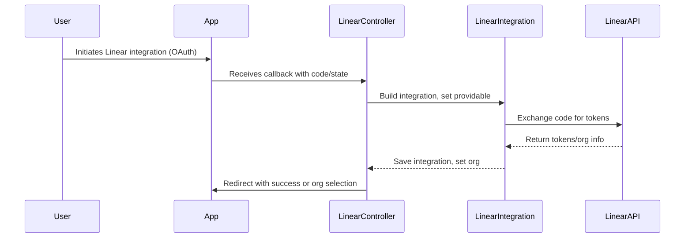
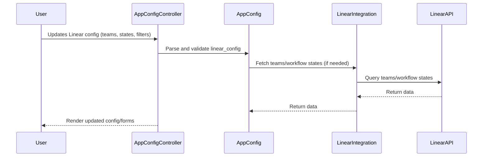

# Discussões da PR #852 | Projeto: tramline

**🔗 Link da PR:** [https://github.com/tramlinehq/tramline/pull/852](https://github.com/tramlinehq/tramline/pull/852)

## 📊 Resumo de Interações

| Origem da Tabela | Quantidade de Registros |
| :--- | :--- |
| `pull_request` (Body) | 1 |
| `pr_comments` | 4 |
| `pr_reviews` | 0 |
| `pr_review_comments` | 0 |

---

## 📝 Pull Request Body (Autor: devin-ai-integration[bot])

> Closes #851 
> 
> # Complete Linear Integration Implementation and API Error Handling
> 
> ## Summary
> 
> This PR completes the Linear integration implementation to match the existing Jira integration pattern, adds comprehensive API error handling tests, and resolves CI failures from recent error handling consolidation changes.
> 
> **Key Changes:**
> - ✅ **Linear Integration**: Complete OAuth 2.0 flow, team selection, and "done" status configuration
> - ✅ **App Configuration Controller**: Added `set_linear_projects`, `parse_linear_config`, and parameter handling
> - ✅ **Database Schema**: Added `linear_config` jsonb column to `app_configs` table
> - ✅ **API Error Handling**: Comprehensive tests for 500, 4xx, token expiration, and network errors (Linear + Jira)
> - ✅ **Cleanup**: Removed unused `release_tracking` functionality from Linear config
> - ✅ **CI Fixes**: Resolved test failures from error handling consolidation (`Installations::Error` vs `Installations::Error::ServerError`)
> 
> ## Review & Testing Checklist for Human
> 
> **🔴 High Priority (4 items)**
> - [ ] **End-to-end Linear integration flow**: Test complete OAuth authentication → team selection → configuration → ticket fetching workflow
> - [ ] **Linear API error handling**: Verify real error scenarios (rate limiting, network failures, invalid tokens) are handled correctly, not just mocked tests
> - [ ] **Configuration edge cases**: Test Linear config parsing with malformed data, missing teams, invalid workflow states
> - [ ] **Jira regression testing**: Verify existing Jira integration still works correctly after shared code changes
> 
> **Recommended Test Plan:**
> 1. Set up Linear OAuth app in test environment
> 2. Walk through complete integration setup flow
> 3. Test error scenarios by temporarily breaking API credentials
> 4. Verify existing Jira integration still works
> 5. Test configuration UI with various team/workflow combinations
> 
> ---
> 
> ### Diagram
> 
> ```mermaid
> %%{ init : { "theme" : "default" }}%%
> graph TB
>     Controller["app_configs_controller.rb<br/>set_linear_projects<br/>parse_linear_config"]:::major-edit
>     LinearIntegration["linear_integration.rb<br/>OAuth & Setup"]:::context
>     LinearAPI["linear/api.rb<br/>GraphQL API Client"]:::context
>     LinearController["linear_controller.rb<br/>OAuth Flow"]:::context
>     
>     JiraIntegration["jira_integration.rb<br/>Pattern Reference"]:::minor-edit
>     JiraAPI["jira/api.rb<br/>REST API Client"]:::context
>     
>     LinearTests["linear/api_spec.rb<br/>Comprehensive Error Tests"]:::major-edit
>     JiraTests["jira/api_spec.rb<br/>Added Error Tests"]:::major-edit
>     GitLabTests["gitlab/api_spec.rb<br/>Fixed Error Type"]:::minor-edit
>     
>     Database["app_configs table<br/>linear_config jsonb"]:::major-edit
>     
>     Controller --> LinearIntegration
>     Controller --> Database
>     LinearIntegration --> LinearAPI
>     LinearController --> LinearAPI
>     
>     LinearTests --> LinearAPI
>     JiraTests --> JiraAPI
>     
>     subgraph Legend
>         L1[Major Edit]:::major-edit
>         L2[Minor Edit]:::minor-edit  
>         L3[Context/No Edit]:::context
>     end
>     
>     classDef major-edit fill:#90EE90
>     classDef minor-edit fill:#87CEEB
>     classDef context fill:#FFFFFF
> ```
> 
> ### Notes
> 
> - **GraphQL vs REST**: Linear uses GraphQL while Jira uses REST, so error handling patterns may differ subtly despite following same structure
> - **OAuth Complexity**: Linear OAuth flow includes organization selection step that Jira doesn't have
> - **Error Handling Consolidation**: Recent changes to `Installations::Error` hierarchy required CI fixes, indicating this area needs careful testing
> - **Database Migration**: The `linear_config` jsonb column was added via migration and needs to handle existing records gracefully
> 
> **Session Details:**
> - Link to Devin run: https://app.devin.ai/sessions/2475bf8b7a7e4ec495031688ce5a2cff
> - Requested by: @kitallis
> 

---

## 💬 PR Comments (4)

**👤 devin-ai-integration[bot]** comentou em 2025-07-08T03:31:39Z:

### 🤖 Devin AI Engineer

I'll be helping with this pull request! Here's what you should know:

✅ I will automatically:
- Address comments on this PR. Add '(aside)' to your comment to have me ignore it.
- Look at CI failures and help fix them

Note: I can only respond to comments from users who have write access to this repository.

⚙️ Control Options:
- [ ] Disable automatic comment and CI monitoring


**👤 coderabbitai[bot]** comentou em 2025-07-08T03:31:44Z:

<!-- This is an auto-generated comment: summarize by coderabbit.ai -->
<!-- This is an auto-generated comment: skip review by coderabbit.ai -->

> [!IMPORTANT]
> ## Review skipped
> 
> Bot user detected.
> 
> To trigger a single review, invoke the `@coderabbitai review` command.
> 
> You can disable this status message by setting the `reviews.review_status` to `false` in the CodeRabbit configuration file.

<!-- end of auto-generated comment: skip review by coderabbit.ai -->
<!-- walkthrough_start -->

## Walkthrough

This update introduces "Linear" as a new project management integration, parallel to the existing Jira integration. It adds new models, controllers, API clients, database migrations, and views to support Linear OAuth flows, team selection, workflow state configuration, and release filter management. Localization, routing, anonymization, and test coverage are extended accordingly.

## Changes

| File(s) / Area                                                                                   | Change Summary                                                                                                              |
|--------------------------------------------------------------------------------------------------|----------------------------------------------------------------------------------------------------------------------------|
| `app/controllers/app_configs_controller.rb`                                                      | Added Linear integration support: config handling, strong params, and setup methods.                                        |
| `app/controllers/integration_listeners/linear_controller.rb`, `spec/controllers/integration_listeners/linear_controller_spec.rb` | New controller and tests for Linear OAuth callback, organization selection, and parameter handling.                        |
| `app/controllers/integration_listeners/jira_controller.rb`, `spec/controllers/integration_listeners/jira_controller_spec.rb`     | Refactored error logging; updated flash messages in specs.                                                                  |
| `app/libs/installations/linear/api.rb`, `spec/libs/installations/linear/api_spec.rb`             | New API client and tests for Linear OAuth, GraphQL queries, and issue search/filtering.                                     |
| `app/libs/installations/linear/error.rb`                                                         | New error class for Linear API responses.                                                                                   |
| `app/libs/installations/jira/api.rb`                                                             | Refactored constant names, error handling for 5xx responses.                                                                |
| `app/models/linear_integration.rb`, `spec/models/linear_integration_spec.rb`, `spec/factories/linear_integrations.rb` | New model, factory, and tests for Linear integration, including OAuth and API delegation.                                   |
| `app/models/jira_integration.rb`                                                                 | Standardized error handling and logging.                                                                                    |
| `app/models/integration.rb`                                                                      | Enabled Linear integration, updated allowed providers, enabled project management category.                                 |
| `app/models/app_config.rb`                                                                       | Added `linear_config` JSONB attribute, validation, and readiness checks for Linear.                                         |
| `db/migrate/20250708032409_create_linear_integrations.rb`, `db/migrate/20250708032410_add_linear_config_to_app_configs.rb`, `db/schema.rb` | Created `linear_integrations` table and added `linear_config` to `app_configs`.                                            |
| `app/views/app_configs/_linear_form.html.erb`, `app/views/app_configs/project_management.html.erb`| New/updated views for Linear form rendering and conditional display.                                                        |
| `app/views/linear_integration/_team_selection.html.erb`, `app/views/linear_integration/_release_filter_form.html.erb` | New partials for Linear team selection and release filter management.                                                       |
| `app/views/jira_integration/_project_selection.html.erb`, `app/views/jira_integration/_release_filter_form.html.erb`   | Refactored layout, info tooltips, and safe hash access in Jira selection/filter forms.                                      |
| `config/routes.rb`                                                                               | Added routes for Linear integration OAuth and organization selection.                                                       |
| `config/locales/en.yml`                                                                          | Added Linear integration localization keys and messages.                                                                    |
| `lib/tasks/anonymize.rake`                                                                       | Added anonymization logic for Linear and general integrations.                                                              |
| `spec/factories/integrations.rb`                                                                 | Added `:linear` trait for integration factory.                                                                              |
| `config/credentials.yml.enc`                                                                     | Replaced encrypted credentials blob.                                                                                        |

## Sequence Diagram(s)





## Poem

> 🐇  
> A hop and a leap, Linear joins the crew,  
> With teams and states, and filters too.  
> OAuth flows and tokens dance,  
> In forms and configs, bunnies now prance.  
> Jira and Linear, side by side,  
> Project management—what a ride!  
> Hooray for new features, let’s multiply!  
>

<!-- walkthrough_end -->
<!-- internal state start -->


<!-- DwQgtGAEAqAWCWBnSTIEMB26CuAXA9mAOYCmGJATmriQCaQDG+Ats2bgFyRUDuki2VmgoBPSACMxTWpTTjx8XADo08SBAB8AKB2gIOtAAdDAeiYZcFfABtrlRCaOGA+uYBm8Iolf4LV25RKFOIcWgBEEVoAxFGQAIIAksRksjT0AkKikPhujLCYpIg6cCR5BSTI8H74tNgMpQLG+BS4kG7N6JDkfIZWAFYkDK3MmGikbBYoFiREVLjwvl1obPRhADJVJMJh6Na+XvAykLiwpSQAHkjzGESQAFLwVFM0s9QLGEqQCVgnpQAG7k82AoJGcvXwAyGzhGGDGJAmuD+kDYJxqABpjqdGDVShh8HxzLRFO80LYpKTrMg/ogSLhnNZNsIwf1BrhEEj4LkNuRhM8ZnN3sgLlcMVV0LQifNFgRMWdLohrrcHk9wZC2fxadhDJ8SvxLPtIIZhMtafY2h0/k4fBgPEQwcbmOz0CDIBcaBgZPQZYZKMxFJ1upA/gyeRRrbakeQFXQ9RQ6rhgSQMX6KFYKFVbr9+Pkfdlcn8+o80OHPEieIpYJAANYkETIdoUDV2IYxmjLRAYtvMbE2oEC3wd7gkOxoGnHKgMKsZjGYeggkdjjzWGgURBKHRxLokPgo2A1IM0ukhrZh1Wsp2oNAS1v4KbE0nwABepVnhvwhmw1mopSz3JPPdtYE3kWaUsScADPGycQ1U+BJWjcWkGFOZA/15WhqDQNorG7LMzyGZFRnGdhDSsAA3Q5KAxMgBBBZAs2DRkw0BIgkXyRBK1QKp7wZZ96HLE5IBkNw0E/VoazrdAPUgUjSWwCoZykxRUgqbJSMoSBUMbLs6NvQ9BJIYTRMgMJaF8UEFW/RAdnEUcY0WHhmirNw9j4CyaGQEYKBrehR2xZhDDsNIdSxZiUGQRA0DU+hOTKG46AUr0QuBEFJk0iDblQC5DHwGl6AbSBsDHMVyO3ZAOjcYFfkbcF6kQRAM3XLQAGV4D9L8KGsEQZy3Pg/iNVdQWPJlmKRXd9046panqL1dLQBDOsNYQx1fPEKBGHifyxKomD9G4NMY9LFqoFEzTcbDZSHABHOSFQxcw1JaDMt2jdJLHjRNkFfBhR0VCR8BsLYsGcsZBx4BA7DaeBl0oJ78DwKYZIZOdhy2RcoZXNdiixPqlroZwrWY+1jqdMbouQLV0LSY5bzYChSAu/rcv20NDqqGVcIdU1VwKpn8opt49qzcDmMagA5W9hQVJ69iIeAGHNRtlUwjp8CqvlXilDBKk+6GQXocRa18HyJSetLGmylopiOilh0+ABRVMOnyD0Q1uL7fH1aw2hcocRjFcx6ujSZ+MrLNJd+o1cBXIGOjw4ZCPhYi2f5YCtcamJ4l11OdIumQGHa7O81dc4Lap2PsHEBl5fYYkKh0KAAFlaT3Y3PS4P4hI1I9GOZCFzw5LB89HKk4mMABhXxbUQCfqgCCgB6DJwzA9/w7FXRxjBLLxrU9tegnEP4tEb5v9yvNug07xnBp75iAApmIASgXoe6qDUfDBnqeZ93ygF8tYxl6zzXg4Amk9PDeHMD/Cg+9D7H1ROkTwsIEwun5mkdundmKJl7mqaECcETPy/K/P479P7gO/qvX+Vt/6mEgRQ9eoDezb1oTYPewQkS3zPjGQkxJfCkkYBSamB5aT0h7nHdkD8j6QCbvA/giDqCJgKoYSmdB0EGXQJvQm/V2wEOHm/ceYCvDkJYZQsU1DAFQJARogxECV7GOgWwyAHDrz0B9GtRQVMtGOgVkGIaTEDF/AkXAlusiiBIIUaglRF81FX1oPjKxjCibaKti/Ee+jGHT1sXPP+S9mFz0sS4ZiNigGBAcU4z0yJKCyz2jkI6TM0qP3CJEI++gtA5MycAkwycNbvBEUHewJhCxUB3nQ/eoQIhhGiLERIyRyBzBjBkTyYgalIXKEULQupKBpkgDLKpGUfhYlogwOSEg9iTiLvRb6tgbKTlGifPivkVlxTyudQqT0/gACVVCUiUDswImzmi3xIE/QRmFLlexlH8Yc+AiCAoxHYNS1guAcH+RQJ+nxxbZDVo8wogisy5O9viKijtGzO1oK7DEHQZZy0gDwSgpQRgyEajoDOcQs6axzlmPOBd2VFyys0Mu1UK5V1dBYWuazxbkHXOM+uLS2nFPXl0/sGBenun6b44ZdjRmNImSypIpBZnfnSIIRZRdsV1y0JuQMuS16MEIVSb4LwlUbD6auDgHBNJGKyWFZ4VgprxSmKcdMv0zosCDA6lOmtnWqooJ6tefxYKtCEpsT6QYwXXKrEiNAQx3iYmoJAUldhKjTG6YsBgIJU7eMwmlOOBFYREUmIq1OwUXzZsWB4VcrREaHEshdNyJAADcKBchVC7bQUUrQ9aPHPDSisklXTEt2JQZQXxWi/CwNQGg/l1QynENgKGPkerqyVegOq+AGDwENTOgSeLkrEXAn2jEh5fqKGQOCci6FK4vijumXdNBpIXs6KcawriKnwNgrkXCZFu2fsgK8CwyAdoBVNOgBgtVPpSSzI2zW/BIoqQEKhioiAKpknHUOIkIIhjIBDp0fDaGuiqzliQT4AB5Kq5YaSkaQoMKs9YOiRS+XICGzQiCYCfNnQdMU8TkGLiKFAE66BTso1eysmFEA+nPR4eWpIl3oHEHDYYSB6rVLpqJx82cqKUlKNRzC+qYbyywzmstWxsMos+HEDAYgLj1EMDy2o6ZBYIFfVYOjwhSi/J8lJWiRkxSYUnRR1o1msAosXS0RquprXqXwA9dMMgU3ghoC2egpMgxvug3YRJjokQylpvTM+PDYRe08VzRAXBMIAhxJmqSmAgzCdM6nZwhwkRugnFTENOEDkkGuhUVoTWMZuZIvAGSf7iuQuJQAfg5MgJN5AZp5G494yDFQyD1CLt15Ls3MuNjO1usQfb05TLZYKXFWIuXGh5TUvlLQ7KCsrtSmu8xzVQFFtuW1ujOG0HbuGktGAo0pFde6xisaTFYDMRlhVxalUqrhw4dVaOYGSIAApCupcV8HqjchpqzRm5Jdqw0Y9TrD2ZLWEehiR/PQnVgCtU1J848nJEstldBJ4i8g9ad/Ch06q42O3Uevab/Dni3vygeCWTqJuQUUbZp7o8X9PI1S6ZzLxHcv2fSuaWAAwACGTiAcFUCyths4DKLBveAWrpW6pmcpI1mQlkU+doULGpQiRuFyCCYSQxmh0SxEreIBOEi2vgMRSQQ5YS7UzCFAcuBMCtD+AAETiNAOIVXbx/AANJ2wAJpNSRPlUPdKMDnr2jru3X52VuveRUbKWsSBupL7WdkCbkRZZUpywY3Kns1OY3EPAsAwDzkvQAVXeWsZAt8/iT/n9AAAEs4OIY8x52yak1Zw0BmNl9Fs4RfaxOv0GIXvg/TUEgACE1h22cO8g/zHF/76P5fgJWFQ224US9oZiBSlq07sxYgECGBgDwrDig6vyIBMA+hua2D8K2A5y5755xBKCWCYBEbNDMCZooJKKXoQpl6V44FUBawNiEFWykzIAFpPQ1oMgKiDjzCTi0gajCBcaDivhuSFTFy4GtofCQA6DfAXSQrnCDB4AkC3LwLdSBi9CK5/pAYgZ/DOAACs5w5wmul4zigiMgXOkAm+0A0ABOkAWh5wGoFAD086Wy/BCGOIa4MAWIxWeIfAVASAKkNmcO1KTeme9ureHADsaYZYs6eIFSdUcIQ6F0tEneY4Dh3qmElhdhzQGIBsDYpQjB1SWKDIxEyW30NI4UdQKmyAAALAAAwACMkk9AlRZRzaQYmh2hmuxWXGk4lQuQqmmeCYjhRwqABsuAtKZAFhFRFRtRFhAAnJMVMPnK8mpGLLeGap9C6Ayj+LeLhMTvLMVvVKEvIrRNkFpFiEPlQKgfis5IShIPDMltkRlEKOcO6OUjKFlFXIoAtJ4WOIsDSDYepCis4eljiHqCIBDKgIgAyEQLALgAtPnIDDGEnrMHDIYE9AHJnvBhMXVgFlkcOCBqTPdpnCuIXBAYHqPm9uPuriXPyt9oaFsSKvMADmslADPBZJMClCaBDkGHngXkiIAEmEQY5BVeWuRC3wze2cbqSsbqo88AsCkATJqJ6ozAQ+zyoaRmRAoBouuiMoKS/ASB3eQY6+W+O+d+h+x+p+ds5+v+GIt+3+D+z+r+7+TUn+7y3+F+S+OiQpWsARLegoYpRYEpSJ0pBO6YS29Kdy4o58HcaizROh98OIwK/sYuwpnpopHA4pHAkph8puEA5urSlu8A1unSHpFIDuvizurukQ7utmcyXuJqyyfu5qlqIO7yFcYgCptQEM/hRZQRmkfpUp3qbMvqdQN4fII2ymF0aUcQsej6WopcT0k+0+1MNYWAMIcICIExAA4lQIYLAAAIprCQBTbpgVAD7bTWDYC5bK41C8aNj4DiCZ5cR7Svih60QIB7RzkCRZp0YECLnkwqk4CojphmbYbSDeGRYGTPkLnUQYhxGsiLbDhdQSBiDZRSyCy3iaQADkyAb5oc+Ai5IqtA2UbMo5+cCekwTmMgoqpIzhcE/O763h8BHkoZMoCEuASEhxImGAYmPKw8Z6F6VMiWKGn5OFIx5EmEmEG5RgO5e5B5IgjUiZmAJ29BuwPs0lpsB02kExDkXkFxrkPR8k44eBNBT0WYUWy4P5T0qm+QesgkGE+l1BBBFaeAUMigMlLhpQWp5s/K4UJ4SET0hmN0kMuscJYgXYXwOeEx84qMpQS4GMd0GecY2aD5xgVgShSu4lW5u5AVK4PYkoT2NkTMiwX4BsXsfBulmV9gCUQ4yCHFgsVB+Ba0MYflgeGEjRaVklxc0h2GxWBaKkJhZhf5pwoq30msGIdwDpostS044VqgRRjAhUBA3YfxB2QlSWJcRYw1Q4iAcMFAJ2eI8EcMHoFK15asE5cefxjUaw0KuyfZ9ep55S+UBRtk6G9AMgu6RAV1rVGVcRA4R5rl9FPMdFShwZ+a2J6kO6e61geU6M6k3CPKY2Q4C4UVUNq4U5TQj0e0hVcBJVSuuAIgPovBUkPAwgWs2QWA2AWs05lJkNusxwuNP1uoJxAiuWiCIq30hgAgLeKk45sew5WaPK1GNxs45KEFS5eC7AFVlMmEuBdla0TaOgzKD2BJPKRJ+kQ8SqZU5JpcVJH4v21coq9J9c8Q+hWpHZgR3pLOJ4PZYRJwoQkA6gMptO9BNtttdtfwpAdIH5hGzgX5ZAMZMgUFCm8WzgwI8AT8WgztLt+AIkJwzgT5FQsAXty1t8sd7ECdi5/t5GrIQd6Yod4dUArtwivWHFgFgoHCBGdUqdZAOddtcl9eIZ8CLWYdztedXE8wD4z4t8kd0++MZd3g3tGAVdtted2kt8UtdVIw7KA9LtmlTkLkzgfaiAI9tVNB2ck9edNI3B8djV3gkgzg0V9gI9WwzAA2Y68NkVu9SNbBS99lE9h8g9kAgZyhpQtuqJCldyDdudQYFwHVoIrwW5l01gt80lq9QYu6+659us1oOVA4B9ywx9/tCN4DGModmZsquZ+Zz9nZgoJgJZrmwQYy5ZUyeqcOl6CywgPusU/uFqh6BRYu3ZwRxKm2PqNQg5fEFYYo9EclptA4o0zDdgooGAgaxIe0cNJtXpA4bqIRzQ8aK6jhHp8VBAV2BGPmKafwX1XezgemtAIgSIF2FAVEDxI26GzoVA5DyWN5ao9Y509EYQfxYQSI4kFVTAAQSmvwjwQYYQbAURpAdjkMw4tA/xyEIZXj3hLo5gQ1ZAl6bMt4qmIBDQlgT0NIWiVMSeO0IwVFuQERnjEUOKoW5oZNJ9mEQkIky4kR2T/w6wB0J1qRFAPjqAhUdAjRJlv0WT0RqARodUQ5WYjQlAWpKJ8jfGewe01mkMUhyMo4XxIgzAemXsfwHARg8AzgKK8actky+JqQT2ytr2atvKFJX29A5cOttJYqBtY8tOquAItOdDkjjYwAXwhZXDWsEjDDVCS8VuNu9zYjWs2DjEJguDB8ki0iKuvOaud4rdG0SdHe31GjNQIgcZ6pRCVzzzpirzeZ7zIp7K3zoYvzxK+OKD2ZS8rZw4+SW8ZZOqhDHuVZ/AxqZDpqdZayuoxCaSEYg+MgXshN9xjxQ5HllsmEgYo1zGosj+6A36eZMhPiN8/iuw+w9URwYc8ov0BYRYW80jAAag+JTDmuy2GTGPlAxKGMq6fbZGVcjZJKSNCnDByliOHE9NHhFUa3vdzKOk2r9X1CyFCMufWnSOWlo60aGVq62ZyAnrtt1ccA5DTXjUXDWh64nA2rrt6fcEWBMZpAPu4Xth0QdliL0EdrXRMYhoFCkK/DUnqyeAazFFWgdA5osKgO0Pk/7VVU9N68msgHlXZPsqUFmzSDmzUjSM2FTOpa+CFZgmrY0ba1sESFGAhqcGciCH7MTWTWavrPDKgKmzDSSF7KBO27RMdqUDUphNHpWyIQkBkyQBWOpAe96h22LRdMViCFVfWJRUxvEIeoDUrk651aGcW0yHazSIg/YGWL5ODoItRAolsKxQ61QrjgYgANphDfuggOtWQAC6jDmEbElYwzo64bL4XWJE2bnaskSYyIjwaYRlUeibCH0k6rFaVKDATKqzrKitGzGxL2JJ2zH2uzAq1Jhz/2CeDJht5Sb7jmFI6a7cb7pQHA6qcHv7JrnIXAYAGgkAAA3tshK4wgAGRKBEgwqwcoy2TSdWQPxKCXsWBraQAAC+bpqSH8kryLAChLlIG8BSBi+OjcNQgbMYpMfOccuCdaMbXrY7Iguh8LVnpCLELzdnOIDnDCtoMCgi3LrQaU57jbE7abPGUrNwMrpQSs64UAcQ+hnnILknunP7CHlnei1njC2SEXrLxLIsDi+Ugne0aUcHxrmMeLFupg9n7zjqTaeD2q9HRDBqVMpDWQtZqyAedOPXmsPDrLNKvkESu2J5Z5L4z7UGMgWktNlpmkEuqcfw/DF0LBrQu7tg+IMYfwBO7yzGKrCQOeds7yx+5eBOB+0jE8qYkLHoIB8F9EcQawawzGAA6nbDns4AkKLNAHbGue8vngkAK0fgAGLMb3cTkE6sSjjoe+QBseBDlnxBjbdxu+BF4SFhDefRsIg+PhNEDNBiD5QCIBTUA0GUfphZ4tZBgLDsiWmzhWCDYVUAhWDl10+4A0HSN5dQMNadSdjYw54JBNRxC2nA9jz54Q+I8JDPc9jMkJYPJ1lKndhLfju3B/DE9ut0ik/sA+MyjXY+ZiDCAmNUTB4wUIqeawi/aYn85qi1ornEQU9U9HrZzoq3iqyBrbLQrUodCCelp0s0p0oESMorMsqPYDjPbEmq2Fzsea37M/bCo8eA4ykZ5Z5BgXdXc3d3cPdPcCnxna47fTfhedeRfdcRrvCxcLcgoSjuN49TfvB2M5c5+FmTDEK/cA9A8g9g8Q9Q/QAw+izw+I874E4o+Cn2r48YBVc181cFnt++CN8kF9u3i6/lNt/1++C1NtvuMk+i0WDk/fiU9ZC6ts97eLwehc+0C3+vi885TeAC9C+Ggt40GYyMm5+99S8y85ezgBXuDzXLK9Ve5fd0mv0X7V8TAXXVfvvw+AOIF2/+bsH8Bg4n9fOZPZDiCiSw3ZjGaAMQOgOQ5SomkWZDrnANr6O4hkB7UlgNwpYkNqWo3X3ON3WRkcqAlfHNPZzm7kxN+Q5HfmOUuqCZ6UvDR9k1BIAPQ+EilE4HmmTgjlqMWYaPFU1fAhtFqtKVYm5yx67YQQdPE7JWWpSHJjklcM9Gl0MFPQ4aAiLzCQB8xPZqMCpF0GpkGCBt5YhglSLq04afNmc1zF7s0DUZ69xe1TIPm9SehasUBcNV5I3k+RQw1wvyaBEs1HJytvM77YJoIgiFp5/gUKMLsVgUFYhiMXsKwTYJAjQRWQ6JObhQGqq3AZY2yCQbbBcKoAzUPA9RAFCDZWx6Ih4LULfz+DMUkIXtOWDWDZC71mgMdYrrIUtLdD46YiJ/lJC6GIQJhRvOej0XqYkw36slI/tSE1CGA5CLcCXpuz7hKYmm3qVNsNl5oNULA0TIPpckZ4XoYMrrPYWyCRBpCL4ngW+BwDETAoMizQNylOynB7QYo/oTKDdn4bRgrwRcDOkMAWge06obyMRMMPZq4AoOrwo3ogBIG/Vb2wIHbPmjR7Vg+8kfYgsoh8ioZmg/g4KreHqaYhUApyPhDJCZ6fpVhQYcYb0I4IDCGwwwhGrf2MrvcaQGFYyFvR2DW9CBSRKEaEmx4XCqRwga4e2S3pIgPhoTb4eYI6DwgbBKXR8pqHKG+VcA/tXQaR03YSCFgAhKoMeFS6YwtA4hGYSxTmF3D2e17UMqmxboXoNoKaSkTM0mGYj2Io5C3jjVd7Tp+RVvUCnezkyuhhAC0GKBczhixJBs3qSuJgCrCNEqmYKDatFk+hCiMREKMRAiLEQ4CZRpQNEWqJd5odGmFQI5KUGMHTtVRxNE4BSLPR8JbhFjVHm6OfpjtTsh6NDipwJLWA6RZonod5wcIVAn+JyaMSp2kxatAOWYiQiHDiQLNb2h5J0CWKrDeJvWcgJyjjQLGIEjBpyOcamyWGf0ZYVtUOFa3OBJCc0r4QmrmMqE1CvYDYkEUWyiHfJYhSgJZo1GYySDbAOwihnhlRLoQKARIZ8IENuKCIhqrFXwAtFEbJlvBxcQ8Qn1fBkjQUA4fXK0B2TmUkqkdViiJW3HQppGDcKoB0FDy81mgvlfyGRBUhOirhwgnmNEVfAnh3iZYq8qDiDQyVY+CtdZgn02ascU+GtSmocS46Z89avHA2himWK4j6UV4dYsAT2LIIVIu7DzMXDT6cTtawqRSgqJ4kqR2G2MJWJwIJ70UUCXsTHnLELjqCn60wcoXwmqyhlNGvHCYgLRdgNR+uZuCgfAPVS0C+ubuclpWUYHe5aWrAuAMuxBxLhiSHgKMJ0D+B79ocSIOINmjUjt4mAX4llnAR0FbtRUD5LAOexyGlAzYlAciPUAHzRtMKU+a9MtSoyzpDCvoLiFLF1plpca2GEqp8KMbcVz0l6QupxRzQ3dGi3A0rOeWkG3hXJf6LMFhSmDosc0l+WKv5HzYXRepkI+sD7CTxeY/c5lbEEcHyh918a9AENg1OLpfEUYwhGIswFEjwAkMbFPrFxRdA5idsA+VljMB7Tm8sAcYvIpMHyjjCjKh9UGI5G0p6hLIFVLesayCqGsxwZaJSEzxnDGBOoTBPWAZE2A+QRWv6H8FfRlpK1mOpQKpmoyKJpYQotOHfsgCnFiAaO3iOMRSEHCOCNMukskJiKskoVcKWUNajmiTzJ0XymYfKeFVpCiAG2k2G6OqC1AgoCIlwbad2AwCCADY15LolHEVFsgB8MsIUMSiFD159qK4GMH5iehVM5BvNJ7CqP9ERQEI+kQyKZUcRCyreqYQgWVBJRo8KgD8Emm0C+SJgWpkXaSTlBUgogrwNld2BgHICbSJa3iIkGpi/CIVgQSFECs9VBkBTqReoiaSDCmBEghqyJIwIuIZD0kqWrFB5L4CdmZ4FAUc30fQCcwYQk5zlAfJRVvBtSAaNJOWIsEvylCFQ/mW4HFLw6y0tAD9IGqoXUiKUQ2fdLuIqE7DLUhwZ0OOpNWukkVWgGDCiutVfD3TqkEGR6RpWek+x56o5SyWSnMp+jpxjRc9luJpDPiiOlwYmvlBDA/CiAGIGSDtJuAYg2pk1V8G7Lp7U952msB8DjXemroJwaXASdRiNAgZcCUMPEgxyYnli4ZKtMfAn1T4cSDm3EukrxMkSnMwcwLIKYxHUkwDbOy/IlpixLaOT/mUAInIc0Upk5G6zdD5vaBOC30XaebU0N3TQzYL0F/UgnmgqDAEA56hC1NOWkTl2ANspC9rI7NZDCC6Fd9akAoxIAsKXa3nDeZQq6GVRA0c9DYZwrzpyS5YA2cwANmYAsR6F7QzYfQttkS1eF5gBOT0kUX0KGRW9QYWGDg68Lj5HsjMmQNQamASoPAWrtYhMAiJ9WNBJQJCWYDtjKAIQfrhWWIbDcmB5DZYhuGfbCAwW/6EHOoXVTWLbF9ihxBNH1B+ptBZAdbp0AZ75Qe2MFJrmpRHkhj1UiiiYi+jIWPTM0EMsVrk2M7LpdQDPLcaCjmqhoGeoDCGupD+B2wBG8lOgHDwIKb4QaFACUtPkfD1K1o1+KluID9DqhMIBOfPGPE3xXQWZqQvgRdGFgGIgImsWCFrCAJZgaC3Ub6NFMQxmRJgdJOwKsHEG9tmY/4aAI9J2CoAUo63f1JAlUAVDOg/UHxQtMPpNgYKoEPNBRhPZqRI8UVAglcX3SURBx/4CWo41vSkVJlx6XyE6ICavK1osxW6iBX6p4S1pGAMABE0/RGpul/oX9AQCwAY0NlxkefHwJ2D8UC5h7DJqhUSXthnQry2tnOm1mvS/0Ky8gA2nRmRK6UrDd8qU2iLggt02o/6lpFvDzhI66fVLulETBehHpM4Qkf5FExfTVMFcWoHCUwCzIUAIwUgHRzj6MdmJH8rZmxKtl7NZJNJLPnx2Bw9BvF9o3xXwF8nat2S/inuIEtwB2L7xISlHEvBMVmL0kJgAxRMlsk5ljFCeUxY5y3gOBMBHvCwDYqtXBLHFzk+IIN09xUt3JY3OKPSyxAmLjgiojmvRgJBGx6sFIMQEcrNBZgwggyYsDQR2CXLDVQEsQDFCqhP1Po8E1GEd2kz7sF+J6TanVL4qzohYxgNzCbHPkkYAx/ZZhrVADAg5V2vCL2LOMESZqjipQMIAEoIIFqDVfCUtYGnLXCtqhP0EmqlIrZ1rapvFGMClKaGfBH8AfI6GCzpX1BYKsoNxtBXClhYqxXsAOcIJolDsK0r4A9mAHxnODrKmeAsR6Bhi/CqMm5H0NFFmWyssQEUNgJAGqXOxpo0AYEHpjh7HQSAE8fyKstaCzjFVjE7ZixOT7vZ2Jmqv+X9iUm6qzIg6PFBH1yYMgelQ5AdQ1mTzrdpYwfeWCHBixGqE1w0pXEfNvC7VdgWVTAJ5g45a1tVetMQGqvZSkDXV5A91SYAdXUDiwB7Cxd2I2nTKglNqkNQQzDUMDXFUalgTGom7xrN0AvUFQmxVBG9blm0rVjhPDxWUZQrUN9HE3kYKJXwOPKoMvQ7XUwbA8wNmo0TCCBlLROwGkMZt8g8Bf1pwzoKcs2CNhqMTfNTFmmRJ2ofZya8FctyMbfB2gCQcwPBs7zER+aJcL8Egm940AHiumfTNSVsBGU+htISxsqTk0xgxEjRGtO0SrB6YpCdK2dm0DPlrsFoXTE0FcVaC5MjhN1a2f+s6D2C3KsEoOPBMIH6ZkZ46nPGZEgBNRdKVkDUL5o8iKkJAUKPgJBktETF6obUIMWIH81OAt1s6CLQ3jdhSRTgV4BJjjULQpt8QcW88t1kS34BktvgVLYhuklfh7y6Q6khQG9mgjpt89RoqZGkwTzat9WtwQqKzSVg44gATAJwoiwmarkz0WEDAtktWACCBIBgAnGggLALMEODbIxteAUUARIFx7RyIAgPhKtOda6gsZNeelaXNS6g6nqrofARPJnZnLyY9eLXp1sOE3aowVMQAkcDqxOaiQpEGiR7IK0Bx9cDAeiWwPHXt4EakAOHhfW813KsAw4ykKSL4GMqVMwNc7QFlkE3V4tc6B7U9owAvaaViaQsT+nZUIcodX272Y0RRWLBXwh3KjV+tuA08TYiU56kgBPlMz5dFHVnWKHnac6Che1RsGLvhh8EjQx28UH0DmoIhnCm4LNuRAtYLQ8l/AdaPkMy2jAFGwVN0PlvhgtcKOTgIGShSUpeilMJm+EIqUfHPjrAr4gSSCFWmbRSgJhBuHuRLnvQQQM4FvpAjdDYBZ1NobfgHEnnZ7stWQAgC5t2k0TQOlYEYH0A6A+b+5ikInWpDx0iACtUeyLUMwrCb7dY7K/JpQFL3u63lWMjoC7NuIoa1maG1VaxMw0arOOoi3WgAvNQSpH26WYjS6FI1KRdsWYbTYmpY1SRTI9GYYJoN9HcaZJOG5/WKhjmlFmt9edlHdGi2DgOgrZT8EeRsmib7VnqhwLmoGwL8LFUnB1louYCBrrVDi/BmSxU1dT5kbijyZppl1zSrMGPTQS0JlCqy4KAlQjBIQdZ1jKw4kMyi7w4NLByIImbDO+FSAdBV8GnP/DtAUAYjqMHcUsBm3+A40fQnSv4IjDkhZL4mkMotBdBiUJ4Iag4HQV+Bj1gjWgLY8acFHqF1lcOakNEtlHdA+LFqIY3g4cKhicS/QUIvaAIbbWi901r40dbDAgzYxH8eAVFWbvYD/s6VYedhdrznQGjNgJyEwQrG7DDNh1wgIgIIGIjm9kQO059TQEMD840MXALMI7qSlFp1em6iLD5GTEiib1n6V8XiqSL6FUJmENohSAqproLoFR71KOvmTWC3scFGwzrAxgXRziPsGpH0eCN7Rf0uHb4s8ouik6B967PAB+C61SQDY+QFPdAgYnX7CSt+jDWSQf28buOeGnQG/uE0yp8WACCTQ5IIOsiz6xBy1eQacnKbpkNB6sjS2jWUMGy+qx6FSM9VNEiDSNEg2QeDWMNu14SkdbTuiVvKaQRAVcvlA9Z+7IqrXZTAxt8Q+8gKAK51tRQ9rKNRR168UbevbhC8xhSNdhO+A7UPweeVQGQOcGkYFK3lW43nTqyMP+NvEn7PxJVzSW9LT0jas7qCd1hOg80XTdTO53/WMmB8o6lNHEvwi0BkqpkHgDHDHXGssO7o2RDcCEyFCsA6wOQMODRA7Aimu82mRMb+XwQka3ItQ0/VyB5Ks56u27XRVy1Wm/GKhjU1oasyzpMIugkgHuAqWNgLgywPaXZvzSHByKvjCGoIk8hzj5lSNV2dNnkYN9+OaaztZhD6PUqk4VRuUjUa1OwhvIKAcwECT4YoZsMtpiqhEXqjPhYqjCAVVqZdkbof0YrdmOmDerqQ92/GJqL9J8xlmc0NOhUuRBd7sm8obylGAiAd0RHFgiOiSJLSoD1jizj6ulZ+qspmsMucy3IW8qx7GHMT66b2BcB7B3lZkV+1+Tftzh36Tjn2R/Xxpf26qQchaoEz5KhgvhQFTxvTi8YIIQnFNS/cTTgdgVMhpNSIWY7cBHNpGozXJsMzOyHydbUV84kYa12uNursDpUf82GGk1e1D6gi3tg3wU0UGnFLklxbQfU1vi1k/xg9YavjXqEuwWFlXV+YcUxHTVsJlc/CbBVyCw8emodg9OWBGbEDgkP7XNoqpF6L6u5zoNifPZ96HijRQpTNXW20Ub8FJ8Vvq0UU88jkb3CwJYpLYjRiTOcLRinkJkLQaDkAefKdTsAJ6JtkMDtAtuwyHcdY4KEeSIxSUYQER2kHAdRhB34AGtcXOTQmvbD2wId9Ojy96g3mdNNza0bkTyZJYKm0gGFpJE2dFZ/oB2l1QtP+nqgZzPRNSOfK4utwq7kA7RmbfMG2mnlZGUCcyz5qNhWWc0M55AGECm1A65tOwe6v5a7CPo9w5YIZmPJu0TyHLPcCWgiOnraUFhlkFEe0sDGsVmrAYuUwFc8uNXWK/V8ebpXSL7VdsEVkWNRcKRQdqLhwRDppzMiDX3I0jI9vRhpQdWdKPacOApCZ2W9KVQ2hDebu9TsR8QIhTcAgGvB4CrrfaZlbVmMAnhOiR1/tg4Iq20BzLFY6KUvq4EJxqrcu9EwhxxU+nnoo2N5XjhXRKV8Qn0T3bcEKuuaIYQl0U4JBEB6WwUYgPK30ZkHXzPApAbmKBYZ6C7BQ9seVuYOEsiNVLKUbuPqzq4jD9ORBbMbTpjCPDfTM6+vaUJ01Jq2ma3HVh0EDAIdkZVgbABCX0yvjDDfjH8riGmxndtz/jLRYT3kO/6wISElKn+lAtxW9DnwWba1E/ACE0cDBQWusTequwJiVNt5dscigLBVwMyxzWu2c3Lhp9AlFgEaCkmz6KriwM7etxfnx93555449/Kw3Xnzjt5vifeYFuMbzmMVo+lFZwtBrvzsA+4z3EAujlgVQYW+DQQ4BwoerGEYu7NTUus3NLBiDgMChWgSweNeUFrd/MbApIMD7XLQMxDMAgyKK3ySZvYvryUH6BXxyNTWQ02UMNk9eUQD5i4Q93D1AVf4F3bIo1xKKSgfu/ePrx1iVtIxGuPOAzXWCzDB2plYGGOzT2qYfeyYMht+oNCJdrBJsbgr/QCBrcdJRyiBFCM6iU9AhU+xVJlk2VhmJ9qez/deilzm0Lobrf7zVg6Sw5CffDHAcc2/RUDtIO2ZnhIuDpi1F0b+zPZcSEC9gIIoPAhFdu/UTVge4mjEx1NnBAHWDlI+IGUyb6pJneoYEBHXaNhEA+NzPNmnlgCTSdeZEElgDp7JxJL+x084cYjtfziaP87DRn1w1x2tAVxzAy0i7tOiKgvzD4P3aHvOKhuRFseyRYm4CSce8XStKtzuHu9PWOJnNCnhjAVNQwfIwZgcEA1ygrgT0MIErAOV1qVJpQapaqSQCVglHC9k25Kc0yBG+1fAdFcZAePQCDlRaMJSwwKjMXFZa+ijESJilewLHzhefMxcwwL8vKwhBQiDlAsMPxJ3iCdYxEieMW7BhGOEDRPEvUKc0tGQjMmEMywwTMRdCtCilrMqKvidQELFJGEhQxEwjjPE9hgiQxzuneUM2SCE+Cvc/BNrRNi0xxT5RqnzmI8VJG8O/kKdlUsB/oT83Dh2xv1a1ntGjzKKVdpsvp6sQqf0xDl1eqKPTL9P6xgqWIepPHOOe9PTyZzlIe48PQFPzZv1KNqf1aBg3fA3ImtKxrqtK407iwOZypBIexOUBJVKGF7FrwpQTs2XGbSwG5u1APQefaPJC4rUYOusR0q5w00gBPjZAL43OJyHJKPFkAToxqZ09Rqrpt+Buo4IlzrU4vrYAQcFLeGy5COw7lrJPmI/VqnHeVT+o5vrUkQi8YwgYGlzCuxEiB248TulFFKBtdcfkOdhfruMo6nlx1mkVx6mgMTYMr1yjsgGvbsXLNcu+hKV1etpdYABDsTqJX8APZrg/VnrVV6GFmb0KD2rgahXQF4V4hnA6z94EoqedDAlAdTuqEG8YUhuXniYCN4BAmdhv2Q9CodkxmjcghpSEr+gJa8uTWvZX7O+1466M7zCTeAa3Ne69YWeu05aQX1/gH9fNPrXLqm4zoC7sy33IdAjRxGpG7uK6WniwMC24SY6klgKwRSyeAYuAdlaLblSPeumWQB/ubDfZKCR1IS80d3AfTCpH0nqywZrWSAGuTtjQAV3YrXVpThuQERvrOt/4J68O7Y5ULSINHAkKxAWO5wq74d8NGE5U4+xBOZjE1D3cTvuTR76nCMFPeJ8cMIG299uoff7u/0qjbNrElxyvubkFVMSru4g96b1hvbWt+xXrcnu/1QHh1wvyxxM5ULUQKK+h4OmBu+z9kZtfe7ZLIfn3YYYjwG4J7NoxwE7jyMRw6BytHHe0SONHH+qjn1TirKgAPGgEqcXUyH40Uqrfl8vP5pJKO0K61Wx3jm4ri1yDj7d7RECEh2jxq/mUsJ8QDbVd/oYYW2gTALHmBE7Tzpu1IAHAP9zyUPN0J24F7/XGqkYi39wPE79uLB6uRvv6FSFVoFZ7g/U5eSaOez3h8vcEffELn6j256DDxSYPN8fz7wos8cB6PdbmFTZ9veKzfAwX6Afh6c+hgiPcmkjy0+m4YhXPq79zz3GS8YfUv8j7MrQHEBwDPAcyEwAACYKizXjQhUQADsFRAABwVEAAzM18qKTEvXzma+PqwLfvGqDnxwi98eYE6O2BqAP0NDiYZ+oU0gYCWi22OCkTwPEVx1xq8wjz5jLYVJQianEiNEaFBkuYueUx3MA15i+hRrOVymVhl7vdlfH8E7rR1xpFdGAc/0+/x1qZP3v/HZpRwMflUEYkuUZWiaCnN1F0ZKT6awBg+TbH44QF6FajTYQz2IU8nd/e+Vu8Y1ADQwt3xiIhjZuTbOaav8NpmAh3WBkwefqHev9mawsH8fRvc2AsdgiGk61CfClADy5kh1k9CTwVj6wnJk87y6A+CbLzjd+T//MU9A5ptI9QLG+JJoQiJQ63kHJt6NbLfj0JqkOAVsx4iAZ5EB3+VI84eAkdVhnGrzoDq8NeNYJAFr2146/de+vg3solUQqL4wJQGl4aAYgTpxInO6SNtwRc0dzeu3nkxX1r4fWq/gnWP9n7t8g58nla1CH1VVmEGNFbvPwWmt6gLCbUMAB8UjGxE6CmmSmXp07G9c9H8txq5jEoX8EU4Wcr591zgjKHY0Ugedn4Ek1q+NHy0DjsM0RzJ/EfR2zjMvsV3L+ky3wI/2GE1WfBTQa+fpbPu71ztMgqRm/1NLjXJ6gNMHRXvHCRB3et+IFTgIwQP9Qdm+j2fj4981LqD3/whMIWrJvubxb4GOaeh6Yp9Y7Mfr8ZtAT/S/BV5Yg4K/QrdP7R4NZhmIv1aAKVKv3wh67WFR5kziOKjOUNeNGyeIP5JP0KQU/WkVTMO1an0PRLvAAP29GhPHy10jLY7wWwzvPvFipsfe70bAxpHunpl25N0UWkLrD7xS9+sCH3iY95Y4HR8LIfyCWlEjT9SsJFgBgKq8mAx/k+A1gH6AwDatNXiflJgDdiDBdqZwX6wn0DMCdAsA/1lYMvpKCyHNPtTQyo4aALgGEhLMJEE59fAZMDQBN5CYxgDCKMTjud1ZYpmUAeXZVXDsR8SO3781/E3039s+DN3uAxqP/zn8UceP2ZZb4YAK4Ba/Erzb9dAh9mNl2YUiSQDrEM1xlIGfTAKiDwnRASdA3LHwPfoXaCMVvgjvG7iICaWBxmsCjIL4wkRWFf73wVPaPunYRIfG4GKCI6KOgB8wKOOiB9HEKoKIAagvOmZ9MgloLaCqFMb1iQCfRxGUQCrQjnY0oA6wG6C/gIn36CAg78CGCSvVWC6A2/boO+BGTE2X4DSPXwBZ8u+BuFUDU5b4QkDPCKQJRxZAwJ01hBFKOEUCUAiGCpkrnN5DE4wg/QOyA9TCXi/sneO2zD5Efd+32DYAxC1E0rcEwEzxEAHjEcApMSZm58ggEwO7x8LI/2D8T/ebw8VGDTAF8BQQmVwBC5xBaQmx5dSQLfVUOXyANgd7B4npVFuJlx/Aw2Db3TkjWS7xZ4wgR1z5EpIZ/zgUsnJQB2ARrbNRpDtvJoyHAlXFYl2E0MVtmDFPg89hyDF/ZAGX9vWbjSuBWhFjmQoK0Gf3f1M2dMGICS1aq0OBjTCYizAwYJSEvdIaJW2dMeRenE/Q4GHYGpD9Q8rArMjQr3lEBVQw3gFwP0crBVDaQ1YDalhBL2k24bHA0AUF2AzPE4DGoFkKxB6QgCyycdgS739ouQklVkRttDqGp4kaL6Skw4VeVm3ZzkLEByCPnXLGuBKdeUNag8g2sG9RqQsdFhsBIMIA6DaAB0LYDPGL0LZoaUBABoAtQyn3QCvuP0NKDvvPuhLDCwuoOGEaA+OmbDwLbkMkgkQv0F4gEKIcC1FMSNxi9MCpASA8BRmT/izR/TGwCiUWg6q0RCPMfsLxguw18DCAlw5ELxhAfPulVDz1eYAd5FiTFED4BJTUkyQCUPgAVEF0P8XXdoTFhlF97AqTwl9ZPK80H9pHWX345JXEHCwDNw/sIrRZxKow3N/gX8O58OAKTkkCkQT5BrBtvQEIVgzPGACiDjQ6ASsgNXU7yzCiBXMLsYMQDUOrCpcbUJ3MDeRtANDDgLCPcYiI00NppSIg3gtCRAKiOtD30Z0JIjOheiMFwXQn0FIiB2T0JDNMYO+mgBEIpIOhwUI0cjQisgcSDIjiw2/hwjhwPCPAt3GIsNIihgjgLZoEPEEL/DxDfMFbCu6JsOWofGZ/k0jo6HcJ0jq8Tkza5DFbMnxlzEOhDr5ocHL3Xg8DNHDnp1MQ/xm8YQzt3oMJ7XIUIRKwWQNfp3nNYQgVGcewB9IqANnCRB8ZXAM50VJZdz9Nxwl8gkId3PdyiBrPCYnO5P3RKOSj3IYWXvoQQT+zBJ6wqKi8iQDRjGklWQLdV8gwgCBUaEE3PISkAGfJkLqEqMebk11BEZx0TZFnRgR7oao3VwEQz0Zm23YQVEi3QA7efCDlZ1MHoiexYlLp0IxiMV/0HganRYERkYtYA2X9ONKSQD51IGjlrNPYC8MOpfxQWl8oj+TKM796OMX3Q0BXHZkgNXAnVUuMzIH4JaQLIy2wQEbI0L1y9q7eVEcjBgZyPDVKWNyN+Nz/RX0DBMohew3cApd5Cah1MWzzsQE1O+3RD/gAKMc94cWXHlQDrf51K1FEaGMTQbKXXhnl9pIr3eALrJwG6h6mPRnpkOaf9WE8wArKN1AjowfDOQ6gmuGgd10KSFvcOpcMM/BsaK1gwByIKwAwBVyI+WsF6VevF45zLP4CSj4vcj0qMMY3mwycw2CSzZAuAabTBgo+Mh1VId2RgOwwJoUiBsBrnEH3WjQtedXyMvbPaTB8ew/jChhU/O5mAJyHXGJzdCiQjizAgYh6Hc5I8cU3Tx5Ud5R3M+CXDBTRMOA9iGkkMdyC4M6oQSwDpp0ZWnAhI4dDjhsE3IqMylLYrMExtdpITHVinsO2NIwnYrHhdjV0N2KgQ+LJf3mCH7FtDoxWoFYE3UFoeY0vFkYFcyMYwfHixzQjQemF19I9KSW0xLYYGDdFIXWs3bRU8XNC60ZIc2JgwTYsMN58GmDcHbVWtfKKDAogJ0INDhcHRiDIlcYrFQBMoocmA4XQf0Cil4sKiX9EcQt0WC1zlC5A6xLSIsKmED0DihmYD2exmzCW2RnzMD5UGHWtgToV2x0ASXU4kFsHY6bEcJbCBOLOVIYr2BelI4wVzxR/PYmWnkvdR+K5hBCEbBzQsZD5zAVWcY3GWY5aCTzPNHA86IkcY7If0AUR/UoFvgvJbWGj8gY3yUHQIiV8OFcbzGAwR1WOKkh0kGmbfzMidACyLiM8JZR0m8lNab2+i3JbR3hCyLJ+VaBdvCTmc9GhMd0QDL402TM0XKfBP0p/QQ8BeVU0C/ip4dDZs26li8a0JwRi3XAF0iusZMTkTbhBiM/RM0GHwrQ8jPb3VdxE3PVGMwyerHZc7ASkAwd6bRvA4BS3aRKQ14YIpUEgKXOvB7k61W0wfDJPcXwvMXwqX3X9royRGgBPCLrVAU+Eyz3C8rYZhKyBcPaAT/gmE3CWnEno4djYRLfLQBSSzNXjlQt8DZCK+jVNLR1P8FvMizh5UkkQD3V4ISpMHczuASKVQt7PEKwBtsIlykT4k27DRi2ZYAOFZdDMVjHDuTRsJ7ogfY+LbDDIxclPiesFOI2CIxajEnDWwabFjBFA9uDCBMosoPLpmw5iLWTxksgA4jphVZOmx0PY+h8Z9w2Ck6hLEjpJFRb1QMVYdGAeaI+DsAsxN7le1e+S3YutbJUDjrlZCluAPwb7WtljolBJEc0Evv0FcyE6X3fDh/BXVqTzmBpN24qEHJMe9lHWFKE1Mkjuwsi3mAsmIUvmEsnmYPo2jim9h7Y/1+iz/WNW8k+AMGIhigYgQCUhpIGGEzjejf02dsVYT4JAkuyRiEtp6KbCIQBWKBWUr1KPVdRZgTqY8mJC6IT+O8Q9MASC1JH1Hvlfp66RonjQ3adZN7plqG9wdpQyZeNVtdsNeKfpWgTeNZAFoEYBrAU0D9y/dhlRZJlB0KHKXnJG5SJQIpJgZWXRE5ErKFKiCRUZzblwKRaXlSlARVJNjVU3RCXjRUl6H/EwEVi3ghZhCSWmSWkmyjysPqPchNTv3ZmUWSHU8oTkTa4wwi+QkxOdB9EZlZkllSW4KkCiBtIDQyiA5rfED2texMMJXjdsDOPudsw8YXpkqqET3VAakftgJoTra6zpV8ZA8LgoMQR4VjT9yOSGnF0SQGQN81PD/1bBoZcelpsXWfLw3oBsOqBugNGEQE5s+pF+jrpgkDVKDSFpMNkQIImdMBygFYocQNj/QVxG/5olaMPoB+09em2pKwBZwXSYtY6Q8hqAHym/UBAPSl1i1YJWPXj5MHeLL9MZCUMkxbwYvRdBc5IG0zg7LO+zJFeqcwhBApsBUD1AK4eQ3NMttdmL/QuaOPEWjGdMTliIyxX+xQcvnWiD8TUEljicDQU4JKuiLjSRDf1HETlApdlfK3ij9v/NbUWTiEo61PCG7S6K4kIUrfzujzI9TEoEV+ZFJ6R8ZIpJHtiUhbykTAwClMGAMY4GNaSU0RDBBABqeqDX0qUvdD/RYY3HnAUzE+zgHwM48yUOxO2E7HeDEw/4BPjek5RLlDz3DBUjithcaEDSt+EVBogdUyqkdSgtXwX1Tqea+ipgxpafGhUK0IuX3j2VZ1MKx48YiBu506RTFaBF8BIAqoPrXRgGj2sYaTwVxpOzLJgpY+gEP1GwfBy8TsqerBZ5/QR9NNlLMGIiFg/MgCgrRgKSMSy0qwEOP9E3oO0wkJzMy8GsAxQruGTATBYLIJCjJL2BxlUCGUBvIjzIOJ0hvyWsI9saYwEDBVSbCQhnM0s1zJTTe0FgNuArHE8DCBXxP4HIVlhGRCKz/Qmpgqo9MAGG6xFKPhRaABFWRQ2xLSI5yGBmFToUrcbsnngVBPhTXGOlxwOSE7A4wQjj0COMCYi+zubLtLOTJEyAjFSyRDpLABylbxNzSYtHYgTB5AKHzCgbAJXCdtdjIjKBSSM9BIH9yEhT0hTqMhX04g1fZjPgzJ/IA3wB84rrRX9/bcjK4zoDT0WfCtYC3xQZtALQD0AoASJVOw8AQgBHtUmdgC4BeAWELEAUmHECoBYc5QFUB1AeTiZzwAKAFSZFAY+m8Acoz1Txh25cyEzxLYTQF0BJcyAH69PQMojcANCKogAA2OaEmINCDQjQAqiDQhIAevcQGa8rcsYjQANCfrwYB9csog0J9chgH69OvNAB68yiGYjVyJciAD8gelWXOGETFRXLR1FmKSE0AgAA -->

<!-- internal state end -->
<!-- tips_start -->

---


<details>
<summary>🪧 Tips</summary>

### Chat

There are 3 ways to chat with [CodeRabbit](https://coderabbit.ai?utm_source=oss&utm_medium=github&utm_campaign=tramlinehq/tramline&utm_content=852):

- Review comments: Directly reply to a review comment made by CodeRabbit. Example:
  - `I pushed a fix in commit <commit_id>, please review it.`
  - `Explain this complex logic.`
  - `Open a follow-up GitHub issue for this discussion.`
- Files and specific lines of code (under the "Files changed" tab): Tag `@coderabbitai` in a new review comment at the desired location with your query. Examples:
  - `@coderabbitai explain this code block.`
  -	`@coderabbitai modularize this function.`
- PR comments: Tag `@coderabbitai` in a new PR comment to ask questions about the PR branch. For the best results, please provide a very specific query, as very limited context is provided in this mode. Examples:
  - `@coderabbitai gather interesting stats about this repository and render them as a table. Additionally, render a pie chart showing the language distribution in the codebase.`
  - `@coderabbitai read src/utils.ts and explain its main purpose.`
  - `@coderabbitai read the files in the src/scheduler package and generate a class diagram using mermaid and a README in the markdown format.`
  - `@coderabbitai help me debug CodeRabbit configuration file.`

### Support

Need help? Join our [Discord community](https://discord.gg/coderabbit) for assistance with any issues or questions.

Note: Be mindful of the bot's finite context window. It's strongly recommended to break down tasks such as reading entire modules into smaller chunks. For a focused discussion, use review comments to chat about specific files and their changes, instead of using the PR comments.

### CodeRabbit Commands (Invoked using PR comments)

- `@coderabbitai pause` to pause the reviews on a PR.
- `@coderabbitai resume` to resume the paused reviews.
- `@coderabbitai review` to trigger an incremental review. This is useful when automatic reviews are disabled for the repository.
- `@coderabbitai full review` to do a full review from scratch and review all the files again.
- `@coderabbitai summary` to regenerate the summary of the PR.
- `@coderabbitai generate sequence diagram` to generate a sequence diagram of the changes in this PR.
- `@coderabbitai resolve` resolve all the CodeRabbit review comments.
- `@coderabbitai configuration` to show the current CodeRabbit configuration for the repository.
- `@coderabbitai help` to get help.

### Other keywords and placeholders

- Add `@coderabbitai ignore` anywhere in the PR description to prevent this PR from being reviewed.
- Add `@coderabbitai summary` to generate the high-level summary at a specific location in the PR description.
- Add `@coderabbitai` anywhere in the PR title to generate the title automatically.

### CodeRabbit Configuration File (`.coderabbit.yaml`)

- You can programmatically configure CodeRabbit by adding a `.coderabbit.yaml` file to the root of your repository.
- Please see the [configuration documentation](https://docs.coderabbit.ai/guides/configure-coderabbit) for more information.
- If your editor has YAML language server enabled, you can add the path at the top of this file to enable auto-completion and validation: `# yaml-language-server: $schema=https://coderabbit.ai/integrations/schema.v2.json`

### Documentation and Community

- Visit our [Documentation](https://docs.coderabbit.ai) for detailed information on how to use CodeRabbit.
- Join our [Discord Community](http://discord.gg/coderabbit) to get help, request features, and share feedback.
- Follow us on [X/Twitter](https://twitter.com/coderabbitai) for updates and announcements.

</details>

<!-- tips_end -->

**👤 kitallis** comentou em 2025-07-16T05:19:59Z:

@coderabbitai review

**👤 coderabbitai[bot]** comentou em 2025-07-16T05:20:04Z:

<!-- This is an auto-generated reply by CodeRabbit -->
<details>
<summary>✅ Actions performed</summary>

Review triggered.

> Note: CodeRabbit is an incremental review system and does not re-review already reviewed commits. This command is applicable only when automatic reviews are paused.

</details>

---

## 🔍 PR Reviews (0) e Comentários de Linha (0)

*Nenhuma revisão estruturada registrada.*

