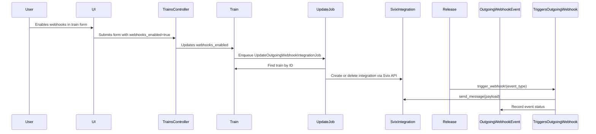

# Discussões da PR #855 | Projeto: tramline

**🔗 Link da PR:** [https://github.com/tramlinehq/tramline/pull/855](https://github.com/tramlinehq/tramline/pull/855)

## 📊 Resumo de Interações

| Origem da Tabela | Quantidade de Registros |
| :--- | :--- |
| `pull_request` (Body) | 1 |
| `pr_comments` | 4 |
| `pr_reviews` | 1 |
| `pr_review_comments` | 7 |

---

## 📝 Pull Request Body (Autor: devin-ai-integration[bot])

> 
> # Fix SvixIntegration Issues: Event Types, Error Handling, and Naming Conventions
> 
> ## Summary
> 
> This PR addresses several issues in the SvixIntegration implementation based on user feedback:
> 
> 1. **Added `event_types` parameter support** - The `create_endpoint` method now accepts an `event_types` parameter with sensible defaults (`["release.started", "release.ended", "rc.finished"]`)
> 
> 2. **Comprehensive error handling** - All Svix API calls (`create_svix_app!`, `create_endpoint`, `send_message`) now include proper error handling with logging and re-raising for upstream handling
> 
> 3. **Improved naming conventions** - Renamed the Train association from `svix_integration` to `webhook_integration` and the background job from `CreateSvixAppJob` to `CreateOutgoingWebhookIntegrationJob` for better clarity
> 
> 4. **Updated all references** - Systematically updated models, services, tests, and factories to use the new naming conventions
> 
> The changes maintain backward compatibility while improving the robustness and clarity of the webhook integration system.
> 
> ## Review & Testing Checklist for Human
> 
> - [x] **Search for missed naming references** - Run `grep -r "svix_integration\|CreateSvixAppJob" app/ spec/` to ensure no old references remain
> - [x] **Test error handling with real Svix API** - Set up actual SVIX_TOKEN and test failure scenarios (invalid tokens, network issues, malformed requests)
> - [x] **Validate default event types** - Confirm `["release.started", "release.ended", "rc.finished"]` align with business requirements  
> - [x] **End-to-end webhook testing** - Create a train, verify `CreateOutgoingWebhookIntegrationJob` runs, create an endpoint via `SvixService.create_endpoint_for_webhook`, and trigger a webhook
> - [x] **Background job behavior** - Verify webhook integration creation still happens automatically when trains are created
> 
> **Recommended Test Plan**: Set up a test environment with valid SVIX_TOKEN, create a new train, configure a webhook endpoint pointing to a test URL (like webhook.site), trigger a release event, and verify the webhook payload is delivered correctly.
> 
> ---
> 
> ### Diagram
> 
> ```mermaid
> %%{ init : { "theme" : "default" }}%%
> graph TB
>     Train["app/models/train.rb"]:::minor-edit
>     SvixIntegration["app/models/svix_integration.rb"]:::major-edit
>     SvixService["app/libs/webhooks/svix_service.rb"]:::minor-edit
>     Job["app/jobs/create_outgoing_webhook_integration_job.rb"]:::major-edit
>     OldJob["app/jobs/create_svix_app_job.rb"]:::deleted
>     
>     Train -->|"has_one :webhook_integration"| SvixIntegration
>     Train -->|"after_create_commit"| Job
>     SvixService -->|"uses"| SvixIntegration
>     Job -->|"calls create_svix_app!"| SvixIntegration
>     
>     TestFiles["spec/ files"]:::minor-edit
>     Factory["spec/factories/svix_integrations.rb"]:::minor-edit
>     
>     TestFiles -->|"tests"| SvixIntegration
>     TestFiles -->|"tests"| SvixService
>     Factory -->|"creates"| SvixIntegration
>     
>     subgraph Legend
>         L1[Major Edit]:::major-edit
>         L2[Minor Edit]:::minor-edit  
>         L3[Deleted]:::deleted
>     end
>     
>     classDef major-edit fill:#90EE90
>     classDef minor-edit fill:#87CEEB
>     classDef deleted fill:#FFB6C1
> ```
> 
> ### Notes
> 
> - All CI checks are passing (lint, tests, security scans, schema dependencies)
> - Error handling follows existing codebase patterns (`rescue => error` with logging and re-raising)
> - The `filter_types` parameter is used in `Svix::EndpointIn` instead of `eventTypes` based on SDK documentation
> - Tests use mocked Svix SDK calls to avoid external dependencies during CI
> 
> **Link to Devin run**: https://app.devin.ai/sessions/089e7435d0d140b89de6c1ed2cc19ac0  
> **Requested by**: @kitallis
> 
> 
> <!-- This is an auto-generated comment: release notes by coderabbit.ai -->
> 
> ## Summary by CodeRabbit
> 
> * **New Features**
>   * Introduced outgoing webhook support for release events, allowing real-time notifications to external systems.
>   * Added integration with Svix for managing webhook delivery and portal access.
>   * Added UI controls to enable/disable webhooks per train and view/manage webhook configuration.
>   * Webhook events are now validated against JSON schemas for reliability.
> 
> * **Bug Fixes**
>   * Improved parameter handling and display in release and train forms.
> 
> * **Documentation**
>   * Added explanatory text and UI elements to inform users about outgoing webhook functionality.
> 
> * **Chores**
>   * Extended anonymization tasks to include webhook-related data for privacy compliance.
> 
> * **Tests**
>   * Added comprehensive automated tests for webhook integrations, event handling, and related models.
> 
> <!-- end of auto-generated comment: release notes by coderabbit.ai -->

---

## 💬 PR Comments (4)

**👤 devin-ai-integration[bot]** comentou em 2025-07-09T11:54:33Z:

### 🤖 Devin AI Engineer

I'll be helping with this pull request! Here's what you should know:

✅ I will automatically:
- Address comments on this PR. Add '(aside)' to your comment to have me ignore it.
- Look at CI failures and help fix them

Note: I can only respond to comments from users who have write access to this repository.

⚙️ Control Options:
- [ ] Disable automatic comment and CI monitoring


**👤 coderabbitai[bot]** comentou em 2025-07-09T11:54:38Z:

<!-- This is an auto-generated comment: summarize by coderabbit.ai -->
<!-- This is an auto-generated comment: skip review by coderabbit.ai -->

> [!IMPORTANT]
> ## Review skipped
> 
> Bot user detected.
> 
> To trigger a single review, invoke the `@coderabbitai review` command.
> 
> You can disable this status message by setting the `reviews.review_status` to `false` in the CodeRabbit configuration file.

<!-- end of auto-generated comment: skip review by coderabbit.ai -->
<!-- walkthrough_start -->

## Walkthrough

This change introduces outgoing webhook support for release events using the Svix service. It adds models, jobs, controllers, views, routes, and JSON schemas for managing webhook integrations and events. New database tables are created for webhook integrations and event records. The release process is updated to trigger webhooks at key lifecycle points, and extensive test coverage is provided.

## Changes

| Cohort / File(s) | Change Summary |
|---|---|
| **Gem Dependency**<br>`Gemfile` | Adds the "svix" gem dependency for interacting with the Svix webhook service. |
| **Controller Additions and Updates**<br>`app/controllers/outgoing_webhooks_controller.rb`, `app/controllers/trains_controller.rb` | Introduces `OutgoingWebhooksController` for portal access; updates `TrainsController` to permit `webhooks_enabled`. |
| **Job for Webhook Integration**<br>`app/jobs/update_outgoing_webhook_integration_job.rb` | Adds a job to create or delete webhook integrations asynchronously based on train settings. |
| **Release and Coordinator Logic**<br>`app/libs/coordinators.rb`, `app/libs/coordinators/finalize_release.rb`, `app/libs/triggers/outgoing_webhook.rb` | Adds webhook trigger calls to release start/finish, and introduces the `Triggers::OutgoingWebhook` service for sending webhooks with schema validation and event recording. |
| **Release Models and Webhook Integration**<br>`app/models/beta_release.rb`, `app/models/pre_prod_release.rb`, `app/models/release.rb`, `app/models/train.rb`, `app/models/svix_integration.rb`, `app/models/outgoing_webhook_event.rb` | Adds webhook event triggering to release models, manages webhook integration lifecycle, event recording, and Svix API interactions. |
| **Database Migrations and Schema**<br>`db/migrate/20250721114016_restructure_svix_integrations_for_trains.rb`, `db/migrate/20250721114017_create_outgoing_webhook_events.rb`, `db/migrate/20250729133903_add_webhooks_enabled_to_trains.rb`, `db/schema.rb` | Creates new tables for webhook integrations and events, adds `webhooks_enabled` to trains, and updates schema accordingly. |
| **Views for Webhook Configuration**<br>`app/views/trains/_configure_svix_webhooks.html.erb`, `app/views/trains/_form.html.erb` | Adds UI for configuring outgoing webhooks and displays integration status and portal access. |
| **Routes**<br>`config/routes.rb` | Adds routes for outgoing webhook resource actions and portal access. |
| **JSON Schemas**<br>`config/schema/webhook_rc_finished.json`, `config/schema/webhook_release_completed.json`, `config/schema/webhook_release_started.json` | Introduces JSON schemas for validating outgoing webhook payloads for different release events. |
| **Anonymization Task**<br>`lib/tasks/anonymize.rake` | Adds webhook integration and event tables to the data anonymization process. |
| **Factories for Testing**<br>`spec/factories/outgoing_webhook_events.rb`, `spec/factories/outgoing_webhooks.rb`, `spec/factories/svix_integrations.rb` | Adds factories for webhook integrations and event models for use in tests. |
| **Specs: Jobs, Libs, Models**<br>`spec/jobs/update_outgoing_webhook_integration_job_spec.rb`, `spec/libs/triggers/outgoing_webhook_spec.rb`, `spec/models/outgoing_webhook_event_spec.rb`, `spec/models/svix_integration_spec.rb` | Adds comprehensive test coverage for webhook integration jobs, trigger service, event model, and Svix integration logic. |
| **Component Formatting**<br>`app/components/integration_card_component.rb` | Refactors method delegation formatting; no functional changes. |

## Sequence Diagram(s)



## Estimated code review effort

🎯 4 (Complex) | ⏱️ ~45 minutes

## Poem

> 🐇✨  
> Outgoing webhooks leap and bound,  
> With Svix, new signals now resound.  
> Releases trigger, payloads fly,  
> Events are logged as time goes by.  
> Integration jobs work late at night,  
> Schema-checked, all data right.  
> The rabbit cheers—webhooks in flight!  
> ✨🌐

<!-- walkthrough_end -->
<!-- internal state start -->


<!-- DwQgtGAEAqAWCWBnSTIEMB26CuAXA9mAOYCmGJATmriQCaQDG+Ats2bgFyQAOFk+AIwBWJBrngA3EsgEBPRvlqU0AgfFwA6NPEgQAfACgjoCEYDEZyAAUASpETZWaCrKNxU3bABsvkCiQBHbGlcSHFcLzpIACIAMxJqLgdubnwKUNi0/jwifHgMIkgAdxIBWHx8AGtkCXg0SABlWoAPaPRaWn9ERGlIZm9xbkiUbuDkfLDYEkaWgEkMGiIqcXwseGYhkjYF6nhVsPxIMlhMBmmSsorK+2wUtM0YKchKknkGE4Le/IYvbCUOIwARg0kAAgh18oVkql0pBMnxMJAAAYkKQLAD6uFk3GkSJ4zjQbBofAmuCeSIY/moJHRZFoqXyuDxRPKtAANMV1LBIEpYmgBkc0aEsTjkD1hYckQBtaL+SJoHoaRC4Zw0WjRDmykjyxV0ugamIUBgaWL5JBTdUAXSRGgMACYQbMNpFtuICgoNv4phhEJJppQKFkPrQvJC4Vk0D4ZvBmmCrLNGJGvMgABQUqk0dGIFrotApEBIjnphKZukMhaF5E9DC0dFsbpoUhIgCUkDk7VoYa8+CIRDDmHo/jAVCQYZIzTO3BWPvDfFuyqpzEgwdDBVtAGZHZ78LV3RhCWGmBghXsZ+3/PvmGGydNoCOsArEPgGHVp3DA0ukdmY+jGSQlrsqx4gQyIXOUVS/gs/7LKeeIDn4ZAHu6N5tmgDCVEs+DYDWkBCII74sMiADCGYkE0MagikABSgjAZKJEliQADyOR5AUADqpTgZU8yLDBqw0QIdEoNuUiMF4zjqLItoACwggAqtwtC7O6SYIfEF5nMgaGBt0fSKNqiAcj0FC1FpHI0MqRnoDhfJiGk8C9CB/ixJEYiTNM5BFJAl6HqsJ6rIgtoGHA0zvJgpDIMw2g7BMAhoZURTOPQTAbLsaihlixQIMM6y8DuYaBgI2DKuQenwT8klZfgsQecUXFXCgUEAW+iCyMqWwgqF1h2N8vxKNpPIkCq8CRIOqKOd58GWW6hTvKIlShsqHL+Kl2ydu6UgUPApoMIBWA1T5SGFC5lBkOZRwUIGfArmGRRcghkbRrGoLxgcLw+hyEiRvAylvodvL8l4oSouwYTYtIHJ0mABBgHS9WXFUYQhJCHLwfF6GYdh9B4QIbYkCctRpMFoI8nUAFLqNvwLtSyAoXK+2IAg3DaTh4WfNpzCrIUKF3jF+lKF4HLkc0vHQftAvasLLQNJQZkkByGMYYG2O4YI1nTSEcKjdIIKglGR5utgWHjM1/FYPN6Haf4+LdKjNn0DNyAldMXPoVEIuNAAIgA0omPh04caASHk9DjsS+6+EoOI1udjlBW4Ty2MUCoIUEIRRO2Lt8AAApU6hJqg8F9X8vT1Ku1wgfUXsTVgoIJhQ2H2NIvr7PCcLYOkUx8Ib4fBRYkBESwrpio40UuIn0yrF4bzD2D+xkh43i+P46fKiMBFLtnkB5wXPhIByRTlGnYxqugCG1CQ3mxB+dXbxSBlUKoBfwDakAAGL4D4+D3chCAaw+PALBqTjSGPIG+hEUJDyUDYFQahQgCHwKEBKGAf5jVII7J4/hL7eVXqfB2TVOx7TPmSagdVsGTR4IGLSyAkp022r2M6tAupPEQcg5MhxUEkJOKEdQPBKDwmYKbSkWx2BPQoVfVm9BaD4F6FwhCw4JpX3QF4KktB5ASJKClYe6hnYYEiOVIB0VxAMAvpNa20xuD8h6MwowAA5Q4sRO43j4J2RADASqtwwByeIdAlYciyGvactCzoISYBQJQ9BSRPDWuwMUohpzBX0MYcAUB4aHX5LDUg5BlhRFiQsLgvB+DCASX6GQs8lBP3gVoHQySTBQHcOMVmOAslkGUGffJnA/BoG8g4JwLg2wVOUM/TQ2hdBgEMCk0wBgADiWxTSRABNEZZBgB712IG03J9A+nj3kIddmkVJ6MA+KQDsg0vKQFIEuaOeoMAMHkNEb8rRORkkgFtLxCgfS4HvKEaIAA/PQkBgQAAY2ggRQtFCYVzIBLV4VgFCczmALJICCBx/AXECx2vAYhp5A5HGaEgWalytjICyFjFm6AbbRSUMFcwlh9bEkZgcOqShKrm1JbVccMIz5ZE8AIUMpj2DqHjvY1YKKjAAFFlTrBAQoJQZjlEkFiPCLpAAZH+BhlnRCMBAMARg8zcAAPSpVSOQBYiBDV/haqedEe0Im2pYKa9gGgKACCWSstZswNk5NlTs5wezaoHOkEcoN6k0jGLpuSQW/5qR4j2lGduLJFDIGjUQWV4LyRWvNniQQIh3LtkQEMdQRKUK8AmibGe9hISRDAKuaYqaJaMiDn0AY8Ba35GmII6gHJYVjjQtyBtZ8k30H2Lo/gRQsB1r1hCacSZZAWXJD9BUdZhqskgBwfKtRKkcg3YGLdKhIh4jrRvLmUh6ACG1D/Fl2oY3/VqsWagB6SAAH44I4QfhgcgYgn2vr6Ku5NzKkSbt+pQN+79sJiFPHOhd9ab1prfPBJdvp3T+EhfCp4iBCQkAANz8H0fIFCXbcBEvgmkSpYZDo3h6DCjtyBCZhROXQWlqz6XA3abi5lKFWUSXZfwTlzRuVRF5dgfl2KjgLGFcGgwDjyDBSleIYxeSDIKu8kqlVXB1VFE1Ssgwur9UpGNasb5X9IgUAtVhXAuRITojAlcRADqFiBh8JQF1brtPas9d69pUQ/UDP2YxxARhSYXMNk50zyIWKWbYkQTiiNqhD0cyZ0DG9GSBloNgM47Imrd2Fe6CBn4GjwCIOQWg8xKJFpxasBLxnnMUDfrMOFPxS6DSRBe+ENI0LTjjUmJWzLxQ2XQCkAVEte7NFCGmHOBqWwsLCkZsLlAhqmjKufZDRBhiddPMiblkY8RH2xdyfw3zHJSBa98mKOaSnuXcfgHEjtDgoQ8VdMGBrIAlX7O+RyNZK2zC9pvchgR8FWKoESSgQVIANY8g+YjWwpx4sECNB8yJsLwHTuibbXh0QVzxPluqZ38gAHJtLdGfK+KISJbMQSzftertUUIV3xYS6yKENv7H8J2VauBI3TG3hm1A4dKCR0gPJGwqqVHdl/nNXSiAwDlHXmz+AHPTyOlp08enqB5FlurLgDkfD5cc6569kyqF0KcaeGWomJV8SnKyPTCooQrGvNTvUPkPh/Fk0LRJWQ/YsABiyPWTDpz8hEJUjzM39wnpMG8PQeRF70AMBoUxowdKwRsd4xm2DbKmWHS5fcITfA+UCvE+EEVunIB2OUaFpLPcJLlQ6HQLgSJItWY4g1KoiBqvzbq01ZEBrDOJdq+Z1i1mKfVAczV0zrmkSl/L95AvYnh0dnr8iXkPBw9eDxBMRvQ+W9xfb3NqvU+DDyZlR05TmijjKvuFwAAsnQeAjh3M6umb3yvA/DV459GPzvrn3UefpV67JbzbZMef1PjY5CKKTbqINbSDoOqJEDgEfezRCflOgOCYjbaYqGgU3aYWFMAnECgK8aHegIHLDYkU2NsJBbkFCJED/NHAkIRN9egGg+8dEW4P6GkEghgv9MkZNFhIub+IoA3V/cLKuePEgKcAhfKGhOAxA2kfcFA2gPETg4aBbI+MgRgDMCjOcJSEPc+D/VFQ4SghbbsPsUxLIV/OEcXDeSMYkRPJPNZVPJldPIaTPYJMAnPdIPPHgETQvIVcQKTBpJ4BfZgmKOg4HRADfLAJEPmfIPffvUzXbVONg9NQ4fAwguqNAGdKDXwZQ4kZEBA1vUfZAsaG0UvbqYI2g5IzMTgiI7vaI+8OI8fZLOhV7HQkhVIygdI5nLI1YJ6XIhbeA2Q4o1AuTaVRTbReVc/NTK/SAW/TsB/LVJ/PVAwXvXGC1KomkCzZvIgGzQoyCPifadEXGH/R/TzQArZG4fpANcAjmILHyZRXGcSR8ZERSdgpvaLWLbiMWa1ASWiFLRLdLTLHXDAHLIlHHJEcrYbacQSerUIXkWjc+IDARcNZkf9TBMhFUF4U7Fg36RggbG7WdXwFEeQkoywxsSAFMQGVtZCe7RuEgZsGbNWPGeIXAeaFrGIjAPEVaMjQZOqPsNEcHX7eCQ7TuGcBICgStHaHyJBcMbGZXZEYYxQjeb5YIHXUIeNZMc+XgSQakbgtdECERXU+oEfJqA4t8duFCD/FAWqMVHkWRZAeRSMNReQccQlfgEkPRYObQCSFAvg5AQ0t8fIEOLwE7DQksa8J4E0qnN8bkiJAhRER8EnWVA1eU4kp9JU1AF3HoNU/2TUzAIw/Pbab6LAhfECaNLAlCKMs2RtWqPhV0qyAhIub6UaJ9Q+BAd4JqYM0M8siM6YRMl8ZMlIAhAaYzL3P+c4Qo008WGM0QMjRkiw1yK9MgBwLoSYMhKss0jjZwKefDMM2VLIcszOBUITdDMKTuC8UIZUI0nCagxU7HCSIgZjBwxlNw5w7jAkNw7PATXPEdfPHwsTPwkvKAGfJ42vSJBvV46kd4yET4q4b482GEuo1Y9WQ1DY9ELY6LXYuLfY6cm1Y411XbB6OfUxYI/AwRFMWg36KGEkqIAAXjCDpObDxO1OLNdjROQAfUzBHxwp+IwAovvCYoISREPKwu4h4vNn4piiYtGIU1lSYEmKUVU0v3SBvzvwWJ0z0xWIM1DAEAtSYDI3yGoDSCCldV/xYzBAAM2V9RAL80DQCyOWCLlASB6HRBOHsyvM8NoALG72oKHgMv3AIDMw4A4EK2K0jFqK5nS2GBaMiqxSiBAhLnlQTJ6MFw1MAycuPI0CO0YQoFEquBABTC1B1BRQ8rVGiEEvWDYE7GpErTQFiDyK4R2jHMKBUAszqguQyuo3yTOFdD9KahMn+nj07hkGGhKHUJQnrKJUat2hGzUmmieDIHTmwAo1qgVFkDuVgEDFQUtzWIpKRCsH8BsBvWPJhKLHfmGneCHlYHUHVSIFOoIQJOyMrSRCOpvmkFgCOu5UQBhIZLL0MIxWgOwL1MUEJ0+Rq0sKvSyF9xugHFXEKBKCpUyPFXsNYxfI4zfNEB4yz340E1/O8NE0FQk38MC2n0OEBucN9DCtwE7l6C/NxvdPxt8KJvjnqkRppUgCYl3JQj/AoEFzyhdDETvTqmCL8oiUMsCsQGCtCsjhMuOpcrcqzBVE8oKs6vpMSKikUDivPXkEyI2haoRm4gYqK1IB7iTBkpPyUwUpwQv3U1mLUuYEf102f20vgF0sM38qMrM0NSWx+gAC8aRVaTjFizirKz5fNrjoC7iQs1IQIkRA7sqTa8qqgCqirnKUUTVIgyrBKWjdaoholpgkRVh0QltzRvLh0+rdbhV9hnxHttJ6qFtprmq1zhQsE5bpg3LtYMBzQoh0YlU0h/QMAlrezkRXqugPrxD7hvraIDD0Vu4YUewxNzD99fBFzvIWig1bEUaU80bAogb3zeM6afyGbiKi9JMSbgKyaAs97MaPyOND7PLj7/zCbi9egEbXYkbzbxi5VpgpjlKuk5j78HbFinblje8dKLUE7QdDUMLh9Cig6PV/8vMLjw6wDI6Qp/57jvJIrvAC67xjbQdgroKd9uIlC90QNkAnE7lCSpJOMGETbsgos7pCjkAGZ2jz5Vb4z7AcQXxdpBQwYRQUVwc4VhU/bX6Hp6gOH4JQYFhwYcQVphptpQYDd+zSd6ANzcK25b56Y27QaP80YcIc8ehBpKo9JgiNANThJIG+BKzJz7pHdLk/QsArFZBuxMjGTmD8Gu8F9TQzN1SpgrZrS6p1HeKN5NdnscIvSWyUCYMsBipRpaBBpnHXH0TGt+pehpHQgiRMjH0KSBHjIsIjR278BSosMLJ1gQhCRuBWx5rLEyHIl8QXH8A3HIAAAhPum2asPWnM76UMdgg3JJpp+gRsGKdeeoKiBoJiOxeweaaKLh0QLFUxZwjJ2RhWbpUcVSH3K6LIKUnp36CWPkUaMHdib0ZuGsYekfHMgMsufhM590LfRh4hq4CVIULk2ciJNGaHDYTnPreGCFFuRsaYWoeoGxuLKc3i/R+gDYg3ZZ2MtRh6BwMQvSLIA534DplUam7SePfytbaSD+b0mmlNTuMMTp/sG2EwjBAhIcEcGxRk7B4YF2MUFUsQGmsOLZvgcl73MODAeELSaZqYWZsJu5TtKGoUFZsHKA5TVAAaIrErZlWPDJ7AOdPwJuIF43ZWLCHCXazAxgc89gStPaWJsKJMKIdnBJGeJ81G9jXejG1wu+nGo+4TAm0+4mnVMEOvFKGvDivBnKyWjgIhmLQowiskAESAXQQeT14Gpg8xpMFMVWqGIUTECGDkAZzIpigwUNqAeYK8oVyN5EMwM0cQUR2Ntu+N9gRNnENNjN8HL5U4NingpgswKxlMFN2gQS5tp+qcigOyYV6xuhygJhuLZsdNsNg6nUks9ikN0NsNpEMwOJrwWsFt5ttARp1NqfKd6dswTppOyoJdld1ttdqdqAGdq5tHOkazDJlMDJugvdytw9vN3Z9g695JrMGZtAAqlt29qtmd9xfltAYutIWkF5yVMYuSs/RSm2mYgACSK1gEds0t70isMkNQvRVHREDtMtOMQfOOsquNQfsvQYLpLqZjLrRJ8vJDaZVCOuKrjQjZis1tNHisOESr7IfBSqehZwfHrr4BJdUhuNIBMOlPEBmsSUaG4YWeg3QC49zLDCREbpsy5FtUYxMO8rsaoKeGiBsCIg/jNCZn1D/QbFOWFO1FlX6LMxg1zdQSmg4VzI4qse3ZU4egmtFZAwkwY74CRFlGNCI4tGiDfkaTOXPhNKsfsBoG4CBu86oWfBbheXKDwBUWJG9xdIJWlXdBMMXr4GhuXFhshAte3qtZnBtaxs/PtYfsdaZpfvPr+r46cnuyeH3qz245leoAJfcO/NK7/KdcAukFw2nh1rWCgl5qegX35tER2DfDTG84LFbBaP51jjhcd1Y87EJNzM/tA6tsoWmJUrtvmKAY0udqNUQ+TGge3x2O4oyfgb/wsqQZw92Tw4gJJuC2UVBEgykCOvCXoEO4ixO9gqqGefYA31NmM0BKiFU/QHQNdrwC+DuX6hk6vYEcrBRATYUwqY2AR6vIxYR+hpXQM5IAR66FNRcr+jQErEQ2JwHNfObTjrbrxD8NxfKIMl8DIB5d6AfaZWXKJfdEFbODAK/HRZKkx6R4hhJ/fTh/KavNR4hbeR+j6eboVMF5xAB7wynlWqoToCVQ7W2WGjAIfb4ZkYEesgSA7JUdlVB7GYmamZ/a2HLkGaiBxyPFNCIE7n2Z1nFfJHR/57B6O0wOmCLh9wwEcBi6l9+F6CRNuaIDR4yxoWF6YJRZGMeFdgZ6aiawGhWyYBxGRFWn++ZTIwW1hfKSGncTPfdGWeR/F+4EdHtzqah+ze5+HQ4theLvxf8G8vgip/e6zEj5bm8pAg2Lqnd6kRC/7sumun04D1pr4Hx8CnrRybQne+rTp6CMT/CqY+rMsjeVB02zO3QjDFVaRAVqsXwMxBHHX1y4ZXy7xS4xvoPpK55Q6/K7PtdfBHqZMY4v9Z+8qD+4rCQoM0O8HwedO72LncCKMXSdkewvTdgCg9mECBwFVoHsoAEqf3p+H75BtuQPTMYFtiL7h8iwCLKPkWFj6KFh2UABLNm1CBIgAAaqCFVQ/Z0QEqMgRKjsTQB0Q0AAAJpWAJUDQZkAajHCisBGIXbaJAOZTjNJmfLK3oFirZkDpejMQpF0HOjK8qwfPCIkWDh5C8lBSPMXiqFR64YPEyoQiKz3NJZBEeZbeHoQMaBp8C6mfL/jn34GFB2whgjEKXw0HcA8QA0M4GHxMFZsVQObOvhnzea1gUWNNAqtDUEqt8G+OArvsW0LRT8jiT4DAIJR75tFpg/fSlsZzPgMd52YgsNvBQliHQ9+y6A/pQCP7elscWQd5KeEhDAdZKp+dboqj/qqUducHfboal/6Goy0aONLGhzboXdzK6ybDmHRsoR18O3UWTkgnE7TgwihICKqRzo6dgGOd2BCEMDQjmDOhqtdEKUKAiB9Wsy1edhoDWEYB0Ql4XHrODgIrDdheIF4Li0e5YNSO5OPYjUXVqL4sse2DsmwAoCRQfBxVDQNxTuGB96gblbkIbBijEtMAwqf2ilCU49hUwSIJxD4EU4QETCeJYSjtFiCwjPg8I5sEWDna1hEBF6OrJLyp7FVVhG/dYSmDex3NMROwokXsIOHTY3WS3J6vOi1KBgaAYgKIBUT7a5UR8KnVOKlkUAZZ4qPCGzsiG9Ym1fWb/OBhY0D7aNiqpbPXkmwIQoQvIlaeErKxuHYU7hM9AstVzxQLkrCUNNllly+xMM2ayNZPGfzTy1cM8RXO1vinpplcAKzNAInbXrZVoqaNNVouwVoAN4V801bFIcW+ETAX+yIA6iQAOqKAqOadSIj3h/4M8LUrQ/KLWHQ5CQKSG9d4WnUJFmZYI9gAptz3BLoc266YrxMJE2HxMKRGYoutSKHZQBb8zo3Op6OXxKoDaVwcYVwQDERt9q/gUMbQHDHHlIxSIBDjGJaH+A2higDoR8IIql5qxa6WsQ3nyjMiz4K+OzpyMvby81a3eQMe2JDFpZuxPQXsf2MFixihx8Y0cWnUnwVCLaExH+uB027/17aDQ0BtGP3GGpExZlEOj6j6G4d/M93I5C9Wp6SxfAM3MbHqHm7ch6gFyY3m+FyH2ZooGAeQBwBgYFBt2gHOJMBAFFStxCtyUIAvFbrFUCEHdREEGVByXiJIwSZmHrEwb9VPBtfa4V8PoK1Ec67reRtTV5rvY/hgfc4fX3zECAqAG1PHvmNOF4iFhuAQRJWH5rYp1AlaUkaHlmxPZIhYfXNhGHB7e8g+YwPWFwjnqxFKJdbNdB4xyr2d7hPI4Ho8PbL/CkwXrdkaKO+7iikwKA/7DhI0m1t9GuvYUBDEpSO9XQkvagjRPCJ4g/hM2LqlfV1o3A7gsIC0uyIowndGxbeBCMRMY7RS06TkhOFvTNFOELRLhK0bvXvq39Ga9oiro/3dboAyer4U8A3gVrQTYJ8EgAdhQybWQbkscApOuhHKBgGRBEszJsViBcAYBv41sc8R/HUdv+B3AcYmKnxQAn+rItEl6IbFeSJhrzJiV3V46sTQe7E1MceXRBcTTgsAXiQSP4lCVBJwktcW2O3GHDN8e4pDkNNLyjSPu40+sbTnZH2dlxRgiGIJQ1IydhRBDP1pZLizRsfAKYHoF4FiAyjcA5bVZlNKEQVULYB0rqVEROlHczpR+EDlUMvHW1rxdQwBneP0wDTHxTycSvtC6GvigClxW7p+NuLoN1cyiJECLCyFdY/xfQTAAC0B4aMsAoPFCJ7BNImR5YRw+oPyXUIhF8gNPImriwhw6DVynsA1FCU2wuchOjkMziF2a4AJHY6gypnLPEzM89EKOYIGVAH5c9AWkgz8lgHOHaxtQCTWlon2VFlw/eAfduEkNB5oCQ+G2KQAiMMovdcewUCHMBhT7eCDS/ja4JEx9KjQaGaYH2T+gR7YRA5KBV9OiPdwLDZ4n6UpPsCJ6S9ehfZV7F3XTir50gT0enBaSeAiyhykkuqJ7B+CfZkEETPAN6BMQSxXoswDkLdHdCVzh+xlS5FQDODQjzWDlRPtCEnp7kSMOEHsu6BzkVYmUqrZmS0DjBVzxMe0FmN4FlSb4T2BqFvu+hEpzzUS9bayE8O5C98IUDPQAJgE2kRSZD0xZz8Cg5rIRioifBi4f48SOSf7jplA1+5GwrdtfKbDJtnAq2OqEIKmaT8fQyNfWIz0AmDdfAdcnmhxwsTFAqAKQPOojnJwKdDsLgZefqQFEwKWatwU3P4GmCl88MzcUyAtmhqphIO0AaAFYEgAABWYFMCgjkct3QSUZiQINZwKMWaUjNlqSiwD+D/Akvalu9m0EEBPw7/SiPAAlRssc0TjDfh1BkYsLdYRgUdqxWXDah8CkbZAInPIkvYDhA/eSD9hkDHkR0p5AqU+HJ7xV7wD1V4cCN9oSwiexswWEnzSbIB8hvbb0uvzLFzSWqOEChXNDzAqA/ZxNfuJa3NHXpbWGUm/l4RPpddKuIFQMdOORAUzV+mY46Q+KQ5YzoySuccVACsAdtvBtYuohEs3JARQBy+JAFHP2FYY4ByILJkT0KUfov0YwkpSYKRAhzmyPpSIK+iqWhz6lpS5HKjnRyY58glQUpbPPzClLF5+YFMAal/B1isZQy36LeyPYPz/mpAXdskzTbAN4OMSo7voQw7B0sOodHzP0Lu7EzLhFBL+AkChxe9IeoEZhnIXTJ4hKSSqIGBkHCqrN5E/vHwNNydz5TnCHJP8WRLAmFSJYkE9CuQHXTcV4l6w06JpBk4ZKGZ+kgEnyOAlDQY4SgGRo1PwB08ignCCvD1gSghIbYYSvsVx1tSkQHU11UIBwBPYArIl6w1vnVWJCsEEh+K9IhwDQokrMlnJdxsSr2KArOSubRasEHQEJk2oG1LaibCZIvEEhYouLJTNPCIUmZTwK0j9iEoqlDhvXQJqqO4hIEaKtAX9KgDlXuN6VrK0leyoXycqSA6AlCJhjYCCrJVaC/RTKpqY6snsMjG2TzyGKqrf0CqqUp5NOV3lPeGBY5SmPzrujqQ7jH0ZVj2HfCF8LRU0M0FilcoBU4k+QFYj0jk40g+cBCWtI2pcBkVFAJNTsRTXvBIiHUTImAXwnOgxJl5WQMwEQReAPlyiYIqMpSDDL7haS5yMNFFJwExlSpSjE8HAlk4GV4KwJoKweChR/J93MFrkkinXBoJALV0KaVSlvLQw8Qe5D8FWZWMB2htNlV3M2xZBe+a1PlasArTyB4oNiDBW6t3xnKFC95RsKf0cIU8fF6UmcJlICUdsgleU+ptQCOVYElVdmE9WNHXSIJ9lmADkFSWBgph34lAhoBKgjn3Ll4RYjksyAZ62gRp+U8CZth+W2kCi2FNlRyBf75K2AXAaIGCt4oGhapcKrpBwARWyAoN94GDYLDg20i8kaKk3NispUns1ofCIlXiu7W8VyN52d5edPykalesDGgoWhWY2ErtVaG3VZxt5ncb4N9TYIivhZVibGVEmvVbBp40ybrhK+UTWJTZVKbKN2oajRdNzbCUGxNa7gHWsAzQapNsxejo5EunOjhhksoNc2NqKb4LNh3LgCmITUZrrM2a2ABwCLHprM1q07ie8DTWJrvNwWjaatwRkqYIOW3ABupW1QgN0ZhqHBBAwaKGoHMDvGmlmBzCIENAsAXAMwArWUA3Mayq7onOAIfi7KX4gwLsqByFtfA1tJEJlqKzZasZeWgrUVo0Alb61Ly1KX2IMypb38DRZwQrgSRpAF+qAa2heEqSDRlQLjJTLFBySq8tcYYfIERk2ytU4uw8mMKOuHX7MIwDjAUvoRPnMdBoUwJGnwHNXPR56uQeUeJNWYVRVgdI3oj4HkBuIo5g0aIDMnuypE18bQTAgQEnSdLrwqUj/KDVaXBAbt6OQJiCxXW6rrCtSp9IyUyBIIFsbs9JgJgkgBUJtyMMbOgEQTbbs5I8+rTkiZjwAwu8EE0vb1a3mxD4D0GYRpDBiPzeghGijIzKmAYpuaCOpst6WR3x83klCBltIq8CyLvB7cCuAP0B2BRJeoslmkeBe2C40uize7N6Rtx1dclnuRbTQBkb7qTydUVdf3wvU70CuqU+rsVxtEOs7+OUh/tJjFRRbLaiMjbrUMgCaY0ZWlI1ENo/wWp/2BBfLYVuK2rKEG5WjZZVsJnVadlii2gN9CFaa9IMC8B7fQGiD+tIA7/RAG0Hon1NnCVpQRH1R6Dx7+uyfa5i4O2hThNsUawEX/DITFFwp//UddpAELIA+YRWjtD8xwhUgvAMMcppADwUELrATEBoNAEE6jCtyhO0IBw2qnMoadjvNnHtrLBsROcjJfPW+ABGxEVsdjDsiajFR69ftvYYYHDsajxBmuNsaunwBqj/SYUKgG9EMyxZi0j5uLY5uoUVKOTK6y3erXUEa2UIDhSe6fW1ty3MM2gqAGbUwmfl2xxyNqi8oNkp03l9FqcbsPGil7bQn0YOa/PkGRbhoX1/YWgEIBKiFa4krNd+vKl9XRAWmEW4lmdkWCyA2gy+zbCXop3ThjIRaYjMS3YCyCB+mRHAyl0KDHouJCQaoDFzaoHJh6vcGRlkEl3G7z+19Xxbev8V41AlDo4JZfSHUgQPCWU+Q+EHe1X8mUb9GmUQfQxSskRDui8TFuRnbdUZCy6ZNPqfEWZdYQey7j0ND0EzQCRMw5CFGRXkSVYWBc3RxnbiF0Tu27OiaEjSWqdfVZUM+FTyfCdxeWnU4qrUX5TPhvZN5ckF0GzG9AOA3uvEPEfQgggGgYnGam9sclIgg844OCAXr8A2Gjhfh//gEd63PrzkGccaJEcKbJzKky0oxm/Cf5V1I4M8NGM3BIJvqKpNRhCE0e55ZHrgoPVBItmuVx43CmeqINjAGIZH/16vBxefCYDOYyjnhntoiXRx4gZkEqIfRxz8l9kUqgPNLHyPInz7GQFDP3LTL7DugShk0WvdsXr3RSUicU48gP29306eCcXGwv22L7JciUWx0lGfoxQpGojs2blrTsZgSHvFl/aQxykt3tdspz9W3dJqiBhGogEJ5o1sYbw4nojgxxAgEnwxcApQHAYo80GtD9UQMPgkY2kdVpxH4D1wGeasAd7WH95p4jE40dSPlHjloPdY25AQwF78T0gVI8gDgn+HiTeGGeGSepOg8H4Gxt8AAG9iUhKmHQAF9c1tJiI+KfXQZG2wzJuolYZBOni4ZlQx3SYZd3xbduiWzSlYct7RRDU3FI0MXR04WgNAQgGIS+PWVvjNlVWrUVHWUTvyRBszZFEdCqonLsKrp7zkxi9PrCO6F6dQg2sOCmy++TLJiXIONKTkS+7IkHic0RCacKSh0weAOD2Y0BWwmIjeBnRULMIBdjp+oIWnmYMdmkuaBJIHzwRjbiCgYfAsTRnHEThJRYFYT5s2lpjtpxY+dvsMcA4iEeLclEfxx7DR8clyqec5enD7uNdpKJSLr2fkBFw+BhUEINtBZFzDbS7a1BcpOkA4aBwgYX6AaGiB7B09ASPgNEEpDFN7Mm5ggtEHcaYipzZa0DEOc4kRalz+Isc5SLghotrBYOFppQWRBzmg08IoSoztXMIXtylKKgO1CX2vtz5ghDsF0b6I9nKAxNfGLIGe2TBim/oLHcWqVErGmMp26Hs1gL6Uh6DfoMIA9puMZd+025wi31yGYHQtoakOg2Xrbjq7/QQoTC7+2VKJ7DQXnd03p2Lj0WU+9QYpTk1cjkkkQzQMAE8jABhMsFcMZoJU0PTNwJQDFYIHCZSnXrb6fi5E2oYfUKHXWIFEMw2e1jrZ3WDeF0wwDdNd1dOzCeM+yuVHD0FwGWTM2ARQiecTQsl9UHPtFZtn3IoPJszwxs0nwuzXF9IPQpvIQxEpx+L+vJSd01Dbabuiw8sQdOvtnTexFYTWbVCenvTmHEPX6bD3OGI9rh3ZY5awvhn31EEcq46kzpxmYhPk1OEmcW6xS0zxqjM26IyRRX+GeZyFqahuCItEA0Ij0JsCFoSNOh9ZrC/FbiqtnLsoQSVeec7Oz6FwYYfKL2fjj9nqAg57KPthbTrxY8p5lXAPUcD4ybZyAaINedDh3mHzBoLIC+alxo4Bz4aaILhhAsrSRz8jPtcPR80Rm5BUotOrhhCF8SwLwJYPCWieC7CQr2Ek8WtYktJgL5uFt/QRdSu9AL0JFpI9IDQWbUSAgjbqE5bO2MXS94gMSOEAMRHDDe3IY69xfjJ8XlAUYQS/oOsYLUeBLk7/YaE6EVX9QZlq9QiZvVInVD96zrnZenzBnzeoZ53DrAeEN5irv7Uq9GfzFi2fLvVxbGaHAPA3FQet3bDmeivbWOzAOZK+zcJscUPzzAUcyDaAt4iThYFow9/StP5WNUhVowJrat7a2xKKw0qj1dWA+nar+MlBi4akzNXlbTltqy6fzGh39bCZ/q5TcGtzDhrGGUayfpV4mlcznjfM8mY+PUZSq5BZvVOixtW85mCVs2cUjzQ7XHOFNy8UEGSuHXOeBNvs1tn+sEFKwa866wgh3LQ2FqiAp65GHQEec3rt5hHveeKa+cnzyIH62+b+vnWAbSIIG8OaAtw3307t+xX5wwxYWcbOF1/dkRStEXibpFqjOTdQUV8LFDF3myxaZu9B24rN8+zxfxL8Web0gJi0JYOj3WnJ4lmuxqqksedA6Kd3zhLfRpm6tDFu2W3Idsu5TFb3kFqxJfDNYqk7BIlO1VfWH+Xjb4DpWmqHNugtlmgV5ljbFB77Wogdtoi0Bl7tO2ALBI0G0JT3uFjPbOV72zMQKt7dlitAAQE0KKy5JDUdoYFHaBIUAB2O0ICGkcyRgUgIAAGwdCyHmZnLT+DZX2Z4QhQ2IrjN9NR2tlMdkmv5yvAhMDJfI+o95CJ566wgT6KG0wTiW6q6J4jIXKot+zalbu5wxkiqBQL33FLs4EgDK2eCvB1IZ0HNs4R5nsqvHkQaijyzDCQ62kSLfQ0Th0VFTVgd95fmDRGb7n3Q6xxwDOF8Mma612AnMEMuWqKEinP4IZdSNl3yDZZcaL+Lk5+FTGBQ9qw6Pef3BOyvzMABWRsAUC/BmAeTrILCzXX7B4IULSlD7wUu0XOjhJHo8nLVkTOlAEakBWkqwkF0CnuJXpw08QzSkMAYAOJ4QnHCHq3eCgup30/hSGEy9V4f2pAHTiKNEppoy9dA4svX9rLct+/i62Qd9BBHI2CGco5pp4b2Un8CgByVqKmzoV9QCkIxjgWKBZeVzA3F+BzDqPgINjxDB0FNiLPxF5p88V7d/q20bT7uvhwI5agkBhHojiR1I5kdyPxHuKxiOhSlOAChQJlUrcHocN1WnDtlQMyTKijfPAykK3lqBOUSWPjy1j7x8LaqPbFEJ1U2EtrF8Y8gez0LIEzJyJPMNkX3jozqei+DfNKTRzgunbMOE5P+nsOqYEl0JSMkLkkTiZ0Xv9L1P+n7F8+PJBcd+OAn+s4FbIOZQQvYBvR1BLs4eW+AO7hQOwYDPh5evVgYAX1zyGpDI85eRg7p04JDc+vl4WTgN8gPjdhvE378lptG4xAtthe/AP+09Azd0mCeNIEpbLoOj5vfANAfHSiDZbY8x+b8BoJ4OUhxkHBlTTZ7a72pXNaw1ABERsW7dMhqmmK6zsxzrPzAMXyz/Kas5qcY9VBD0hXniNF71hHBpz3J3DkufwBrntz+OO4xkQTpoX40d5E5CmCDqOYvJToDdm4DD1xXmFM7oy9VfrZ29WwAqO6DHSUmvg91k18qCgfWsYHiJ1rraOt1omPnRAiNlioYhQUPp3ET/pzkiKgkww4JZ7gzZIBvcyMwVVA7xSlDiONAdoeU0RRSXsUkcTgxCz/HZWb5CXxjoRyI7EfApJH0jwELI8BDUuT2yrqqYy7NNZW1uuVpSni9vF+2DA5HnlyS6o/kuAAnICHXDrgRPwKdcLmA6ABHP1dATEPgC0c+gdHkd5Bvo8auQEMGFHiWLrXMd7L5QFsG11gDFeOrzlQNcJ7UQtfzkTPG8frKbyafAwLzPPLMocPggyI5EMpY+z5ETfPXv3pu559jVecIP5bSDi+n8pTC6fzSat/T+fCFddU7P2rTzw6RlKxVYgfXJLgB9RNe2glQ7LF9lbA5IyXd3Du09MkJcNm1PrLvRwGbQbU2sLaNlon27+zCf0QNH9EHaBk/SO7QIj9cMyla/te7QIn9EOJ8k/SfK13kC18iBY9iUpXKcGAvUwFMme7XJtmkBs5TAOufsHICDY8tnf2CheFJf19t5lK+uI5gbzELG4uXsFkex30IKd+wEnPDvR2AoLd98+7es3gMnNxSV8sCBXv93ot1EJKXfeYhAgM71jxZ0XKq3uACOdNFjdg4x344V+qEi7cYLzvrbiXh96BnO2XKuJPEcgLIntZnXQTo8DTEZDzeHhNGDAJmum/0vWPcSF1PmI2ex1GTGgXEiTHIlTeEXajhx7UZB4PRNvrj7aO49eBFhKKSpDby47+/Lwzv6z8X/65l/FPa1pTi5fL/KfNBcwta6kU9+sEy/HvP0570QGWN8gBQbTvV+VQ8lw/HQscJZwQa7n67eetTtXxr9M3re4nMP99GL4uVu+Cf/dIn9HNJ8yM5j9ACuDJ3seMqgonvwDN7tZ+KFgoQwg01N5zqp5YpgUgV95B/VGf23URcz6esD4AablyYFjtHhO+JuSfH+TQEYCBf+PisgT/3+X4xUnH6mWczyMogtdE46brtHuogikCeK8u8JurrA+tHwPH6YX9EzABReuWaf1R298hMD4GuZw8l8dwVI78Xoss8EQnzX/1mrezNrru5DJ0ZOlEGkE/8ClWERc8+5/y3xstb7Lgpof7GBOgJLw396ygn4Tnf0qhCcvg7mGR6jUPDOfq2ozyqgp7i+GfgcpG+0xm55S+jypxg2OVnqUQFenHpw5xavHjw5GAOlO/gKg1QIaj5kMElc4ooVAC8AR21Xhp61egwh2reupahu4SwKoIgDXA7cBwxWkRPOT7NeCVJM4DYp9q9oGy87DEA5+Y0IAZaKe2DQC4E7atMDRA3umCj860AO4bmuyBrb4pmGROQFXOEsFIQtwOGjN5Ni1Um0DwQjyGf7h+GgG0CV+31moEQQ1UmyBtAefOM6RcCeJoqSkADp2rjQOEpNRfGAtmDApegnCojOkDOOvC+qI5OLRK4Aum46gE+sqgD3m7IJoG2QjkOkIi2BIlRRtA0QIu4o83AKYExAygnIyxB/fEkFaBV7C2yaBFDggCCBhKD3QQC8NI5yW+AulqCyShPI+htAaQlEiswqwBQGgi7rtrARq2yLnY+8tUH2oBILiPdDUYXdF4C4YvoFeA8YsznEG1uLOoAZ1BOARu4p+zQT5gG+vajIILAXQd3A9BnkKNDBQQLjEBh+DMkZBmBvgiArKB3QCeQ2BGRF8okI+io4HyiTwKuquBjpKogJA6iJ4H9qZuEL6BBQTsEExBBCKIE4kkVloH98OQecB5B2oAUFDMRQZKKlB3UDUEvWsvkkHaBFTkr6fBfwYr6maBwgCE2Q9QbgFzC4atQ4SQZwOUDzsC2P66JSA6gxhDqs3JggscGIZQEr6O4MoCnIVcGxz/ihRIogxS0iDPw4QnsDcGPo1FCuS9kvQYK45M9JiAojuZHJSFTBxim+ABaq9AF4X8A/n+53qoXu85AUNGtHjKI2AQ0FUBNjmMaVGRgZUBIS5qJGLUEMRmmIf4yLjQExcm+GgHUBmAeqG4BLqGgAvAh/iqGKKCgdSGb8WoUab5OOgTsGGh5IMaErSpodY7mhIRlERWhGARai2h0wfaGOh1GtfjWa/IoCHqAwIevBQh6NiIFiBIrrlBaK8BCsKBh1ocyjMcS9jwH6gcARx7RauLjMT4ufHvFbe0nWA5DSAx3NP4Mu9PnYbdCllGy7R2Wng9zkS78HWEuA0Fjcr2QAyGK66h+oUyD/EQPFCpHCLsD5QhArvJmR9h8gOKC3+xvs54vqXqmvyJU3uNopJk4RrAIN2CSOZyPYkBlG6pwaPpd69GJqpsANMyTMiDKmqOh1LxQFAFqaOSJfC5JgOMll5Y+cS5vUD5+Mshiw88G6JgJ+c7hnjjfMqFliocAYQt0B4gy4emayygGFBGd8MEZIRV8g0I5bzBZ4Z/KVBKoBvb5E+ArBHDQBuEkKx0HAARFX+VrgNg1u10HW4Aszgnf6u0HCqsDlKm/OUwWYfVHZCBULpDRTIAzlG8CaE1dPeijhGTLmqaStCAzpIiITpeTosL9jbgownPJ3CpARjDKFSG0tv+5W6OXo+ql4vYUOE60k/te6wMdPl/yb4NYZxH1hf/BK4z+5qJPiSiI4N8zwE0EbUSt8ZEd6SoEZ4oV7VC3Hlw6+2KAQYCmRfYfHCNhlkcwxVe7YTV7h6nLrso6RXEQOFwgi4UcLUEuobpq+AqAKY6ZYKOvFFwRf4euEQ8m4QpbbhdgciCBhJIq/JGhqnPsLKejttZ52RMPrMH0AwuKqi9Gj9qsAv6Tsv+GW4/WOCh0k1Tn+Fvh6fM4DoWGTkbYBuqdJlQQOB9ueZgRICmC7Mo6XgRhPAZkS4Cg0+fpLT5Ejskh6ER9kXq7CQbnkDYcA/QMDAU6kQGOG1EcEWj4ZWwkAmRXQy7IHwHRgwMMCkOBvpCKjRioONFFgL0SihASC9kvZGg4Vl+ElhzYDvZMEMAh5ZzeZ0SkG4g7rg+DXR0cgjjs6z1GFaxm6oAfaoA4oMgrH2FDJEAEo3jgGTrqQkbT4kMFErWziRryIzpSR/4WbJhworL/q8YFpPJGFAngBQBKRmLg84m6soZaKWWMhiF4j+SoY6LRRuOliqLR5UgTFXAvYv5FDhgUbqFMuNklNFrR7ThtFFg+0a2ibAJ0cBYgxqsew5Fezuj7ZaY1Ydwy1hEsQ2HbBvFEy6EBYUcQERRaDFFGLhsUULG2OAAU2LaaCUeSAAu1OKBR0Y6duoRpRtFv5x2xWUVcoCgOUd7zCIMPBsw7huikwSBhMVtrjsMA4CwCVoFWqf7whLvkqT+uqvNiHQqr1rWoGgqti0FJx6vpU4FKSbjEDQAWsJ7DlYOcRExOepAsgJgEr1h07ToiuhJxkgk0XZHTRNFnWJFG8sX6C7YxkkZbwutcSBCm+HTkDaqcFmM75maA9mdGtqwkH0FAxoEApyFxbAL3FXWtIVdDkMLapr5FxQcfyYPQ0QERC4GhEOXEpAnTiSEMU2gOBECElhK6Q4xh8YoFC0hGPFH2SQrHa4zQR1opHkW9zt0KPOP7kF5wObXDZaj+wHniy6R//lCLxRqGlpq6qGGp6w4arsdOC+cdROLGBUgUcbHsoNkUzJtxcsdtGKxY8XgATxuPkJQIEi8VvHLxmsZ5GxaaqD5FleyxDWFrEqFNSqjhbKkcSCAWYNwyhR13O+KWxpAaTKTeWsOGamyYoNwyvx5IJBQ0AIql8S6qiFC/w+Iz4HnKjo9kWRRbm5dCfJwR6MUVEUaB4e5DbOMiD4TbG1BPAmZiwTObCeOc4QoBbQYQO4ZoYYNOHDqKB6lO5pkufqZy2wB6rHRKJfdsFCP6URB6oaqdJAzQsAxaFECXKq4SWi0kwQBHIoQjxEzBYQXAVcyBck5KupSk3rhRaM4d9ltCbWsvJxQ0g7GubDeUqABqT66lpPopqEpnivyMqoTIsEPAswPnYJJCOk6QPBn7uBE4QvOlExROdUI8S3BlBPbA06BBJnDcRvIXczyaUCYyp5JqXuqTGsm9F4kKkqqorwQB7SfhAvqMON8xlkN6BWQLUirpQq1J5SVKR1kQJgPwtJdSlTZSqWsD0lCImSf0rcA88kwSkaLfDbAFJmikExbJDMvKSTGq6pcHbMvCGMnoASOtEzzJeMJ0mLwGzNIj2kbgdSz+gjCnH7HJDZDOEL4yoCJhqAQKUTE5suiSgR4ogwVPJrJtTGTY5sEYLpRuuh0MYlMoNTArgUx1kOkkZew9LjCg0Cunha+AF6ITB7AJIBbCaEDxq4irJa2g45x4h8jiwqRhXJzEy2ACW8426wCSBQzQNwEmFgJdBrHhiJzEJB5wUUiX8QmR+sfQloUTCbqosJAgGwmiANkavqrGTsM7EF07iU7aRs5CVx6UJKMglpLERgDWHgMw2p4wWRN7nsTxWHCYnGdhnLv5zmuWsA4ASpvhq9JBU70v/zv8eIOSks0KEPSnBwjKWmEMMLxkFzsimCvLB32aiWFxipjAVuG8cejKXaPaOEISmShD0GQC1AW1JOrfQSBqin6Q7sHWZDCX0uvjuxubBqoNGzKOzw2wfCM/GFsa/Mapyw2KEX6Ci1BFYz7ukojEhpAHODeGDMkKQXSNs7IqJG1staXTD1pCxnwB3RR0VCZQ+q0SUnxJoLIkmYsSHjmSYi/TMuy3h8EJ0wG4I+Lhirp60SxZ+4SAKtg5kAKacwUho6lb7lJ+qeikxSMxoqxMhoLDxw2C8gG7DU+O2qLDQJdik1QRkZCIiD3M2xO/zQeivCj6jOCQnMKORGCoLB+gLgB5ICiYiiwzaA1GDgoEI48JXDOBMjKnD4C/aeCkj8LOmEg58m9A0ANeOspvxmJpybLwtsdrh3IP0fUWXA2wegj3Q4QWuLNY0ILcgyJ7Y9LD6C3A9NCxnoZSACxzIgoIK8KPWCwPwrXQB9mgpmJ6TuSkuk+os4r4wDKRGA4QdtgaIhgK1HtqIZW0ElyTgwSMFBMQX9kLC44tGWvFIpraaeDPye7G2BbCXTHtqfpAMmRl36hvvXIw0hoi94EITlnoKbYzftGnRYe2sFxsynabym/uakQqE8xwqcqEyY0wBRQa6yqAFxp+tdu/j8JsXj3Igp8iHNE2QWXhpHqGNDN4aBQDJO5EIBFYUgH1CesaIBNCA4sJEJszqa2F4yFsQ1bupGDOwH9ck4fy6LWXoMuQsWNgLkaiAyMOvDepWBEFlgZHxIUSQZ7yifIhpR7linVg3PE9pPYYgBrJgEVDkMx7ya/AiwgSHFPEFl8aPCc57eQbioIsOv4ohotRPjmGAJeJALWigwvgGX4/IrvIkLLUFZGYk688ljrzPWlRhDEIiKbuJgDJDMQTZB85ZuXqMKDNOODGZW5DbBgpo7uqRsmCuGcmloiwctk4QIZg+w0MOQlkF7pgzHAGggZwTDkKZHUHMJ0Zm8uYrgC3MHigeuF2Y+5t2q5OoDuMDPq4Ljh12OnxTaOsrFJWCCUme4/2mApj7o+TgiCAICAfOGlEwfABNm1xO8VgT5JXsrbwiWhtrKzo8l5hgJh8EfHNbAWBEaOnipWBPNn9MqOV2l/OednAQUCVAl7A0CdAgwJMCrAuwJ1ONbEsGA5HPIUBv2LGVlzNIhUZV5GAHglOneCM7A3xiKVyXmyhCyEYgC3JxOakJL0q2dJEIRULFDD6ipGYM7SAxbhG4qgg/FQCkA/6o+hWO+BL6AiKZwJLyZcNcoUD7AmGGJBoZLsgjr6pTABYm4xvHDrzLMpvFGCbZnqrlGUxVaAdG6kLcjRhzqsgAurFAiaqvT0ImAL6DTg8HrfCh8etEWKOROaO5zkRyuWSn9sFKapDbZpIae4eeOTFmg0MLcVhBEAsXBX5JSP8YF5S2/KepEomRWSKn26jwAYYpZcXmllipbVjWHNCDWWWxNZSYngmZM9HE3SYABWWfmIOxWYP6BQpqYgE3i1Wb5GP5A4mgmHEr+WbGcJ/ptwk1aHqa35epeRr6IxewwBNmGJ6wp9zV5oOC2iHR14QqDcM3zMIF/ioNGLmMpaSYvn0KhOTLqO51ggboI6lOQIJVw58fkB32+qQFm707cFrI88AOXE7rZOQrL4/hjevnEEJSpCBCx4fQYyRkAFsgYK1x+SYjm9JcwvRh1Q4SEOk/Z9cUh5hBSemelSAX5t+JmAPSpcl9pdaSTlHCjkQta4xgkefD9yYsldnigKNms7IhZmohgvcuhCNayyd9rTYwK8gMroYKbMtgoQ5KYL3qEKJCmQpfQi+U3SkILdFpIwuiCrTQ5s8ECYSDQVCg4psKGGdcycKhEEiA8Kl7rJlpAcEFJzRQBKP0BLg8RSTHcgmXM4ra5M7Bckkczovqk9k1hX+lQGMCeKQHmrIZwEJMfmcNBEoJESvx6uiaUJmdy9QFkVLgL2DKrOJRnLNK8RzgCcHc62yabB6uDNFeBgGjilAaCkaMCHC/QsTjHI0IoBHXIakxIeSCbsdILRFNgubE+kh5C1p+kFqo/ACzDp+atvnYAu+fnIjyhcuwCMSopMPRA4B6iGbYRgjBDjpO+qWIrTMiENtDFM2UEEabMI/EAYZFWWI2nvYORYUS8K+RV3gaqm1CR6QpKsLvkWY5nPqk/p+KBHBPQBcqGBgwQCgXoD8+aQrirARaZJDIGkvMpm3a9xjYIEwEaVkD7AWGdMV3OkWX/FD+gqYqFxZjoqKlepb2Y35L4Rmu4j3+z0GKrrCSqbVnNCkBWMKv5dTukkFA2SgTnJO+0A3hMFRAFAKHA6RhRomCEgr0xSCK2vin3ofBSnLqy0XIIXOFhCcfZTph0H0GiFM8SYIi5zAA3i1x1shPYh8mhX6CIJrfMPFaFhSt7leCE7MOxfshhXipLykZRux1FB7FGVTKOPIfhlhlppVkgF5hntyTI9SOJgjoq1EAiwF2iKwDsAXAFQC9IWyu2A5WVSIzljIdSKkgeghBMMr2YmiIp6lU4yDmUNl64DJBoAaAAAAcgIAIDiO4jiQDAoJAOuAMAfZX2WxADAN2W0AInmgDiO85X2UMA4jtI6xAgIGgA9lInrEDrggIB2VTIUAMJrNlHQjgiKe8MPWUQAfQAwCmao2IDLtlySAYBIgz5QYDKmw7G06U0BWunpymbIO+WpFkIN+WQAUoJaAGAGpk+UvlBgLmXMAN5WPjhwchPQD6AQAA -->

<!-- internal state end -->
<!-- tips_start -->

---


<details>
<summary>🪧 Tips</summary>

### Chat

There are 3 ways to chat with [CodeRabbit](https://coderabbit.ai?utm_source=oss&utm_medium=github&utm_campaign=tramlinehq/tramline&utm_content=855):

- Review comments: Directly reply to a review comment made by CodeRabbit. Example:
  - `I pushed a fix in commit <commit_id>, please review it.`
  - `Explain this complex logic.`
  - `Open a follow-up GitHub issue for this discussion.`
- Files and specific lines of code (under the "Files changed" tab): Tag `@coderabbitai` in a new review comment at the desired location with your query. Examples:
  - `@coderabbitai explain this code block.`
  -	`@coderabbitai modularize this function.`
- PR comments: Tag `@coderabbitai` in a new PR comment to ask questions about the PR branch. For the best results, please provide a very specific query, as very limited context is provided in this mode. Examples:
  - `@coderabbitai gather interesting stats about this repository and render them as a table. Additionally, render a pie chart showing the language distribution in the codebase.`
  - `@coderabbitai read src/utils.ts and explain its main purpose.`
  - `@coderabbitai read the files in the src/scheduler package and generate a class diagram using mermaid and a README in the markdown format.`
  - `@coderabbitai help me debug CodeRabbit configuration file.`

### Support

Need help? Join our [Discord community](https://discord.gg/coderabbit) for assistance with any issues or questions.

Note: Be mindful of the bot's finite context window. It's strongly recommended to break down tasks such as reading entire modules into smaller chunks. For a focused discussion, use review comments to chat about specific files and their changes, instead of using the PR comments.

### CodeRabbit Commands (Invoked using PR comments)

- `@coderabbitai pause` to pause the reviews on a PR.
- `@coderabbitai resume` to resume the paused reviews.
- `@coderabbitai review` to trigger an incremental review. This is useful when automatic reviews are disabled for the repository.
- `@coderabbitai full review` to do a full review from scratch and review all the files again.
- `@coderabbitai summary` to regenerate the summary of the PR.
- `@coderabbitai generate sequence diagram` to generate a sequence diagram of the changes in this PR.
- `@coderabbitai resolve` resolve all the CodeRabbit review comments.
- `@coderabbitai configuration` to show the current CodeRabbit configuration for the repository.
- `@coderabbitai help` to get help.

### Other keywords and placeholders

- Add `@coderabbitai ignore` anywhere in the PR description to prevent this PR from being reviewed.
- Add `@coderabbitai summary` to generate the high-level summary at a specific location in the PR description.
- Add `@coderabbitai` anywhere in the PR title to generate the title automatically.

### CodeRabbit Configuration File (`.coderabbit.yaml`)

- You can programmatically configure CodeRabbit by adding a `.coderabbit.yaml` file to the root of your repository.
- Please see the [configuration documentation](https://docs.coderabbit.ai/guides/configure-coderabbit) for more information.
- If your editor has YAML language server enabled, you can add the path at the top of this file to enable auto-completion and validation: `# yaml-language-server: $schema=https://coderabbit.ai/integrations/schema.v2.json`

### Documentation and Community

- Visit our [Documentation](https://docs.coderabbit.ai) for detailed information on how to use CodeRabbit.
- Join our [Discord Community](http://discord.gg/coderabbit) to get help, request features, and share feedback.
- Follow us on [X/Twitter](https://twitter.com/coderabbitai) for updates and announcements.

</details>

<!-- tips_end -->

**👤 kitallis** comentou em 2025-07-30T10:37:14Z:

@coderabbitai review


**👤 coderabbitai[bot]** comentou em 2025-07-30T10:37:21Z:

<!-- This is an auto-generated reply by CodeRabbit -->
<details>
<summary>✅ Actions performed</summary>

Review triggered.

> Note: CodeRabbit is an incremental review system and does not re-review already reviewed commits. This command is applicable only when automatic reviews are paused.

</details>

---

## 🔍 PR Reviews (1) e Comentários de Linha (7)

### 🛠️ Revisão por coderabbitai[bot] [Status: COMMENTED]

**Comentário Geral da Revisão:**
> **Actionable comments posted: 7**
> 
> <details>
> <summary>🧹 Nitpick comments (5)</summary><blockquote>
> 
> <details>
> <summary>app/libs/coordinators/finalize_release.rb (1)</summary><blockquote>
> 
> `50-50`: **LGTM! Webhook trigger appropriately placed.**
> 
> The webhook trigger is correctly positioned in the release finalization flow and uses a descriptive event type. The placement after `notify!` and before `RefreshReportsJob` maintains logical sequencing.
> 
> 
> 
> Consider whether error handling is needed for the webhook trigger to prevent release finalization failures due to webhook issues, depending on your error handling strategy in the `trigger_webhook!` method.
> 
> </blockquote></details>
> <details>
> <summary>config/schema/webhook_rc_finished.json (1)</summary><blockquote>
> 
> `47-51`: **Remove trailing blank lines.**
> 
> The file contains unnecessary trailing blank lines.
> 
> 
> Apply this diff to clean up the file:
> 
> ```diff
>  }
> -
> 
> 
> -
> 
> ```
> 
> </blockquote></details>
> <details>
> <summary>spec/models/outgoing_webhook_event_spec.rb (2)</summary><blockquote>
> 
> `78-83`: **Consider using a different approach for testing invalid enum values.**
> 
> Testing invalid enum values with `build` will raise an `ArgumentError` before Rails validations run. While this correctly verifies that invalid values are rejected, it's testing ActiveRecord's enum behavior rather than your model's validation logic.
> 
> 
> Consider adding a model-level validation if you want to provide custom error messages:
> 
> ```diff
> +    it "is invalid with non-enum status value" do
> +      event = build(:outgoing_webhook_event)
> +      event.status = 99 # numeric value outside enum range
> +      expect(event).not_to be_valid
> +      expect(event.errors[:status]).to include("is not included in the list")
> +    end
> ```
> 
> ---
> 
> `109-113`: **Remove duplicate test for release presence.**
> 
> This test duplicates the validation test on lines 27-31. The association test on lines 105-107 is sufficient for this section.
> 
> 
> ```diff
> -    it "requires a release to be present" do
> -      event = build(:outgoing_webhook_event, release: nil)
> -      expect(event).not_to be_valid
> -      expect(event.errors[:release]).to include("must exist")
> -    end
> ```
> 
> </blockquote></details>
> <details>
> <summary>app/models/svix_integration.rb (1)</summary><blockquote>
> 
> `42-52`: **Consider logging API errors for portal link generation.**
> 
> While returning nil on API error is acceptable, logging the error would help with debugging issues.
> 
> 
> ```diff
> -    rescue Svix::ApiError
> +    rescue Svix::ApiError => e
> +      elog("Failed to generate portal link for Svix app #{svix_app_id}: #{e.message}", level: :warn)
>        nil
> ```
> 
> </blockquote></details>
> 
> </blockquote></details>
> 
> <details>
> <summary>📜 Review details</summary>
> 
> **Configuration used: CodeRabbit UI**
> **Review profile: CHILL**
> **Plan: Pro**
> 
> 
> <details>
> <summary>📥 Commits</summary>
> 
> Reviewing files that changed from the base of the PR and between 0861337c3b909f74f624dd1b06b6cd2a98550786 and 34aa81b77e0e3c88fc34d9a7d98c711f1a4a9f31.
> 
> </details>
> 
> <details>
> <summary>⛔ Files ignored due to path filters (3)</summary>
> 
> * `Gemfile.lock` is excluded by `!**/*.lock`
> * `app/assets/images/integrations/logo_svix.svg` is excluded by `!**/*.svg`
> * `app/assets/images/webhook.svg` is excluded by `!**/*.svg`
> 
> </details>
> 
> <details>
> <summary>📒 Files selected for processing (32)</summary>
> 
> * `Gemfile` (1 hunks)
> * `app/components/integration_card_component.rb` (1 hunks)
> * `app/controllers/outgoing_webhooks_controller.rb` (1 hunks)
> * `app/controllers/trains_controller.rb` (2 hunks)
> * `app/jobs/update_outgoing_webhook_integration_job.rb` (1 hunks)
> * `app/libs/coordinators.rb` (1 hunks)
> * `app/libs/coordinators/finalize_release.rb` (1 hunks)
> * `app/libs/triggers/outgoing_webhook.rb` (1 hunks)
> * `app/models/beta_release.rb` (1 hunks)
> * `app/models/outgoing_webhook_event.rb` (1 hunks)
> * `app/models/pre_prod_release.rb` (2 hunks)
> * `app/models/release.rb` (3 hunks)
> * `app/models/svix_integration.rb` (1 hunks)
> * `app/models/train.rb` (5 hunks)
> * `app/views/trains/_configure_svix_webhooks.html.erb` (1 hunks)
> * `app/views/trains/_form.html.erb` (1 hunks)
> * `config/routes.rb` (2 hunks)
> * `config/schema/webhook_rc_finished.json` (1 hunks)
> * `config/schema/webhook_release_completed.json` (1 hunks)
> * `config/schema/webhook_release_started.json` (1 hunks)
> * `db/migrate/20250721114016_restructure_svix_integrations_for_trains.rb` (1 hunks)
> * `db/migrate/20250721114017_create_outgoing_webhook_events.rb` (1 hunks)
> * `db/migrate/20250729133903_add_webhooks_enabled_to_trains.rb` (1 hunks)
> * `db/schema.rb` (6 hunks)
> * `lib/tasks/anonymize.rake` (2 hunks)
> * `spec/factories/outgoing_webhook_events.rb` (1 hunks)
> * `spec/factories/outgoing_webhooks.rb` (1 hunks)
> * `spec/factories/svix_integrations.rb` (1 hunks)
> * `spec/jobs/update_outgoing_webhook_integration_job_spec.rb` (1 hunks)
> * `spec/libs/triggers/outgoing_webhook_spec.rb` (1 hunks)
> * `spec/models/outgoing_webhook_event_spec.rb` (1 hunks)
> * `spec/models/svix_integration_spec.rb` (1 hunks)
> 
> </details>
> 
> <details>
> <summary>🧰 Additional context used</summary>
> 
> <details>
> <summary>🪛 ast-grep (0.38.6)</summary>
> 
> <details>
> <summary>app/libs/coordinators.rb</summary>
> 
> [warning] 45-45: Found the use of an hardcoded passphrase for RSA. The passphrase can be easily discovered, and therefore should not be stored in source-code. It is recommended to remove the passphrase from source-code, and use system environment variables or a restricted configuration file.
> Context: release.notify!("New release has commenced!", :release_started, release.notification_params)
> Note: [CWE-798]: Use of Hard-coded Credentials [OWASP A07:2021]: Identification and Authentication Failures [REFERENCES]
>      https://cwe.mitre.org/data/definitions/522.html
> 
> (hardcoded-secret-rsa-passphrase-ruby)
> 
> </details>
> 
> </details>
> 
> </details>
> 
> <details>
> <summary>⏰ Context from checks skipped due to timeout of 90000ms. You can increase the timeout in your CodeRabbit configuration to a maximum of 15 minutes (900000ms). (1)</summary>
> 
> * GitHub Check: test
> 
> </details>
> 
> <details>
> <summary>🔇 Additional comments (53)</summary><blockquote>
> 
> <details>
> <summary>Gemfile (1)</summary>
> 
> `86-86`: **Svix gem version constraint is sufficient**
> 
> - The latest Svix Ruby gem release is 1.69.0 (July 7, 2025).  
> - There are no known security vulnerabilities for this version.  
> - The `"~> 1.0"` constraint will automatically allow any 1.x release (<2.0), including 1.69.0.
> 
> No changes required here.
> 
> </details>
> <details>
> <summary>db/migrate/20250729133903_add_webhooks_enabled_to_trains.rb (1)</summary>
> 
> `1-5`: **LGTM! Well-structured migration.**
> 
> The migration correctly adds a boolean column with appropriate defaults and constraints. The `default: false, null: false` ensures data integrity and sensible defaults for existing records.
> 
> </details>
> <details>
> <summary>app/components/integration_card_component.rb (1)</summary>
> 
> `20-27`: **LGTM! Improved code readability.**
> 
> The multi-line delegation format improves readability when delegating multiple methods. The reordering of `alias_method` after the delegate calls is also a logical improvement.
> 
> </details>
> <details>
> <summary>app/controllers/trains_controller.rb (2)</summary>
> 
> `141-142`: **LGTM! Webhook parameter correctly added to creation params.**
> 
> The `:webhooks_enabled` parameter is properly added to the permitted parameters for train creation, following the existing pattern and positioning.
> 
> ---
> 
> `195-196`: **LGTM! Webhook parameter correctly added to update params.**
> 
> The `:webhooks_enabled` parameter is consistently added to both creation and update parameter methods, ensuring proper parameter handling across all train operations.
> 
> </details>
> <details>
> <summary>app/models/beta_release.rb (1)</summary>
> 
> `43-43`: **LGTM! Webhook trigger appropriately placed.**
> 
> The webhook trigger for "rc.finished" is correctly positioned after the changelog notification, ensuring the release completion workflow is followed by webhook notification.
> 
> </details>
> <details>
> <summary>db/migrate/20250721114016_restructure_svix_integrations_for_trains.rb (1)</summary>
> 
> `1-16`: **LGTM! Well-structured migration with appropriate constraints.**
> 
> The migration properly establishes the webhook integration infrastructure with:
> - Unique constraint on train association (one integration per train)
> - Unique index on `svix_app_id` to prevent duplicates
> - Status index for efficient queries
> - Appropriate default status of "inactive"
> 
> </details>
> <details>
> <summary>app/libs/coordinators.rb (1)</summary>
> 
> `47-47`: **LGTM! Webhook trigger correctly positioned in release startup flow.**
> 
> The webhook trigger for "release.started" is appropriately placed after the notification but before async job processing, ensuring proper sequencing of the release startup workflow.
> 
> Note: The static analysis warning about "hardcoded passphrase" is a false positive - this is just a notification message string, not a cryptographic credential.
> 
> </details>
> <details>
> <summary>app/views/trains/_configure_svix_webhooks.html.erb (1)</summary>
> 
> `1-42`: **LGTM! Well-structured partial with appropriate conditional logic.**
> 
> The view implementation is solid with:
> - Proper safe navigation operator usage (`&.available?`)
> - Clear conditional flow for available vs unavailable integration states
> - Consistent styling and component usage
> - Appropriate external link handling for Svix portal access
> 
> </details>
> <details>
> <summary>config/schema/webhook_release_started.json (1)</summary>
> 
> `1-30`: **LGTM! Well-defined JSON schema for release.started webhook.**
> 
> The schema properly defines the webhook event structure with:
> - Appropriate required fields (platform, release_branch, release_version)
> - Platform enum covering expected values (android, ios, cross_platform)
> - Flexibility through `additionalProperties: true`
> - Clear titles and descriptive event description
> 
> </details>
> <details>
> <summary>spec/factories/outgoing_webhook_events.rb (1)</summary>
> 
> `1-19`: **LGTM! Well-structured factory with comprehensive test coverage.**
> 
> The factory provides good defaults and useful traits for testing different webhook event states. The dynamic timestamp, realistic response data, and error scenarios will facilitate thorough testing of the webhook event lifecycle.
> 
> </details>
> <details>
> <summary>app/views/trains/_form.html.erb (2)</summary>
> 
> `136-141`: **Good formatting improvements for better readability.**
> 
> The sentence splits and line break adjustments improve the flow of the branching strategy description without changing the content or functionality.
> 
> ---
> 
> `117-131`: **Outgoing Webhooks UI Approved**
> 
> The new “Outgoing Webhooks” section and toggle integrate seamlessly with the existing form patterns. The partial `app/views/trains/_configure_svix_webhooks.html.erb` is present and will render correctly when enabled. No further changes required.
> 
> </details>
> <details>
> <summary>spec/factories/svix_integrations.rb (1)</summary>
> 
> `1-7`: **Well-structured factory with good defaults.**
> 
> The factory provides appropriate default values with unique app IDs using SecureRandom and proper train association. The default status "active" aligns with expected integration states.
> 
> </details>
> <details>
> <summary>config/schema/webhook_release_completed.json (1)</summary>
> 
> `1-30`: **Well-designed JSON schema for release completion webhooks.**
> 
> The schema appropriately captures essential release completion data with proper validation rules. The platform enum covers expected mobile platforms, required fields are sensible, and the flexible additional properties support extensibility.
> 
> </details>
> <details>
> <summary>spec/factories/outgoing_webhooks.rb (1)</summary>
> 
> `1-21`: **Comprehensive factory with good trait coverage.**
> 
> The factory provides realistic defaults and useful traits for testing different webhook configurations. The event type arrays cover various release lifecycle scenarios, and the train association with the `:with_no_platforms` trait is appropriate for webhook testing.
> 
> </details>
> <details>
> <summary>config/routes.rb (2)</summary>
> 
> `114-114`: **LGTM! Appropriate nested routing for webhook events.**
> 
> The nested `outgoing_webhooks` resource under releases provides a clean RESTful interface for accessing webhook events related to specific releases.
> 
> ---
> 
> `145-149`: **LGTM! Well-structured collection route for webhook portal access.**
> 
> The `portal` collection route under trains is appropriately structured since it provides access to the external Svix portal rather than operating on individual webhook resources.
> 
> </details>
> <details>
> <summary>app/controllers/outgoing_webhooks_controller.rb (1)</summary>
> 
> `1-15`: **LGTM! Clean controller implementation with good error handling.**
> 
> The controller properly handles train lookup, portal link retrieval, and provides graceful error handling with user-friendly messaging. The `allow_other_host: true` parameter is necessary for redirecting to the external Svix portal.
> 
> </details>
> <details>
> <summary>db/migrate/20250721114017_create_outgoing_webhook_events.rb (1)</summary>
> 
> `6-21`: **LGTM! Well-designed table schema with appropriate indexes.**
> 
> The table structure properly supports webhook event tracking with:
> - Proper foreign key relationship to releases
> - Appropriate column types and constraints
> - JSONB for flexible payload storage
> - Strategic indexes on commonly queried columns
> 
> </details>
> <details>
> <summary>config/schema/webhook_rc_finished.json (1)</summary>
> 
> `1-46`: **LGTM! Comprehensive and well-structured JSON schema.**
> 
> The schema appropriately defines all necessary properties for the "rc.finished" webhook event with proper types, constraints, and documentation.
> 
> </details>
> <details>
> <summary>app/models/pre_prod_release.rb (3)</summary>
> 
> `169-169`: **LGTM! More accurate version reference.**
> 
> Using `build.version_name` instead of `release.release_version` provides a more precise version identifier from the actual build.
> 
> ---
> 
> `177-186`: **LGTM! Well-structured webhook parameters method.**
> 
> The `webhook_params` method properly merges release-level webhook parameters with PreProdRelease-specific data, including sanitized changelogs and build information.
> 
> ---
> 
> `198-202`: **LGTM! Clean webhook triggering interface.**
> 
> The protected `trigger_webhook!` method provides a clean, consistent interface for triggering outgoing webhooks with the appropriate parameters.
> 
> </details>
> <details>
> <summary>app/models/release.rb (3)</summary>
> 
> `121-121`: **LGTM! Proper association setup.**
> 
> The `outgoing_webhook_events` association is correctly configured with appropriate dependency and inverse relationship.
> 
> ---
> 
> `609-611`: **LGTM! Clean webhook trigger implementation.**
> 
> The `trigger_webhook!` method is well-implemented with clear naming and proper parameter passing to the external service.
> 
> ---
> 
> `467-473`: **Confirm `platform` availability via delegation**  
> The `Release` model delegates `platform` to `app`, so `webhook_params` can safely call `platform`. No changes required.  
> 
> • app/models/release.rb – `delegate :platform, :organization, :notification_provider, to: :app`
> 
> </details>
> <details>
> <summary>app/jobs/update_outgoing_webhook_integration_job.rb (2)</summary>
> 
> `15-20`: **LGTM! Proper webhook integration creation logic.**
> 
> The method correctly checks for existing integrations and uses fail-fast creation methods.
> 
> ---
> 
> `22-27`: **LGTM! Proper webhook integration deletion logic.**
> 
> The method correctly checks for existing integrations and follows the proper sequence of operations (delete app first, then destroy record).
> 
> </details>
> <details>
> <summary>spec/jobs/update_outgoing_webhook_integration_job_spec.rb (1)</summary>
> 
> `5-69`: **Excellent test coverage and structure.**
> 
> The test suite thoroughly covers all scenarios:
> - Creation and deletion flows
> - Default parameter behavior  
> - Edge cases with missing/unavailable integrations
> - Proper use of mocking and instance doubles
> 
> The tests are well-organized and follow good RSpec practices.
> 
> </details>
> <details>
> <summary>spec/libs/triggers/outgoing_webhook_spec.rb (1)</summary>
> 
> `4-139`: **Outstanding comprehensive test coverage.**
> 
> This test suite exemplifies excellent testing practices:
> - Complete coverage of all webhook integration states
> - Proper mocking of external dependencies
> - Integration tests simulating real webhook delivery
> - Schema validation testing
> - Comprehensive error handling scenarios
> - Clear test organization with descriptive contexts
> 
> The tests provide confidence in the webhook triggering functionality across all scenarios.
> 
> </details>
> <details>
> <summary>app/models/outgoing_webhook_event.rb (3)</summary>
> 
> `16-19`: **LGTM! Proper model structure with auditing.**
> 
> The model correctly includes paper trail for auditing and has the appropriate association to release.
> 
> ---
> 
> `28-33`: **Validation depends on schema loading fix.**
> 
> The `event_type_is_valid` validation correctly checks against valid event types, but it depends on the `VALID_EVENT_TYPES` constant loading successfully. Once the schema loading issue is addressed, this validation will be more robust.
> 
> The other validations and scope are well-implemented.
> 
> ---
> 
> `35-49`: **LGTM! Well-designed instance methods.**
> 
> The `record_failure!` and `record_success!` methods are well-implemented:
> - Clear naming with bang notation for side effects
> - Proper use of `update!` for fail-fast behavior
> - Clean parameter handling
> 
> The private validation method is appropriately scoped and provides clear error messages.
> 
> </details>
> <details>
> <summary>spec/models/svix_integration_spec.rb (6)</summary>
> 
> `1-11`: **LGTM! Proper test setup and associations.**
> 
> The test setup correctly creates test fixtures and verifies the association between webhook integration and train.
> 
> ---
> 
> `13-31`: **LGTM! Comprehensive validation tests.**
> 
> The validation tests properly cover:
> - Status presence validation
> - App ID uniqueness validation 
> - Nullable app ID handling
> 
> Good coverage of the model's validation constraints.
> 
> ---
> 
> `33-37`: **LGTM! Enum definition test.**
> 
> Correctly verifies the status enum values match expectations.
> 
> ---
> 
> `39-98`: **LGTM! Thorough testing of create_app! method.**
> 
> The tests comprehensively cover:
> - Successful app creation flow
> - Retry logic with proper mocking
> - Error handling after max retries
> - Proper logging verification
> 
> The retry logic test correctly simulates server errors and verifies the retry behavior.
> 
> ---
> 
> `100-138`: **LGTM! Complete delete_app! method testing.**
> 
> The tests cover all scenarios:
> - Successful app deletion with data cleanup
> - Custom app_id parameter handling
> - Early return for unavailable integrations
> 
> Proper verification of state changes and cleanup behavior.
> 
> ---
> 
> `140-174`: **LGTM! Solid send_message method testing.**
> 
> The tests verify:
> - Successful message sending with proper JSON parsing
> - Error handling with WebhookApiError raising
> - Proper mocking of Svix client interactions
> 
> Good coverage of both success and failure scenarios.
> 
> </details>
> <details>
> <summary>app/models/train.rb (5)</summary>
> 
> `45-45`: **LGTM! Proper schema documentation.**
> 
> The new `webhooks_enabled` boolean attribute is correctly documented in the schema comment with appropriate defaults.
> 
> ---
> 
> `90-90`: **LGTM! Proper association definition.**
> 
> The `has_one :webhook_integration` association is correctly defined with:
> - Proper class name reference to SvixIntegration
> - Dependent destroy for cleanup
> 
> ---
> 
> `144-145`: **LGTM! Appropriate callback placement.**
> 
> The webhook integration callbacks are properly positioned after other creation callbacks, ensuring proper lifecycle management.
> 
> ---
> 
> `438-438`: **Good fix! Explicit parameter naming.**
> 
> The change from implicit `:working_branch` symbol to explicit `working_branch: working_branch` improves clarity and prevents potential issues.
> 
> ---
> 
> `444-446`: **LGTM! Clean helper method.**
> 
> The `svix_app_id` helper method provides a clean interface to access the webhook integration's app_id with proper nil handling.
> 
> </details>
> <details>
> <summary>db/schema.rb (5)</summary>
> 
> `13-13`: **LGTM!**
> 
> Schema version update is appropriate and follows Rails conventions.
> 
> ---
> 
> `481-495`: **Well-designed webhook events table.**
> 
> The table structure effectively supports webhook event tracking with:
> - Proper foreign key relationships to releases
> - Strategic indexing on commonly queried fields (event_timestamp, event_type, status)
> - Flexible JSONB storage for event payloads and responses
> - Error tracking capabilities for debugging
> 
> ---
> 
> `946-957`: **Solid Svix integration table design.**
> 
> The table structure properly manages webhook integrations with:
> - One-to-one relationship with trains (unique constraint on train_id)
> - Unique constraint on svix_app_id prevents duplicate integrations
> - Proper status tracking with sensible default
> - Necessary Svix API identifiers for integration management
> 
> ---
> 
> `1014-1014`: **Appropriate feature flag addition.**
> 
> The `webhooks_enabled` column is well-designed with:
> - Sensible default value (false) for existing records
> - Not null constraint ensuring data integrity
> - Clear naming following Rails conventions
> 
> ---
> 
> `1145-1145`: **Essential foreign key constraints.**
> 
> The foreign key constraints properly ensure referential integrity:
> - `outgoing_webhook_events` → `releases` prevents orphaned webhook events
> - `svix_integrations` → `trains` ensures integrations are tied to valid trains
> 
> 
> 
> 
> Also applies to: 1183-1183
> 
> </details>
> <details>
> <summary>lib/tasks/anonymize.rake (3)</summary>
> 
> `53-54`: **Appropriate whitelist addition.**
> 
> Adding `webhooks_enabled` to the trains table whitelist is correct as it's a non-sensitive boolean configuration flag, consistent with other feature flags already whitelisted.
> 
> ---
> 
> `61-69`: **Well-designed webhook events anonymization.**
> 
> The anonymization logic properly handles webhook event data:
> - Preserves non-sensitive operational fields (event_type, status, timestamps)
> - Appropriately anonymizes potentially sensitive response data and error messages
> - Maintains null values where appropriate
> - Follows established anonymization patterns
> 
> ---
> 
> `413-422`: **Appropriate Svix integration anonymization.**
> 
> The anonymization logic correctly handles Svix integration data:
> - Preserves necessary relational data (train_id) and operational status
> - Properly anonymizes Svix-specific identifiers that could be sensitive
> - Uses consistent placeholder values maintaining data integrity
> - Follows established anonymization patterns
> 
> </details>
> 
> </blockquote></details>
> 
> </details>
> 
> <!-- This is an auto-generated comment by CodeRabbit for review status -->

**Comentários de Linha atrelados a esta revisão (7):**

- **📍 coderabbitai[bot]** em `app/jobs/update_outgoing_webhook_integration_job.rb` (Linha/Pos 4):
  > _⚠️ Potential issue_
  > 
  > **Fix train existence check and add error handling.**
  > 
  > The current implementation has issues:
  > 1. Line 4 returns unless train, but `Train.find(train_id)` will raise `ActiveRecord::RecordNotFound` if the train doesn't exist, so this check is ineffective
  > 2. No error handling for the database query
  > 
  > 
  > 
  > Apply this diff to fix the issue:
  > 
  > ```diff
  > -  def perform(train_id, enabled = true)
  > -    train = Train.find(train_id)
  > -    return unless train
  > +  def perform(train_id, enabled = true)
  > +    train = Train.find_by(id: train_id)
  > +    return unless train
  > ```
  > 
  > <details>
  > <summary>🤖 Prompt for AI Agents</summary>
  > 
  > ```
  > In app/jobs/update_outgoing_webhook_integration_job.rb around lines 2 to 4, the
  > code uses Train.find(train_id) which raises an exception if the record is not
  > found, making the subsequent existence check ineffective. Replace Train.find
  > with Train.find_by(id: train_id) to return nil if not found, then keep the
  > return unless train check. Additionally, wrap the database query in a
  > begin-rescue block to handle potential exceptions gracefully and log or handle
  > errors as appropriate.
  > ```
  > 
  > </details>
  > 
  > <!-- fingerprinting:phantom:poseidon:panther -->
  > 
  > <!-- This is an auto-generated comment by CodeRabbit -->

- **📍 coderabbitai[bot]** em `app/libs/triggers/outgoing_webhook.rb` (Linha/Pos 31):
  > _🛠️ Refactor suggestion_
  > 
  > **Add fallback for missing HOST_NAME environment variable.**
  > 
  > `ENV["HOST_NAME"]` could be nil if not set, which might cause issues downstream.
  > 
  > 
  > ```diff
  > -        event_source: ENV["HOST_NAME"],
  > +        event_source: ENV["HOST_NAME"] || "unknown",
  > ```
  > 
  > <!-- suggestion_start -->
  > 
  > <details>
  > <summary>📝 Committable suggestion</summary>
  > 
  > > ‼️ **IMPORTANT**
  > > Carefully review the code before committing. Ensure that it accurately replaces the highlighted code, contains no missing lines, and has no issues with indentation. Thoroughly test & benchmark the code to ensure it meets the requirements.
  > 
  > ```suggestion
  >         event_source: ENV["HOST_NAME"] || "unknown",
  > ```
  > 
  > </details>
  > 
  > <!-- suggestion_end -->
  > 
  > <details>
  > <summary>🤖 Prompt for AI Agents</summary>
  > 
  > ```
  > In app/libs/triggers/outgoing_webhook.rb at line 31, the code uses
  > ENV["HOST_NAME"] directly, which can be nil if the environment variable is not
  > set. To fix this, add a fallback value using the Ruby `||` operator or `fetch`
  > with a default, for example, `ENV["HOST_NAME"] || "default_host_name"`, to
  > ensure a non-nil value is always provided.
  > ```
  > 
  > </details>
  > 
  > <!-- fingerprinting:phantom:medusa:lion -->
  > 
  > <!-- This is an auto-generated comment by CodeRabbit -->

- **📍 coderabbitai[bot]** em `app/models/outgoing_webhook_event.rb` (Linha/Pos 26):
  > _⚠️ Potential issue_
  > 
  > **Critical: Schema loading approach needs improvement.**
  > 
  > The current implementation loads JSON schemas at class definition time, which has several problems:
  > 
  > 1. **Boot-time failures**: If schema files are missing, the application won't start
  > 2. **No error handling**: JSON parsing or file reading errors will crash the application
  > 3. **Performance impact**: Files are read every time the class is loaded
  > 
  > 
  > 
  > Consider this safer approach:
  > 
  > ```diff
  > -  VALID_EVENT_TYPES = {
  > -    "rc.finished" => {schema: JSON.parse(Rails.root.join("config/schema/webhook_rc_finished.json").read)},
  > -    "release.started" => {schema: JSON.parse(Rails.root.join("config/schema/webhook_release_started.json").read)},
  > -    "release.completed" => {schema: JSON.parse(Rails.root.join("config/schema/webhook_release_completed.json").read)}
  > -  }.freeze
  > +  VALID_EVENT_TYPES = %w[rc.finished release.started release.completed].freeze
  > +
  > +  def self.schema_for(event_type)
  > +    return nil unless VALID_EVENT_TYPES.include?(event_type)
  > +    
  > +    schema_file = Rails.root.join("config/schema/webhook_#{event_type.tr('.', '_')}.json")
  > +    JSON.parse(schema_file.read)
  > +  rescue Errno::ENOENT, JSON::ParserError => e
  > +    Rails.logger.error "Failed to load schema for #{event_type}: #{e.message}"
  > +    nil
  > +  end
  > ```
  > 
  > <!-- suggestion_start -->
  > 
  > <details>
  > <summary>📝 Committable suggestion</summary>
  > 
  > > ‼️ **IMPORTANT**
  > > Carefully review the code before committing. Ensure that it accurately replaces the highlighted code, contains no missing lines, and has no issues with indentation. Thoroughly test & benchmark the code to ensure it meets the requirements.
  > 
  > ```suggestion
  >   VALID_EVENT_TYPES = %w[rc.finished release.started release.completed].freeze
  > 
  >   def self.schema_for(event_type)
  >     return nil unless VALID_EVENT_TYPES.include?(event_type)
  >     
  >     schema_file = Rails.root.join("config/schema/webhook_#{event_type.tr('.', '_')}.json")
  >     JSON.parse(schema_file.read)
  >   rescue Errno::ENOENT, JSON::ParserError => e
  >     Rails.logger.error "Failed to load schema for #{event_type}: #{e.message}"
  >     nil
  >   end
  > 
  >   enum :status, {pending: "pending", success: "success", failed: "failed"}
  > ```
  > 
  > </details>
  > 
  > <!-- suggestion_end -->
  > 
  > <details>
  > <summary>🤖 Prompt for AI Agents</summary>
  > 
  > ```
  > In app/models/outgoing_webhook_event.rb around lines 21 to 26, the JSON schemas
  > are loaded at class definition time, causing boot-time failures if files are
  > missing, no error handling for parsing issues, and performance hits. Refactor to
  > load and parse these schema files lazily, for example by defining a method that
  > reads and parses the schema on demand with proper error handling, instead of
  > loading them directly into a constant at class load time.
  > ```
  > 
  > </details>
  > 
  > <!-- fingerprinting:phantom:poseidon:panther -->
  > 
  > <!-- This is an auto-generated comment by CodeRabbit -->

- **📍 coderabbitai[bot]** em `app/models/svix_integration.rb` (Linha/Pos 1):
  > _🛠️ Refactor suggestion_
  > 
  > **Improve retry logic robustness.**
  > 
  > The retry mechanism has two potential issues:
  > 1. Linear backoff instead of exponential
  > 2. `server_error?` method assumes all errors have a `code` attribute
  > 
  > 
  > ```diff
  >  def with_retry
  >    attempt = 0
  >  
  >    begin
  >      yield
  >    rescue Svix::ApiError, StandardError => error
  >      if attempt < MAX_RETRY_ATTEMPTS && server_error?(error)
  >        elog("Svix API error for train #{train.id}, retrying attempt #{attempt + 1}", level: :warn)
  > -      sleep 0.1 * (attempt + 1)
  > +      sleep (2 ** attempt) * 0.1  # Exponential backoff: 0.1s, 0.2s, 0.4s
  >        attempt += 1
  >        retry
  >      else
  >        elog(generic_error_message(error), level: :error)
  >        raise WebhookApiError, error
  >      end
  >    rescue => error
  >      elog(generic_error_message(error), level: :error)
  >      raise
  >    end
  >  end
  > ```
  > 
  > And update the server_error? method:
  > ```diff
  >  def server_error?(error)
  > -  error.code == 500
  > +  error.respond_to?(:code) && error.code == 500
  >  end
  > ```
  > 
  > <!-- suggestion_start -->
  > 
  > <details>
  > <summary>📝 Committable suggestion</summary>
  > 
  > > ‼️ **IMPORTANT**
  > > Carefully review the code before committing. Ensure that it accurately replaces the highlighted code, contains no missing lines, and has no issues with indentation. Thoroughly test & benchmark the code to ensure it meets the requirements.
  > 
  > ```suggestion
  >   def with_retry
  >     attempt = 0
  > 
  >     begin
  >       yield
  >     rescue Svix::ApiError, StandardError => error
  >       if attempt < MAX_RETRY_ATTEMPTS && server_error?(error)
  >         elog("Svix API error for train #{train.id}, retrying attempt #{attempt + 1}", level: :warn)
  > -       sleep 0.1 * (attempt + 1)
  > +       sleep (2 ** attempt) * 0.1  # Exponential backoff: 0.1s, 0.2s, 0.4s
  >         attempt += 1
  >         retry
  >       else
  >         elog(generic_error_message(error), level: :error)
  >         raise WebhookApiError, error
  >       end
  >     rescue => error
  >       elog(generic_error_message(error), level: :error)
  >       raise
  >     end
  >   end
  > 
  >   def server_error?(error)
  > -   error.code == 500
  > +   error.respond_to?(:code) && error.code == 500
  >   end
  > ```
  > 
  > </details>
  > 
  > <!-- suggestion_end -->
  > 
  > <details>
  > <summary>🤖 Prompt for AI Agents</summary>
  > 
  > ```
  > In app/models/svix_integration.rb around lines 102 to 121, improve the retry
  > logic by changing the backoff from linear to exponential (e.g., sleep for 0.1 *
  > 2^attempt seconds) to reduce retry frequency more effectively. Also, update the
  > server_error? method to safely check for the presence of the code attribute
  > before accessing it, preventing errors if the attribute is missing.
  > ```
  > 
  > </details>
  > 
  > <!-- fingerprinting:phantom:medusa:lion -->
  > 
  > <!-- This is an auto-generated comment by CodeRabbit -->

- **📍 coderabbitai[bot]** em `app/models/train.rb` (Linha/Pos 1):
  > _💡 Verification agent_
  > 
  > <details>
  > <summary>🧩 Analysis chain</summary>
  > 
  > **Verify job class exists and handles edge cases properly.**
  > 
  > The webhook integration callback methods look correct, but ensure that:
  > 1. `UpdateOutgoingWebhookIntegrationJob` class exists and is properly implemented
  > 2. The job handles cases where the train might be deleted before job execution
  > 3. Error handling is in place for job failures
  > 
  > ---
  > 
  > 🏁 Script executed:
  > 
  > ```shell
  > #!/bin/bash
  > # Description: Verify the UpdateOutgoingWebhookIntegrationJob exists and check its implementation
  > 
  > # Search for the job class definition
  > ast-grep --pattern 'class UpdateOutgoingWebhookIntegrationJob
  >   $$$
  > end'
  > 
  > # Also search for any references to this job
  > rg -A 10 "UpdateOutgoingWebhookIntegrationJob"
  > ```
  > 
  > Length of output: 5098
  > 
  > ---
  > 
  > 
  > 
  > </details>
  > 
  > **Ensure UpdateOutgoingWebhookIntegrationJob handles missing records and failures**
  > 
  > We’ve confirmed that app/jobs/update_outgoing_webhook_integration_job.rb exists and is wired up, but it needs a couple of hardening tweaks:
  > 
  > • app/jobs/update_outgoing_webhook_integration_job.rb  
  >   – Change  
  >     ```ruby
  >     train = Train.find(train_id)
  >     return unless train
  >     ```  
  >     to something that won’t blow up if the record’s gone, e.g.  
  >     ```ruby
  >     train = Train.find_by(id: train_id)
  >     return unless train
  >     ```  
  >     or wrap the lookup in a `rescue ActiveRecord::RecordNotFound` block.  
  >   – Wrap the body of perform in a `begin…rescue` (or use ActiveJob retry mechanisms) to catch and log/notify on failures from `create_webhook_integration!` or `delete_webhook_integration!`.
  > 
  > • spec/jobs/update_outgoing_webhook_integration_job_spec.rb  
  >   – Add a case where `Train.find_by(id:…)` returns nil to assert the job simply exits.  
  >   – Add specs that simulate failures inside `create_webhook_integration` / `delete_webhook_integration` and verify your error handling or retry logic kicks in.
  > 
  > These changes will ensure the job won’t explode if a train has been deleted or if an integration call raises an exception.
  > 
  > <details>
  > <summary>🤖 Prompt for AI Agents</summary>
  > 
  > ```
  > In app/jobs/update_outgoing_webhook_integration_job.rb around the lines where
  > the Train record is fetched, replace Train.find(train_id) with Train.find_by(id:
  > train_id) to avoid exceptions if the record is missing, and return early if nil.
  > Also, wrap the perform method's main logic in a begin-rescue block to catch and
  > log any exceptions from create_webhook_integration! or
  > delete_webhook_integration! calls. In
  > spec/jobs/update_outgoing_webhook_integration_job_spec.rb, add tests to cover
  > the case when Train.find_by returns nil to ensure the job exits gracefully, and
  > add tests simulating failures in create_webhook_integration and
  > delete_webhook_integration to verify error handling or retry mechanisms work as
  > expected.
  > ```
  > 
  > </details>
  > 
  > <!-- fingerprinting:phantom:poseidon:panther -->
  > 
  > <!-- This is an auto-generated comment by CodeRabbit -->

- **📍 coderabbitai[bot]** em `db/migrate/20250721114017_create_outgoing_webhook_events.rb` (Linha/Pos 5):
  > _⚠️ Potential issue_
  > 
  > **Fix the order of operations in the up method.**
  > 
  > The migration attempts to remove an index after dropping the table, which will fail if the table exists.
  > 
  > 
  > Apply this diff to fix the operation order:
  > 
  > ```diff
  >  def up
  > -  drop_table :outgoing_webhooks, if_exists: true
  >    remove_index :outgoing_webhooks, :active, if_exists: true
  > +  drop_table :outgoing_webhooks, if_exists: true
  > ```
  > 
  > <!-- suggestion_start -->
  > 
  > <details>
  > <summary>📝 Committable suggestion</summary>
  > 
  > > ‼️ **IMPORTANT**
  > > Carefully review the code before committing. Ensure that it accurately replaces the highlighted code, contains no missing lines, and has no issues with indentation. Thoroughly test & benchmark the code to ensure it meets the requirements.
  > 
  > ```suggestion
  >   def up
  >     remove_index :outgoing_webhooks, :active, if_exists: true
  >     drop_table :outgoing_webhooks, if_exists: true
  > ```
  > 
  > </details>
  > 
  > <!-- suggestion_end -->
  > 
  > <details>
  > <summary>🤖 Prompt for AI Agents</summary>
  > 
  > ```
  > In db/migrate/20250721114017_create_outgoing_webhook_events.rb around lines 2 to
  > 5, the up method drops the outgoing_webhooks table before removing its index,
  > causing a failure if the table exists. To fix this, reorder the operations so
  > that remove_index is called before drop_table, ensuring the index is removed
  > while the table still exists.
  > ```
  > 
  > </details>
  > 
  > <!-- fingerprinting:phantom:poseidon:panther -->
  > 
  > <!-- This is an auto-generated comment by CodeRabbit -->

- **📍 coderabbitai[bot]** em `spec/factories/svix_integrations.rb` (Linha/Pos 1):
  > _⚠️ Potential issue_
  > 
  > **Fix attribute name inconsistencies in traits.**
  > 
  > The trait attribute names don't match the factory defaults, which could cause test failures.
  > 
  > 
  > 
  > Apply this diff to fix the attribute naming:
  > 
  > ```diff
  >     trait :without_app_id do
  > -     app_id { nil }
  > +     svix_app_id { nil }
  >     end
  > 
  >     trait :with_app_name do
  > -     app_name { "Custom Svix App" }
  > +     svix_app_name { "Custom Svix App" }
  >     end
  > ```
  > 
  > <!-- suggestion_start -->
  > 
  > <details>
  > <summary>📝 Committable suggestion</summary>
  > 
  > > ‼️ **IMPORTANT**
  > > Carefully review the code before committing. Ensure that it accurately replaces the highlighted code, contains no missing lines, and has no issues with indentation. Thoroughly test & benchmark the code to ensure it meets the requirements.
  > 
  > ```suggestion
  >     trait :without_app_id do
  >       svix_app_id { nil }
  >     end
  > 
  >     trait :with_app_name do
  >       svix_app_name { "Custom Svix App" }
  >     end
  > ```
  > 
  > </details>
  > 
  > <!-- suggestion_end -->
  > 
  > <details>
  > <summary>🤖 Prompt for AI Agents</summary>
  > 
  > ```
  > In spec/factories/svix_integrations.rb around lines 12 to 18, the trait
  > attribute names do not match the factory defaults, causing potential test
  > failures. Rename the trait attributes to align with the factory's attribute
  > names, ensuring consistency. For example, if the factory uses app_id, the trait
  > should also use app_id, not app_name or other variants. Update the trait
  > definitions accordingly to fix the naming inconsistencies.
  > ```
  > 
  > </details>
  > 
  > <!-- fingerprinting:phantom:poseidon:panther -->
  > 
  > <!-- This is an auto-generated comment by CodeRabbit -->

---

